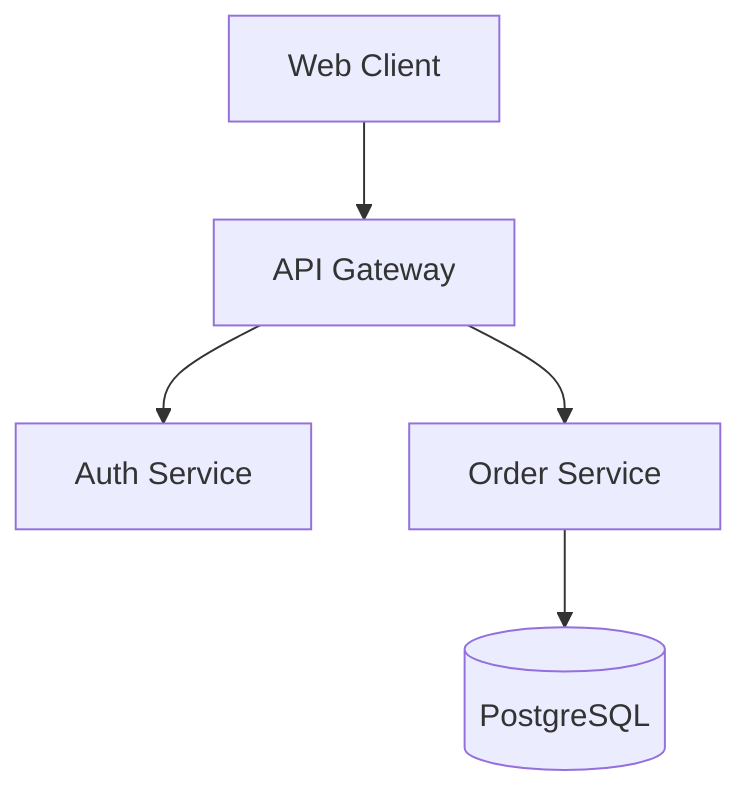

# Technical Documentation, Architecture Specs & API Reference Authoring

## Overview & Purpose
The Technical Documentation, Architecture Specs & API Reference Authoring skill provides a deterministic, battle-tested framework for executing technical-documentation processes across the Agents United multi-agent ecosystem.

Following this skill ensures high quality, zero-regression execution, rigorous testing gates, and seamless cross-functional team alignment.

## Execution Triggers & Prerequisites
### Execution Triggers
- Direct request or workflow step invoking technical-documentation.
- Auditing, implementing, or standardizing technical-documentation procedures.
- Addressing technical debt, architectural reviews, or production readiness gates.
- Preparing pull requests or automated release validations.

### Prerequisites
- Active project repository workspace with version control configured.
- Operational testing, typechecking, and build toolchains.
- Domain requirements, architectural constraints, or user stories defined.
- Clean git working tree before beginning execution.

## Input & Output Requirements
### Inputs
| Parameter | Type | Required | Description |
|---|---|---|---|
| `target_scope` | String | Yes | Target module, service, component, or file path |
| `config` | Object | Optional | Specific domain configurations, thresholds, and options |
| `output_dir` | Directory Path | Optional | Destination directory for generated artifacts and reports |
| `strict_mode` | Boolean | Optional | Enforce strict zero-warning validation and high test coverage |

### Outputs
| Artifact | Path / Format | Description |
|---|---|---|
| Specification Document | `docs/technical-documentation/spec.md` | Full technical specification and architectural plan |
| Implementation Files | `src/technical-documentation/*` | Production-ready source code, tests, and configurations |
| Execution Report | `reports/technical-documentation/summary.json` | Verification metrics, test results, and audit summary |

## Step-by-Step Execution Runbook

### Phase 1: Audience Profiling & Diátaxis Framework Selection
1. Identify primary audience: new engineers, API consumers, operations teams, or technical leadership.
2. Classify documentation mode using Diátaxis framework: Tutorial (learning), How-To (goal-oriented), Reference (information), Explanation (understanding).
3. Audit existing documentation for outdated diagrams, broken code samples, and missing prerequisites.
4. Establish documentation style guide: active voice, direct phrasing, clean markdown formatting.
5. Draft documentation outline.

### Phase 2: Architecture Diagrams & Visual Modeling
1. Author C4 / sequence diagrams using Mermaid syntax embedded directly in markdown.
2. Illustrate data flows, authentication handshakes, and component boundary interactions.
3. Ensure diagram labels are concise, legible, and maintainable as pure text.
4. Include high-level system topology and deployment infrastructure overviews.
5. Review diagrams for technical accuracy.

### Phase 3: Code Examples & Copy-Pasteable Runbooks
1. Author complete, self-contained code samples (avoid non-compiling pseudo-code).
2. Provide verified terminal commands with explicit prerequisites and expected output.
3. Document all environment variables, configuration parameters, and default values.
4. Include comprehensive error code reference table with troubleshooting remedies.
5. Verify every code example by executing it against a live test environment.

### Phase 4: Review, Accuracy Validation & Link Checking
1. Run automated markdown linter (markdownlint) to enforce formatting consistency.
2. Check for dead markdown links and broken anchor references.
3. Verify that all code blocks specify valid language tags for syntax highlighting.
4. Perform peer review with a domain engineer to validate factual accuracy.
5. Ensure zero typos or outdated terminology.

### Phase 5: Publication & Living Documentation Maintenance
1. Publish documentation to repository docs directory or documentation site (Docusaurus / MkDocs).
2. Update table of contents and root README index links.
3. Set up automated doc-testing in CI to prevent code sample bitrot.
4. Commit documentation changes to version control.
5. Notify team of published documentation updates.

## Code & Configuration Exemplars

### Exemplar 1: Technical Documentation, Architecture Specs & API Reference Authoring Configuration & Specification
```yaml
# System Architecture Specification
## Component Overview

### Communication Contracts
- Edge: HTTPS / RESTful JSON
- Internal: gRPC over HTTP/2 with mTLS
```

### Exemplar 2: Technical Documentation, Architecture Specs & API Reference Authoring TypeScript Type Contract
```typescript
export interface DocumentationArtifact {
  title: string;
  category: 'tutorial' | 'how-to' | 'reference' | 'explanation';
  targetAudience: 'developers' | 'architects' | 'operations' | 'end-users';
  path: string;
  lastReviewed: string;
}
```

## Edge Cases & Error Recovery Procedures

### Scenario A: Validation Failure in Technical Documentation, Architecture Specs & API Reference Authoring
1. **Diagnosis**: Static analysis, typechecking, or unit tests fail validation rules during execution.
2. **Recovery Protocol**:
   - Step 1: Inspect detailed error log output in test/build terminal.
   - Step 2: Formulate targeted hypothesis and isolate failing line or assertion.
   - Step 3: Implement surgical code fix and re-run verification suite.

### Scenario B: Missing or Incompatible Dependency
1. **Diagnosis**: Required toolchain binary or library dependency is missing from the environment.
2. **Recovery Protocol**:
   - Step 1: Verify `package.json` engine requirements and local environment versions.
   - Step 2: Install required peer dependencies cleanly with lockfile sync.
   - Step 3: Resume runbook from Phase 1.

## Verification & Validation Checklist
- [ ] Frontmatter conforms strictly to `author: "agents-united"` and `version: "2.0.0"`.
- [ ] All 7 mandatory sections present with explicit headers.
- [ ] Step-by-Step Execution Runbook body contains >= 50 lines.
- [ ] Code exemplars provided with valid syntax fencing.
- [ ] Zero dummy placeholder strings or unpopulated template markers present.
- [ ] Project build, test suite, and doctor check pass 100% cleanly.
