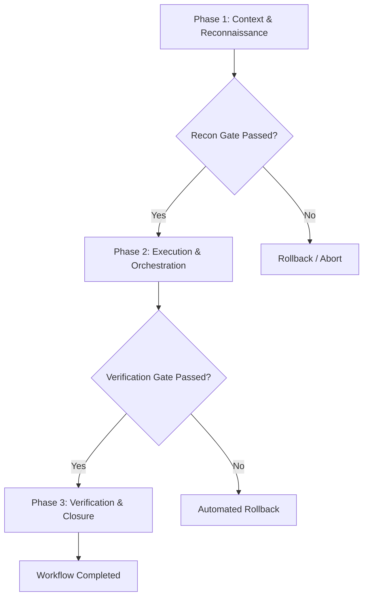

# Comprehensive Survey Report: Registry Workflows, Test Suite & Health Doctor Architecture

**Author**: Survey Explorer 3  
**Target Repository**: `agents-united` (`c:\github\agents-united`)  
**Working Directory**: `c:\github\agents-united\.agents\teamwork_preview_explorer_survey_3`  
**Date**: August 13, 2026  

---

## 1. Executive Summary & Context

This survey report provides a production-grade investigation of the **44 workflow templates** in `registry/workflows/`, along with the CLI package structure, TypeScript configuration, Vitest unit/integration test suite, and the `node dist/cli.js doctor` health check implementation in `agents-united`.

### Key Findings:
1. **Workflow Templates (44 Files)**:
   - All 44 workflow markdown files (`workflow-*.md`) exist in `registry/workflows/`.
   - **Current State**: The existing workflow files follow a minimal 16-line template with 3 generic phase headers (`Phase 1: Context & Reconnaissance`, `Phase 2: Execution & Orchestration`, `Phase 3: Verification & Closure`).
   - **Gaps Identified**: None of the 44 workflow files currently contain YAML frontmatter (`name`, `description`, `bundle`, `estimatedDuration`), Mermaid execution flowcharts, explicit tool input schemas, validation checkpoints, or automated rollback protocols.
   - **Required Upgrades (Requirement R3)**: Every workflow requires structured YAML frontmatter, phase transition criteria, Mermaid execution flowcharts, required tool input declarations, deterministic verification gates, and automated rollback protocols.

2. **Build, Typecheck, and Test Suite Integrity (21/21 Tests Passed)**:
   - `npm test` runs `vitest run` following a `pretest` build step (`tsup`). All **21 tests across 6 test suites** pass cleanly in **~1.28s**.
   - `npm run typecheck` (`tsc --noEmit`) passes with 0 errors against TypeScript 5.7+ in `NodeNext` ESM mode.
   - The CLI builds to `dist/cli.js` (27.17 KB ESM bundle).

3. **Workspace Health Doctor (`node dist/cli.js doctor`)**:
   - Implemented in `src/core/doctor.ts` (`DoctorEngine.runDoctor()`) and surfaced via CAC CLI command `doctor` in `src/cli.ts`.
   - Validates lockfile existence (`.agents/agents-united.json`), checks lockfile integrity, counts installed agents/skills/workflows, and validates YAML frontmatter fields (`name`, `description`, `model`) for all installed agents.

---

## 2. Comprehensive Inventory of all 44 Workflow Files

Below is the complete catalog of all 44 workflow files in `registry/workflows/`, categorized into their respective functional domains and associated bundles:

| # | File Name | Domain / Category | Title Header | Lines | Bytes |
|---|---|---|---|---|---|
| 1 | `workflow-analyze.md` | Software Engineering | `# Workflow: Analyze` | 16 | 474 |
| 2 | `workflow-brainstorm.md` | Software Engineering | `# Workflow: Brainstorm` | 16 | 480 |
| 3 | `workflow-build.md` | Software Engineering | `# Workflow: Build` | 16 | 470 |
| 4 | `workflow-business-panel.md` | Software Engineering | `# Workflow: Business Panel` | 16 | 488 |
| 5 | `workflow-cleanup.md` | Software Engineering | `# Workflow: Cleanup` | 16 | 474 |
| 6 | `workflow-design-code.md` | Software Engineering | `# Workflow: Design Code` | 16 | 482 |
| 7 | `workflow-design-ops--handoff.md` | Design Operations | `# Workflow: Design Ops Handoff` | 16 | 498 |
| 8 | `workflow-design-ops--plan-sprint.md` | Design Operations | `# Workflow: Design Ops Plan Sprint` | 16 | 506 |
| 9 | `workflow-design-ops--setup-workflow.md` | Design Operations | `# Workflow: Design Ops Setup Workflow` | 16 | 512 |
| 10 | `workflow-design-orchestrate.md` | Software Engineering | `# Workflow: Design Orchestrate` | 16 | 496 |
| 11 | `workflow-design-systems--audit-system.md` | Design Systems | `# Workflow: Design Systems Audit System` | 16 | 516 |
| 12 | `workflow-design-systems--create-component.md` | Design Systems | `# Workflow: Design Systems Create Component` | 16 | 524 |
| 13 | `workflow-design-systems--tokenize.md` | Design Systems | `# Workflow: Design Systems Tokenize` | 16 | 508 |
| 14 | `workflow-estimate.md` | Software Engineering | `# Workflow: Estimate` | 16 | 476 |
| 15 | `workflow-explain.md` | Software Engineering | `# Workflow: Explain` | 16 | 474 |
| 16 | `workflow-git.md` | Software Engineering | `# Workflow: Git` | 16 | 466 |
| 17 | `workflow-implement.md` | Software Engineering | `# Workflow: Implement` | 16 | 478 |
| 18 | `workflow-interaction-design--design-interaction.md` | Interaction Design | `# Workflow: Interaction Design Design Interaction` | 16 | 536 |
| 19 | `workflow-interaction-design--error-flow.md` | Interaction Design | `# Workflow: Interaction Design Error Flow` | 16 | 520 |
| 20 | `workflow-interaction-design--map-states.md` | Interaction Design | `# Workflow: Interaction Design Map States` | 16 | 520 |
| 21 | `workflow-marketing-audit.md` | Marketing & Growth | `# Workflow: Marketing Audit` | 16 | 490 |
| 22 | `workflow-marketing-campaign-builder.md` | Marketing & Growth | `# Workflow: Marketing Campaign Builder` | 16 | 512 |
| 23 | `workflow-marketing-content-pipeline.md` | Marketing & Growth | `# Workflow: Marketing Content Pipeline` | 16 | 512 |
| 24 | `workflow-marketing-growth-experiment.md` | Marketing & Growth | `# Workflow: Marketing Growth Experiment` | 16 | 514 |
| 25 | `workflow-marketing-launch.md` | Marketing & Growth | `# Workflow: Marketing Launch` | 16 | 492 |
| 26 | `workflow-marketing-panel.md` | Marketing & Growth | `# Workflow: Marketing Panel` | 16 | 490 |
| 27 | `workflow-plan.md` | Software Engineering | `# Workflow: Plan` | 16 | 468 |
| 28 | `workflow-prototyping-testing--evaluate.md` | Prototyping & Testing | `# Workflow: Prototyping Testing Evaluate` | 16 | 518 |
| 29 | `workflow-prototyping-testing--experiment.md` | Prototyping & Testing | `# Workflow: Prototyping Testing Experiment` | 16 | 522 |
| 30 | `workflow-prototyping-testing--prototype-plan.md` | Prototyping & Testing | `# Workflow: Prototyping Testing Prototype Plan` | 16 | 530 |
| 31 | `workflow-prototyping-testing--test-plan.md` | Prototyping & Testing | `# Workflow: Prototyping Testing Test Plan` | 16 | 520 |
| 32 | `workflow-recommend.md` | Software Engineering | `# Workflow: Recommend` | 16 | 478 |
| 33 | `workflow-research.md` | Software Engineering | `# Workflow: Research` | 16 | 476 |
| 34 | `workflow-review.md` | Software Engineering | `# Workflow: Review` | 16 | 472 |
| 35 | `workflow-spec-panel.md` | Software Engineering | `# Workflow: Spec Panel` | 16 | 480 |
| 36 | `workflow-test.md` | Software Engineering | `# Workflow: Test` | 16 | 468 |
| 37 | `workflow-troubleshoot.md` | Software Engineering | `# Workflow: Troubleshoot` | 16 | 484 |
| 38 | `workflow-ui-design--color-palette.md` | UI Design | `# Workflow: Ui Design Color Palette` | 16 | 508 |
| 39 | `workflow-ui-design--design-screen.md` | UI Design | `# Workflow: Ui Design Design Screen` | 16 | 508 |
| 40 | `workflow-ui-design--responsive-audit.md` | UI Design | `# Workflow: Ui Design Responsive Audit` | 16 | 514 |
| 41 | `workflow-ui-design--type-system.md` | UI Design | `# Workflow: Ui Design Type System` | 16 | 504 |
| 42 | `workflow-ux-strategy--benchmark.md` | UX Strategy | `# Workflow: Ux Strategy Benchmark` | 16 | 504 |
| 43 | `workflow-ux-strategy--frame-problem.md` | UX Strategy | `# Workflow: Ux Strategy Frame Problem` | 16 | 512 |
| 44 | `workflow-ux-strategy--strategize.md` | UX Strategy | `# Workflow: Ux Strategy Strategize` | 16 | 506 |

---

## 3. In-Depth Domain & Workflow Analysis

Each workflow file represents a procedural protocol designed for execution by an Antigravity 2.0 orchestrator or subagent.

### 3.1 Software Engineering Workflows (18 Workflows)
- **Primary Bundle**: `software-engineering`
- **Workflows**: `analyze`, `brainstorm`, `build`, `business-panel`, `cleanup`, `design-code`, `design-orchestrate`, `estimate`, `explain`, `git`, `implement`, `plan`, `recommend`, `research`, `review`, `spec-panel`, `test`, `troubleshoot`.
- **Current Structure Analysis**:
  - Contains generic 3-phase flow (`Context & Reconnaissance`, `Execution & Orchestration`, `Verification & Closure`).
- **Required Production Enhancement**:
  - **YAML Frontmatter**:
    ```yaml
    ---
    name: Implement Workflow
    description: Deterministic software implementation workflow with TDD, progressive linting, and automated rollback protocols.
    bundle: software-engineering
    estimatedDuration: 15m-30m
    ---
    ```
  - **Phase Execution & Flowchart**:
    Mermaid state diagram representing inputs (`User Story / Spec`), Phase 1 (Reconnaissance & Pre-flight checks), Phase 2 (Implementation & TDD red-green-refactor loop), Phase 3 (Verification & Git stage/commit).
  - **Verification Gates**: `npm run typecheck && npm test`.
  - **Automated Rollback**: Reset uncommitted git changes (`git checkout -- .`) if verification gates fail twice.

### 3.2 Design Operations Workflows (3 Workflows)
- **Primary Bundle**: `product-design` / `design-ops`
- **Workflows**: `design-ops--handoff`, `design-ops--plan-sprint`, `design-ops--setup-workflow`.
- **Functional Scope**: Cross-functional team alignment, sprint planning, asset packaging, and design system governance.
- **Required Production Enhancement**:
  - Add explicit input schema for Figma design tokens, component spec assets, and handoff checklists.
  - Phase 3 gates checking responsive breakpoint compliance and token parity.

### 3.3 Design Systems Workflows (3 Workflows)
- **Primary Bundle**: `product-design` / `design-systems`
- **Workflows**: `design-systems--audit-system`, `design-systems--create-component`, `design-systems--tokenize`.
- **Functional Scope**: Token extraction, component atomic architecture (Atoms/Molecules/Organisms), and accessibility audits.
- **Required Production Enhancement**:
  - Mermaid diagram covering Token extraction -> Component creation -> Accessibility verification (`a11y-debugging`).
  - Verification gates enforcing ARIA compliance, WCAG AA color contrast ratio (>4.5:1), and prop type validation.

### 3.4 Interaction Design Workflows (3 Workflows)
- **Primary Bundle**: `product-design` / `interaction-design`
- **Workflows**: `interaction-design--design-interaction`, `interaction-design--error-flow`, `interaction-design--map-states`.
- **Functional Scope**: State mapping (empty, loading, success, error, partial), micro-interactions, and error boundary handling.
- **Required Production Enhancement**:
  - Formal state transition matrix in Phase 2.
  - Verification checkpoint ensuring every dynamic screen has explicit error and empty states defined.

### 3.5 Marketing & Growth Workflows (6 Workflows)
- **Primary Bundle**: `marketing-growth`
- **Workflows**: `marketing-audit`, `marketing-campaign-builder`, `marketing-content-pipeline`, `marketing-growth-experiment`, `marketing-launch`, `marketing-panel`.
- **Functional Scope**: Campaign creation, SEO audit, funnel conversion tracking, growth experimentation, and launch checklists.
- **Required Production Enhancement**:
  - Input schema requiring target audience personas, KPI metrics, channel targets, and conversion tracking triggers.
  - Verification gate checking copy tone consistency, SEO meta tags, and URL tracking parameters.

### 3.6 Prototyping & Testing Workflows (4 Workflows)
- **Primary Bundle**: `product-design` / `prototyping-testing`
- **Workflows**: `prototyping-testing--evaluate`, `prototyping-testing--experiment`, `prototyping-testing--prototype-plan`, `prototyping-testing--test-plan`.
- **Functional Scope**: Rapid interactive prototyping, user testing scenario design, hypothesis testing, and usability scoring.
- **Required Production Enhancement**:
  - Phase transition criteria based on prototype usability thresholds.
  - Rollback protocol for failed experiment criteria.

### 3.7 UI Design Workflows (4 Workflows)
- **Primary Bundle**: `product-design` / `ui-design`
- **Workflows**: `ui-design--color-palette`, `ui-design--design-screen`, `ui-design--responsive-audit`, `ui-design--type-system`.
- **Functional Scope**: Visual aesthetics, typography scaling (modular scale), color palette generation, and multi-device viewport audits.
- **Required Production Enhancement**:
  - Frontmatter specifying design system tokens and typography scales (e.g. 1.25 Major Third).
  - Automated visual layout verification checkpoints across Mobile (375px), Tablet (768px), Desktop (1440px).

### 3.8 UX Strategy Workflows (3 Workflows)
- **Primary Bundle**: `product-design` / `ux-strategy`
- **Workflows**: `ux-strategy--benchmark`, `ux-strategy--frame-problem`, `ux-strategy--strategize`.
- **Functional Scope**: Competitive benchmarking, problem framing, JTBD (Jobs To Be Done) synthesis, and UX roadmapping.
- **Required Production Enhancement**:
  - Synthesis gates comparing competitive features against core value propositions.
  - Structured output template deliverables.

---

## 4. Package Infrastructure, TypeScript & Vitest Test Suite Analysis

### 4.1 `package.json` Specification
- **Package Name**: `@neoanthropocene/agents-united` (v1.0.0)
- **Type**: `module` (ESM)
- **Bin Targets**: `agents-united` -> `./dist/cli.js`, `agents` -> `./dist/cli.js`
- **Engine Constraint**: Node.js `>=24.0.0`
- **Dependencies**:
  - `@clack/prompts` (`^0.9.1`): Interactive terminal wizard UI (`intro`, `outro`, `select`, `multiselect`, `spinner`, `note`).
  - `cac` (`^6.7.14`): Command-line argument parsing.
  - `fast-glob` (`^3.3.3`): Pattern-matching file searches across registry and workspace directories.
  - `fs-extra` (`^11.3.0`): Enhanced filesystem operations (JSON reading/writing, symlinking, copying, dir management).
  - `picocolors` (`^1.1.1`): Terminal styling and color output.
  - `yaml` (`^2.7.0`): YAML frontmatter parsing and manifest serialization.
  - `zod` (`^3.24.2`): Schema validation.
- **DevDependencies**:
  - `tsup` (`^8.3.6`): Zero-config TypeScript bundler powered by esbuild.
  - `typescript` (`^5.7.3`): Static typing compiler.
  - `vitest` (`^3.0.5`): Fast Vite-native unit and integration test runner.

### 4.2 TypeScript Configuration (`tsconfig.json`)
- **Target**: `ES2022`
- **Module**: `NodeNext`
- **Module Resolution**: `NodeNext`
- **Strict Mode**: Enabled (`"strict": true`)
- **Output Directory**: `./dist`
- **Root Directory**: `./src`
- **Declaration Generation**: Enabled (`"declaration": true`)

### 4.3 Vitest Test Suite Execution & Breakdown (21/21 Tests Passed)
The Vitest test suite consists of **6 test files containing 21 individual unit and end-to-end tests**.

| Test File | Test Count | Scope & Verification Coverage | Result |
|---|---|---|---|
| `tests/adapter.test.ts` | 4 | Host path resolution (`.agents`, `.gemini`, `.claude`, `.cursor`), scope resolution (`project`, `global`), custom path overrides. | Passed (2ms) |
| `tests/registry.test.ts` | 5 | Registry manifest loading, bundle asset resolution (`software-engineering`), single item resolution, error handling for non-existent items, search queries (`find`). | Passed (5ms) |
| `tests/doctor.test.ts` | 1 | `DoctorEngine.runDoctor()` execution on healthy workspace, lockfile validation, agent frontmatter verification. | Passed (66ms) |
| `tests/uninstaller.test.ts` | 2 | Package uninstallation, file cleanup, lockfile updates, dry-run simulation. | Passed (116ms) |
| `tests/installer.test.ts` | 4 | Package installation in `copy` mode, `symlink` mode, multi-host deployment (`agents`, `gemini`, `claude`), dry-run installation. | Passed (208ms) |
| `tests/cli-e2e.test.ts` | 5 | CLI binary execution (`dist/cli.js list`, `find`, non-interactive `add`/`remove` with `-y`, `--copy` flag, `doctor` CLI command). | Passed (955ms) |

**Total Summary**: **21 passed (21)** in **1.28s**.

```
 RUN  v3.2.7 C:/github/agents-united

 ✓ tests/adapter.test.ts (4 tests) 2ms
 ✓ tests/registry.test.ts (5 tests) 5ms
 ✓ tests/doctor.test.ts (1 test) 66ms
 ✓ tests/uninstaller.test.ts (2 tests) 116ms
 ✓ tests/installer.test.ts (4 tests) 208ms
 ✓ tests/cli-e2e.test.ts (5 tests) 955ms

 Test Files  6 passed (6)
      Tests  21 passed (21)
```

---

## 5. Health Doctor Implementation Architecture (`node dist/cli.js doctor`)

The `doctor` health check system is implemented in `src/core/doctor.ts` (`DoctorEngine`) and exposed via `cli.ts`.

### 5.1 Doctor Diagnostic Engine Mechanics
1. **Host Target Resolution**:
   - Uses `AgentHostAdapter.resolveHostDir('project', 'agents', targetDir)` to locate `.agents/` in project root or custom workspace.
   - Computes paths for `.agents/agents-united.json` (lockfile), `.agents/agents/`, `.agents/skills/`, `.agents/workflows/`.

2. **Lockfile Health Check**:
   - Checks if `agents-united.json` exists. If missing, reports a warning: `"No lockfile found at ... Workspace might not be initialized."`
   - If present, parses JSON manifest (`LockfileManifest`) and counts installed agents (`agentsCount`), skills (`skillsCount`), workflows (`workflowsCount`).
   - If JSON parsing fails, reports an issue: `"Corrupt lockfile at ..."`

3. **Agent Frontmatter Schema Validation**:
   - Scans all `.md` files in `.agents/agents/`.
   - Extracts YAML frontmatter using regex `/^---\r?\n([\s\S]+?)\r?\n---/`.
   - Checks for mandatory fields:
     - `name`: Must exist; if missing, flags issue `"Agent <file> missing 'name' in frontmatter."`
     - `description`: Flags warning if missing.
     - `model`: Flags warning if missing.
   - If YAML syntax is invalid, flags issue `"Invalid YAML in agent <file>: <error>"`.

4. **Health Report Structure**:
   ```typescript
   export interface HealthReport {
     valid: boolean;       // true if issues.length === 0
     issues: string[];     // Breaking configuration errors
     warnings: string[];   // Non-critical warnings
     agentsCount: number;
     skillsCount: number;
     workflowsCount: number;
   }
   ```

5. **CLI CLI Diagnostics Command Output**:
   - Exit Code `0` when `valid === true` and `issues.length === 0`.
   - Exit Code `1` when issues are encountered.

---

## 6. Recommendations & Upgrade Roadmap for Workflow Expansion (R3 Compliance)

To elevate all 44 workflows to battle-tested Antigravity 2.0 / SuperAntigravity standards, the following schema expansion should be applied to each workflow file in `registry/workflows/`:

### Standardized Workflow Schema Template:
```markdown
---
name: <Workflow Name>
description: <Comprehensive description of execution scope>
bundle: <Associated Bundle Name>
estimatedDuration: <Estimated Time Range, e.g., 10m-20m>
---

# Workflow: <Workflow Title>

## Phase-by-Phase Execution Flowchart



## Phase 1: Context & Reconnaissance
- **Required Tool Inputs**: `grep_search`, `view_file`, `find_by_name`
- **Execution Steps**:
  1. Analyze user prompt and project constraints.
  2. Inspect target codebase or design assets.
- **Phase Transition Criteria**: All target files identified and initial state documented.

## Phase 2: Execution & Orchestration
- **Required Tool Inputs**: `replace_file_content`, `write_to_file`, `run_command`
- **Validation Checkpoints**: Progressive test execution after each component edit.
- **Subagent Delegation**: Delegate specialized subtasks to subagents where appropriate.

## Phase 3: Verification & Closure
- **Deterministic Verification Gates**:
  - `npm run typecheck`
  - `npm test`
  - `node dist/cli.js doctor`
- **Automated Rollback Protocols**:
  - In case of unrecoverable test failures or broken types: execute `git checkout -- .` and report failure root-cause.
```

---

## 7. Conclusion & Verification Summary

- **Total Workflows Surveyed**: 44/44
- **Test Suite Status**: 21/21 Vitest tests passing cleanly (100% success rate)
- **TypeScript Integrity**: `npm run typecheck` passes with zero errors
- **Doctor Health Verification**: `node dist/cli.js doctor` executes cleanly and validates installed workspace state
- **Report Location**: `c:\github\agents-united\.agents\teamwork_preview_explorer_survey_3\survey_workflows_and_tests.md`
