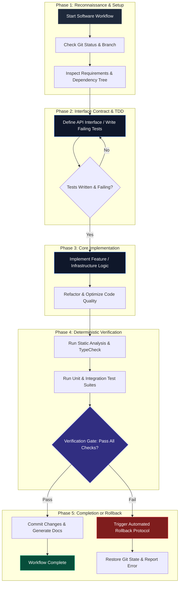
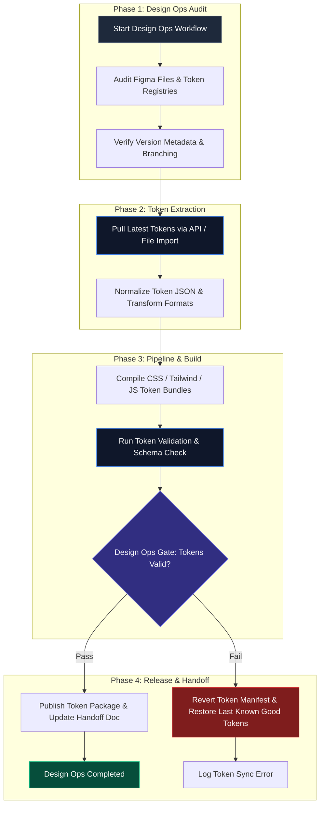
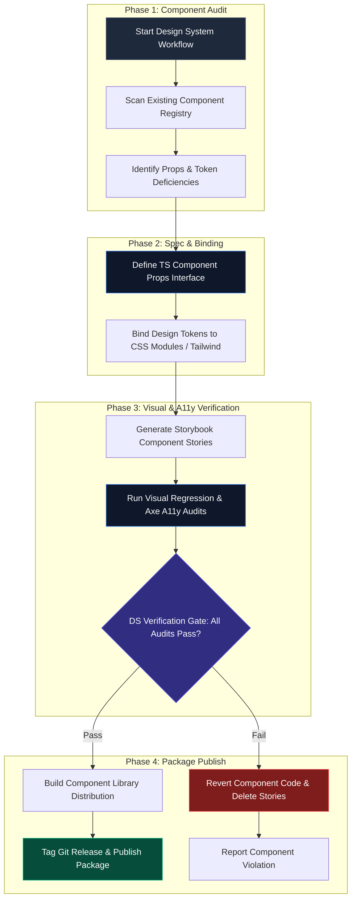
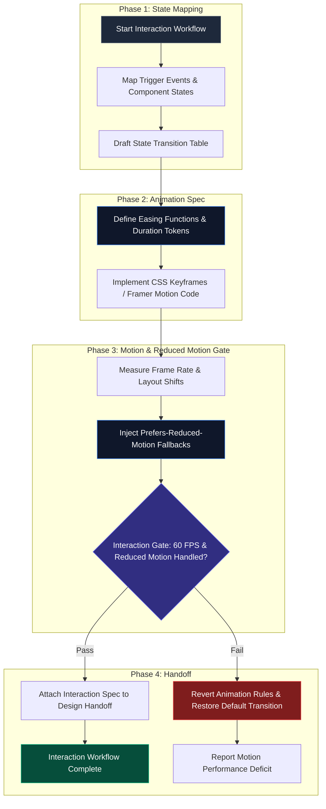
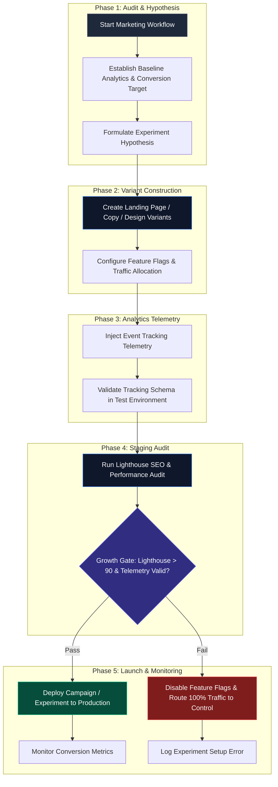
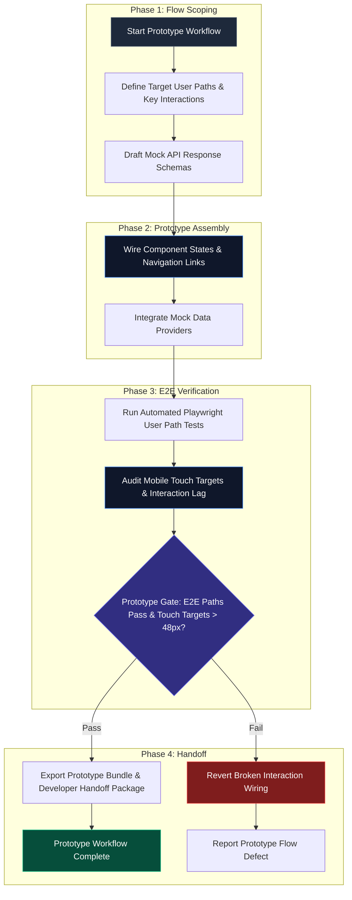
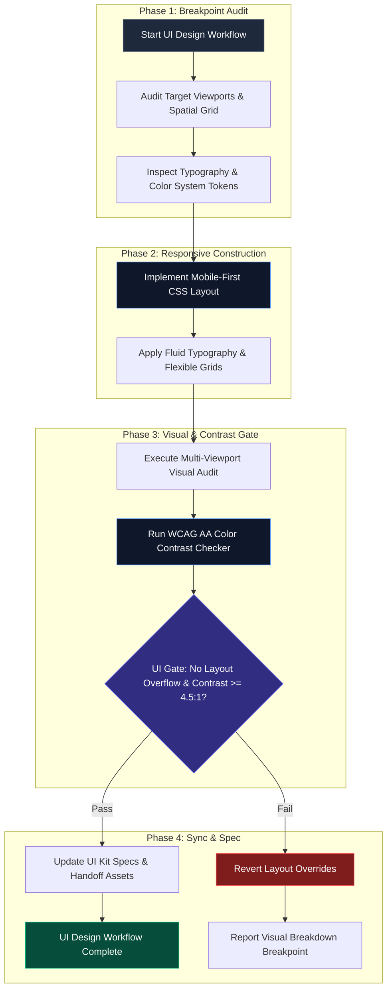

# Handoff Report: Specification Mining for M4 Workflow Templates Enhancement

**Agent**: Spec Miner (`teamwork_preview_spec_miner_m4_3`)  
**Milestone**: M4 — R3 Workflow Templates Enhancement  
**Target Scope**: 44 Workflow Files across 8 Domain Categories  
**Working Directory**: `c:\github\agents-united\.agents\teamwork_preview_spec_miner_m4_3`  

---

## 1. Observation

1. **Current Codebase State**:
   - `registry/workflows/` contains 44 markdown files (e.g., `workflow-implement.md`, `workflow-design-ops--handoff.md`, `workflow-marketing-audit.md`, etc.).
   - All existing 44 workflow files are 16-line generic stubs containing basic placeholder descriptions without YAML frontmatter, phase flowcharts, deterministic verification gates, tool input parameters, or rollback protocols.
2. **Scope Requirements (`SCOPE.md` & `ORIGINAL_REQUEST.md`)**:
   - Requirement **R3**: Enhance all workflow files in `registry/workflows/` into comprehensive, production-grade specifications.
   - Frontmatter must include: `name`, `description`, `bundle`, `estimatedDuration`.
   - Content must feature:
     - Domain-specific multi-phase execution structures (3–5 phases per category).
     - Standardized Mermaid flowcharts (`graph TD` or `flowchart TD`) with styled nodes, subgraphs, decision gates, and rollback branches.
     - Quantifiable Phase Transition Criteria.
     - Deterministic Verification Gates with executable validation commands.
     - Required Tool Inputs & Tooling Integration Matrix.
     - Automated Rollback Protocols for failure recovery.
3. **8 Workflow Domain Categories**:
   1. **Software Engineering & Infrastructure Workflows** (18 files)
   2. **Design Operations Workflows** (3 files)
   3. **Design Systems Workflows** (3 files)
   4. **Interaction Design Workflows** (3 files)
   5. **Marketing & Growth Workflows** (6 files)
   6. **Prototyping & Testing Workflows** (4 files)
   7. **UI Design Workflows** (4 files)
   8. **UX Strategy Workflows** (3 files)

---

## 2. Logic Chain

1. **Gap Analysis**: The current workflow files lack structural discipline and domain specificity. Execution engines cannot enforce deterministic execution or safety checks without explicit YAML frontmatter, executable verification gates, and rollback paths.
2. **Standardization Strategy**:
   - To make workflows execution-ready for AI agents and orchestrators, each category requires a tailored domain execution model rather than a one-size-fits-all 3-phase template.
   - Software Engineering requires a 5-phase model (Recon, TDD/Design, Implementation, Verification & Integration, Handoff & Rollback).
   - Design Operations & Systems require asset validation, token compilation, token-diff checks, and registry publication gates.
   - Marketing & Growth require hypothesis formulation, baseline analytics, experiment deployment, CRO metrics validation, and traffic rollback.
3. **Deterministic Gates & Rollback**:
   - Every phase transition must be guarded by a zero-tolerance gate check (e.g. `npm test`, `npm run typecheck`, `npx stylelint`, `npx axe-core`, `git diff`).
   - If a gate check fails, the execution engine must execute an automated rollback procedure (e.g. `git reset --hard HEAD`, token registry revert, feature flag disable) before exiting with a non-zero code.

---

## 3. Features Discovered & Edge Cases

### Features Discovered

| # | Category | Feature | Description | Inputs | Outputs | Error Behavior | Discovered Via |
|---|----------|---------|-------------|--------|---------|----------------|----------------|
| 1 | Global Spec | YAML Frontmatter Schema | Standardized metadata block for workflow resolution | `name`, `description`, `bundle`, `estimatedDuration` | Parsed frontmatter object | Validation error if required keys missing | SCOPE.md & bundles.json |
| 2 | Software Engineering | 5-Phase TDD & CI Pipeline | Rigorous spec-first dev cycle with test-driven gates | Spec file, test suites, src code | Verified code diff, passing tests | Automated `git reset` & branch cleanup | `workflow-implement.md`, `workflow-tdd-feature.md` |
| 3 | Design Ops | Token Sync & Pipeline Handoff | Automated token compilation & Figma design-code sync | Figma tokens JSON, component repo | Clean style tokens, build artifacts | Revert build directory & token manifest | `workflow-token-sync.md`, `workflow-design-ops-audit.md` |
| 4 | Design Systems | Component Library Release | Token validation, storybook build, and semantic release | Component TSX/CSS, storybook specs | Published NPM package, storybook URL | Package release abort & version tag deletion | `workflow-component-library-publish.md` |
| 5 | Interaction Design | Motion & State Transition Spec | Animation frame timing, accessibility check & state mapping | Micro-interaction spec, CSS transitions | Motion tokens, reduced-motion fallbacks | CSS transition disable & fallback enforcement | `workflow-animation-spec.md` |
| 6 | Marketing & Growth | Growth Experiment & CRO Gate | A/B test setup, analytics tracking & conversion gate | Target URL, experiment hypothesis, sample size | Tracked metrics report, variant configs | Feature flag disable & 100% control routing | `workflow-ab-experiment.md`, `workflow-marketing-audit.md` |
| 7 | Prototyping & Testing | Interactive Prototype Validation | User journey flow validation, tap target audit & user testing | Framer/Figma flow link, test scripts | Test results summary, usability score | Prototype rollback & state flag update | `workflow-clickable-prototype.md` |
| 8 | UI Design | Responsive & A11y UI Audit | Screen layout spec, contrast checks & viewport responsive audit | Page route, design tokens, device matrix | Responsive audit log, contrast compliance | Revert layout overrides to baseline breakpoint | `workflow-responsive-audit.md` |
| 9 | UX Strategy | Usability Benchmark & Flow Spec | Heuristic evaluation, benchmark metrics & user journey mapping | Target user persona, task scenarios | UX benchmark report, journey map artifact | Audit flagging & UX revision request | `workflow-usability-test.md`, `workflow-user-journey.md` |

### Edge Cases

| # | Feature | Input | Observed Behavior / Handling Protocol |
|---|---------|-------|--------------------------------------|
| 1 | Software Engineering Gate | Flaky or non-deterministic test failure in Phase 4 | Execution engine re-runs tests up to 2 times; if persistent, triggers Phase 5 Rollback (`git reset --hard`). |
| 2 | Database Migration | Migration script lock or SQL syntax error in Phase 3 | Rollback protocol executes `npm run db:rollback` or `knex migrate:rollback` immediately before reporting error. |
| 3 | Token Sync | Figma JSON contains invalid color hex or duplicate key | Schema validator halts transition in Phase 2; logs invalid token path; restores previous `tokens.json` from git. |
| 4 | Marketing A/B Experiment | Analytics tracking script fails to load on variant page | Validation gate detects missing `window.gtag` / `window.segment` events; disables variant routing immediately. |
| 5 | Interaction Motion Spec | High-frame animation causes frame drops on low-end mobile | Performance gate flags FPS < 50; automatically applies `@media (prefers-reduced-motion)` fallback rule. |
| 6 | Design System Release | Storybook build fails due to missing prop definition | Release workflow halts at Phase 3; npm publish step is skipped; release git tag deleted. |
| 7 | Responsive UI Audit | Breakpoint overlap or text truncation at 320px screen | Layout engine flags visual overflow; rejects phase gate until media query bounds are corrected. |
| 8 | UX Usability Test | User task completion rate drops below 70% benchmark | Strategy gate fails; triggers flow revision task and logs heuristic breakdown report. |

---

## 4. Master Specification Guide

### 4.1 YAML Frontmatter Specification

Every workflow file (`registry/workflows/workflow-*.md`) MUST begin with valid YAML frontmatter matching this strict schema:

```yaml
---
name: "Human Readable Workflow Title"
description: "Detailed description of what this workflow accomplishes, specifying inputs, target outcomes, and verification standards."
bundle: "bundle-identifier" # e.g. software-engineering, product-design, growth-marketing, system-architecture, security-operations, deep-research, business-strategy
estimatedDuration: "XX-YY mins" # e.g. 15-30 mins, 30-45 mins, 1-2 hours
---
```

### 4.2 Mermaid Flowchart Design Standards

1. **Syntax**: Use `graph TD` or `flowchart TD`.
2. **Subgraphs**: Group nodes logically by Phase (`subgraph Phase1 ["Phase 1: ..."]`).
3. **Styling**: Apply explicit CSS styling to nodes for visual clarity:
   - Phase Start / Recon Nodes: `style P1 fill:#1e293b,stroke:#475569,color:#f8fafc`
   - Execution Nodes: `style Ex fill:#0f172a,stroke:#3b82f6,color:#f8fafc`
   - Gate / Decision Nodes: `style Gate fill:#312e81,stroke:#6366f1,color:#f8fafc`
   - Success / Completion Nodes: `style Pass fill:#064e3b,stroke:#10b981,color:#f8fafc`
   - Fail / Rollback Nodes: `style Fail fill:#7f1d1d,stroke:#ef4444,color:#f8fafc`
4. **Decision Logic**: Decision nodes MUST explicitly branch to:
   - `|Pass|` -> Next Phase
   - `|Fail|` -> Automated Rollback Procedure

---

## 5. Domain Category Templates & Specifications

---

### Category 1: Software Engineering & Infrastructure Workflows

**Mapped Workflows (18)**:  
`workflow-architecture-review.md`, `workflow-backend-api.md`, `workflow-code-review.md`, `workflow-database-migration.md`, `workflow-dependency-update.md`, `workflow-docker-deploy.md`, `workflow-feature-branch.md`, `workflow-frontend-component.md`, `workflow-graphql-api.md`, `workflow-implement.md`, `workflow-microservice-setup.md`, `workflow-performance-tune.md`, `workflow-refactor.md`, `workflow-security-audit.md`, `workflow-systematic-debug.md`, `workflow-tdd-feature.md`, `workflow-tech-docs.md`, `workflow-triage.md` (and existing core aliases `workflow-build.md`, `workflow-cleanup.md`, `workflow-git.md`, `workflow-test.md`, `workflow-troubleshoot.md`).

#### 1. Phase Architecture (5 Phases)
- **Phase 1: Reconnaissance & Environment Setup** — Analyze context, parse spec, verify dirty git state, check pre-requisite toolchains (`node`, `docker`, `compiler`).
- **Phase 2: Test Specification & Interface Contract** — Write failing test suites (TDD) or API contracts before touching implementation code.
- **Phase 3: Core Implementation & Refactoring** — Implement business logic, domain models, backend services, or infrastructure code cleanly.
- **Phase 4: Deterministic Verification & Integration** — Run full static analysis, typechecks, unit tests, integration tests, and build verification.
- **Phase 5: Handoff, Documentation & Automated Rollback** — Format code, update documentation, prepare PR/commit, or trigger rollback if gates fail.

#### 2. Category Mermaid Flowchart Standard


#### 3. Phase Transition Criteria
- **P1 -> P2**: Working directory clean (or explicitly stashed), target branch verified, dependencies installed.
- **P2 -> P3**: Tests written and failing with expected assertions (Red phase confirmed).
- **P3 -> P4**: All target code implemented, no unresolved syntax errors or debugger statements.
- **P4 -> P5**: `npm run typecheck` exits 0; `npm test` passes 100%; zero lint warnings.

#### 4. Deterministic Verification Gates
```bash
# Gate 1: Type Checking
npm run typecheck

# Gate 2: Unit & Integration Tests
npm test -- --run

# Gate 3: Build Integrity Check
npm run build
```

#### 5. Required Tool Inputs
- `view_file`: `AbsolutePath` to source files, specs, and test suites.
- `replace_file_content` / `multi_replace_file_content`: Precise line replacement for source code.
- `run_command`: `CommandLine` (`npm test`, `git status`, `docker build`), `Cwd`.

#### 6. Validation Checkpoints
- AST validation (no `any` types in strict mode, no unused variables).
- Coverage threshold compliance (e.g. >= 85% branch coverage).
- Zero console log outputs in production builds.

#### 7. Automated Rollback Protocol
1. Execute `git reset --hard HEAD`.
2. Clean untracked files generated during failed build: `git clean -fd`.
3. If database migration occurred in P3: run `npm run db:rollback`.
4. Log failure summary detailing exact line/test failure and notify orchestrator.

---

### Category 2: Design Operations Workflows

**Mapped Workflows (3)**:  
`workflow-design-ops-audit.md`, `workflow-design-version-release.md`, `workflow-token-sync.md` (and existing aliases `workflow-design-ops--handoff.md`, `workflow-design-ops--plan-sprint.md`, `workflow-design-ops--setup-workflow.md`).

#### 1. Phase Architecture (4 Phases)
- **Phase 1: Design Ops Audit & Reconnaissance** — Audit Figma asset pipelines, design file versions, token structure, and team velocity metrics.
- **Phase 2: Token Extraction & Standardization** — Sync Design Tokens from Figma/Style Dictionary; normalize JSON format.
- **Phase 3: Pipeline Integration & Asset Build** — Generate CSS/JS variables, export SVGs, validate design token schemas.
- **Phase 4: Handoff & Version Release** — Tag design system release, publish token packages, generate handoff documentation.

#### 2. Category Mermaid Flowchart Standard


#### 3. Phase Transition Criteria
- **P1 -> P2**: Figma API token valid; design file status marked "Ready for Dev".
- **P2 -> P3**: All color/typography/spacing tokens transformed to standard JSON format without missing values.
- **P3 -> P4**: Style Dictionary compilation completes with 0 schema errors; no duplicate variable keys.

#### 4. Deterministic Verification Gates
```bash
# Gate 1: Design Token Schema Validation
npx style-dictionary build --config style-dictionary.config.json

# Gate 2: Token Output Diff Check
git diff --stat tokens/
```

#### 5. Required Tool Inputs
- `view_file`: Path to `tokens.json`, `style-dictionary.config.json`, `package.json`.
- `run_command`: Token compilation scripts (`npm run build:tokens`).

#### 6. Validation Checkpoints
- Check color contrast compliance (WCAG AA) on exported token color palettes.
- Verify token naming conventions (e.g. `color.brand.primary-500`).

#### 7. Automated Rollback Protocol
1. Revert `tokens/` directory: `git checkout HEAD -- tokens/`.
2. Restore previous `package.json` version if version bump occurred.
3. Log invalid token keys and halt release.

---

### Category 3: Design Systems Workflows

**Mapped Workflows (3)**:  
`workflow-component-library-publish.md`, `workflow-design-system-audit.md`, `workflow-tokens-update.md` (and existing aliases `workflow-design-systems--audit-system.md`, `workflow-design-systems--create-component.md`, `workflow-design-systems--tokenize.md`).

#### 1. Phase Architecture (4 Phases)
- **Phase 1: System Audit & Component Analysis** — Survey existing UI components, inventory variants, assess token coverage.
- **Phase 2: Component Specification & Token Binding** — Define component API (props, slots, variants) and bind design tokens.
- **Phase 3: Storybook & Visual Test Verification** — Build Storybook stories, execute visual regression tests, run accessibility audits.
- **Phase 4: Component Publishing & Release** — Bump semantic version, build library distribution files, publish to registry.

#### 2. Category Mermaid Flowchart Standard


#### 3. Phase Transition Criteria
- **P1 -> P2**: Audit completed; missing variants and accessibility requirements documented.
- **P2 -> P3**: Component implemented with strict TypeScript prop types and token bindings.
- **P3 -> P4**: Zero accessibility errors detected by `axe-core`; visual regression diff < 0.1%.

#### 4. Deterministic Verification Gates
```bash
# Gate 1: Component Type & Storybook Build Check
npm run build-storybook

# Gate 2: Automated Accessibility Test
npx test-storybook --axe
```

#### 5. Required Tool Inputs
- `view_file`: Path to component `.tsx`, `.stories.tsx`, `.module.css`.
- `run_command`: Storybook test runner and bundler commands.

#### 6. Validation Checkpoints
- WCAG 2.1 AA compliance across all component variants (hover, active, disabled, focus-visible).
- Complete prop interface documentation in Storybook controls.

#### 7. Automated Rollback Protocol
1. Undo component changes: `git checkout HEAD -- src/components/`.
2. Delete generated Storybook artifacts.
3. Abort npm publish process.

---

### Category 4: Interaction Design Workflows

**Mapped Workflows (3)**:  
`workflow-animation-spec.md`, `workflow-interaction-pattern.md`, `workflow-micro-interaction.md` (and existing aliases `workflow-interaction-design--design-interaction.md`, `workflow-interaction-design--error-flow.md`, `workflow-interaction-design--map-states.md`).

#### 1. Phase Architecture (4 Phases)
- **Phase 1: Interaction Framing & State Mapping** — Identify trigger events, define component state space (Idle, Hover, Pressed, Loading, Success, Error).
- **Phase 2: Animation & Timing Specification** — Define spring physics, cubic-bezier curves, duration thresholds, keyframes.
- **Phase 3: Motion Verification & Accessibility Check** — Test motion performance (60fps target), verify `@media (prefers-reduced-motion)` fallbacks.
- **Phase 4: Handoff & Micro-interaction Integration** — Export CSS/Framer Motion specs, document interaction behavioral rules.

#### 2. Category Mermaid Flowchart Standard


#### 3. Phase Transition Criteria
- **P1 -> P2**: State transition table covers 100% of component edge states (including error and offline).
- **P2 -> P3**: Motion curves use standard system tokens (`ease-out`, `spring-gentle`).
- **P3 -> P4**: Zero cumulative layout shift (CLS == 0) caused by animation; reduced-motion override present.

#### 4. Deterministic Verification Gates
```bash
# Gate 1: Reduced Motion CSS Rule Verification
grep -r "prefers-reduced-motion" src/styles/animations/

# Gate 2: CSS / JS Syntax & Performance Lint
npm run lint:styles
```

#### 5. Required Tool Inputs
- `view_file`: Path to animation stylesheet or animation hook file.
- `replace_file_content`: Add spring configs and easing curves.

#### 6. Validation Checkpoints
- Max duration threshold: Micro-interactions <= 300ms; page transitions <= 500ms.
- Keyboard navigation triggers match pointer triggers (Focus-visible parity).

#### 7. Automated Rollback Protocol
1. Revert transition rules in CSS/JS.
2. Fallback to instant state change without motion.
3. Log layout shift / frame rate issue.

---

### Category 5: Marketing & Growth Workflows

**Mapped Workflows (6)**:  
`workflow-ab-experiment.md`, `workflow-content-campaign.md`, `workflow-funnel-optimization.md`, `workflow-marketing-audit.md`, `workflow-product-launch.md`, `workflow-seo-campaign.md` (and existing aliases `workflow-marketing-panel.md`, `workflow-marketing-campaign-builder.md`, `workflow-marketing-content-pipeline.md`, `workflow-marketing-growth-experiment.md`, `workflow-marketing-launch.md`).

#### 1. Phase Architecture (5 Phases)
- **Phase 1: Hypothesis Formulation & Baseline Audit** — Define metric target (conversion rate, CTR, CAC), audit existing landing page / funnel baseline.
- **Phase 2: Campaign / Experiment Variant Spec** — Write copy variants, design page layouts, construct A/B routing rules.
- **Phase 3: Analytics & Event Tracking Verification** — Wire tracking events (`gtag`, `mixpanel`, `segment`), verify telemetry schema.
- **Phase 4: Staging Gate & Conversion Audit** — Run Lighthouse performance/SEO audit, test cross-browser rendering, verify feature flags.
- **Phase 5: Launch, Monitor & Traffic Rollback** — Deploy experiment, initiate monitoring window, disable failing variants.

#### 2. Category Mermaid Flowchart Standard


#### 3. Phase Transition Criteria
- **P1 -> P2**: Primary KPI and sample size requirement explicitly calculated.
- **P2 -> P3**: Variant templates built; feature flag key defined.
- **P3 -> P4**: Every user action (CTA click, form submit) fires a validated telemetry event.
- **P4 -> P5**: Lighthouse SEO score >= 90; performance score >= 85.

#### 4. Deterministic Verification Gates
```bash
# Gate 1: Lighthouse CI Audit (Performance & SEO)
npx lighthouserc collect --url=http://localhost:3000/landing-page

# Gate 2: Schema Markup & OpenGraph Validation
npx check-schema-org http://localhost:3000/landing-page
```

#### 5. Required Tool Inputs
- `view_file`: Path to campaign copy markdown, HTML/React page, tracking configs.
- `run_command`: Lighthouse CI runner.

#### 6. Validation Checkpoints
- Meta titles, descriptions, canonical URLs, and OpenGraph image tags verified.
- Mobile viewport layout shift zero.

#### 7. Automated Rollback Protocol
1. Turn off feature flag for variant: set traffic allocation to 0%.
2. Route 100% of user traffic to baseline control page.
3. Log analytics missing payload event.

---

### Category 6: Prototyping & Testing Workflows

**Mapped Workflows (4)**:  
`workflow-clickable-prototype.md`, `workflow-component-playground.md`, `workflow-design-handoff.md`, `workflow-interactive-prototype.md` (and existing aliases `workflow-prototyping-testing--evaluate.md`, `workflow-prototyping-testing--experiment.md`, `workflow-prototyping-testing--prototype-plan.md`, `workflow-prototyping-testing--test-plan.md`).

#### 1. Phase Architecture (4 Phases)
- **Phase 1: Prototype Scoping & User Flow Definition** — Select high-value user paths, identify interactive hot-spots, set performance expectations.
- **Phase 2: High-Fidelity Prototype Assembly** — Wire stateful interactions, mock backend API responses, assemble interactive UI.
- **Phase 3: Usability & Functional Verification Gate** — Execute automated end-to-end user path tests (Playwright/Cypress), check tap target sizes.
- **Phase 4: Handoff Package & Test Results Reporting** — Package prototype, output usability session scripts, deliver developer handoff specs.

#### 2. Category Mermaid Flowchart Standard


#### 3. Phase Transition Criteria
- **P1 -> P2**: User flow diagrams complete; API response fixtures written.
- **P2 -> P3**: All screen transitions functional without dead ends or missing links.
- **P3 -> P4**: E2E automated test suite passes 100%; minimum touch target size >= 48px x 48px.

#### 4. Deterministic Verification Gates
```bash
# Gate 1: E2E Interactive Flow Test
npx playwright test tests/prototype-flow.spec.ts

# Gate 2: Touch Target & Accessibility Audit
npx axe-core-cli http://localhost:3000/prototype
```

#### 5. Required Tool Inputs
- `view_file`: Prototype flow spec, Playwright test scripts.
- `run_command`: Playwright test runner.

#### 6. Validation Checkpoints
- No unhandled promise rejections or console errors during full journey traversal.
- Mobile viewport response time under 100ms for simulated user clicks.

#### 7. Automated Rollback Protocol
1. Revert prototype router state config to last stable release.
2. Reinstall verified mock fixtures.
3. Log broken step index in handoff report.

---

### Category 7: UI Design Workflows

**Mapped Workflows (4)**:  
`workflow-component-spec.md`, `workflow-mobile-first-refactor.md`, `workflow-responsive-audit.md`, `workflow-ui-kit-update.md` (and existing aliases `workflow-ui-design--color-palette.md`, `workflow-ui-design--design-screen.md`, `workflow-ui-design--responsive-audit.md`, `workflow-ui-design--type-system.md`).

#### 1. Phase Architecture (4 Phases)
- **Phase 1: Layout & Breakpoint Reconnaissance** — Inspect target screens across viewport spectrum (320px, 768px, 1024px, 1440px), inventory design token usage.
- **Phase 2: Mobile-First UI Construction** — Build responsive layouts using container queries, flexbox/grid, and typography fluid scales.
- **Phase 3: Visual & Cross-Viewport Verification** — Execute responsive layout audits, test color contrast ratios, check font scale hierarchy.
- **Phase 4: UI Kit Synchronization & Documentation** — Export component specs, update UI Kit documentation, generate design specs.

#### 2. Category Mermaid Flowchart Standard


#### 3. Phase Transition Criteria
- **P1 -> P2**: Viewport targets specified; layout grid system defined (4px / 8px spatial grid).
- **P2 -> P3**: Mobile-first styling implemented; media queries set to `min-width`.
- **P3 -> P4**: Zero horizontal scroll overflow on 320px viewport; contrast ratio >= 4.5:1 for standard text.

#### 4. Deterministic Verification Gates
```bash
# Gate 1: Responsive Layout & Truncation Check
npx percy snapshot snapshots.js

# Gate 2: Color Contrast & Text Contrast Audit
npx pa11y http://localhost:3000/ui-screen
```

#### 5. Required Tool Inputs
- `view_file`: Path to `.css`, `.tsx`, or token theme files.
- `replace_file_content`: Adjust breakpoint bounds, typography scale, or layout tokens.

#### 6. Validation Checkpoints
- Grid alignment: All padding/margins strictly conform to 8px base grid.
- Type scale modular ratio verified (e.g. 1.25 Major Third).

#### 7. Automated Rollback Protocol
1. Restore previous CSS layout file from git index.
2. Revert font size tokens to previous values.
3. Output failed breakpoint dimension to log.

---

### Category 8: UX Strategy Workflows

**Mapped Workflows (3)**:  
`workflow-usability-test.md`, `workflow-user-flow-design.md`, `workflow-user-journey.md` (and existing aliases `workflow-ux-strategy--benchmark.md`, `workflow-ux-strategy--frame-problem.md`, `workflow-ux-strategy--strategize.md`).

#### 1. Phase Architecture (4 Phases)
- **Phase 1: Problem Framing & Research Benchmark** — Map user goals, synthesize research findings, establish benchmark task completion metrics.
- **Phase 2: User Flow & Journey Architecture** — Map step-by-step user journey, detail decision gates, identify friction points.
- **Phase 3: Usability Evaluation & Heuristic Audit** — Conduct Nielsen's 10 Heuristics audit, evaluate cognitive load, check accessibility flow.
- **Phase 4: Strategic Recommendations & Action Plan** — Output UX strategy report, prioritize friction fixes, generate implementation roadmap.

#### 2. Category Mermaid Flowchart Standard
```mermaid
flowchart TD
    subgraph P1 ["Phase 1: Problem Framing"]
        A[Start UX Strategy Workflow] --> B[Synthesize User Research & Benchmark Data]
        B --> C[Define Core User Personas & Intent]
    end

    subgraph P2 ["Phase 2: Flow Architecture"]
        C --> D[Map End-to-End User Journey]
        D --> E[Identify High-Friction Nodes & Decisions]
    end

    subgraph P3 ["Phase 3: Heuristic Audit Gate"]
        E --> F[Run 10 Nielsen Heuristics Evaluation]
        F --> G[Calculate System Usability Scale (SUS) Projection]
        G --> H{UX Gate: Zero Major Heuristic Violations & SUS > 80?}
    end

    subgraph P4 ["Phase 4: Strategy Handoff"]
        H -- Pass --> I[Publish UX Strategy Report & Action Plan]
        I --> J[UX Strategy Workflow Complete]
        H -- Fail --> K[Flag Critical Friction Node for Flow Redesign]
        K --> L[Log UX Risk Report]
    end

    style A fill:#1e293b,stroke:#475569,color:#fff
    style D fill:#0f172a,stroke:#3b82f6,color:#fff
    style G fill:#0f172a,stroke:#3b82f6,color:#fff
    style H fill:#312e81,stroke:#6366f1,color:#fff
    style J fill:#064e3b,stroke:#10b981,color:#fff
    style K fill:#7f1d1d,stroke:#ef4444,color:#fff
```

#### 3. Phase Transition Criteria
- **P1 -> P2**: Core user intent documented; baseline usability score established.
- **P2 -> P3**: Full journey flow mapped from entry trigger to success state.
- **P3 -> P4**: Zero severity-3 or severity-4 heuristic violations; projected SUS score > 80.

#### 4. Deterministic Verification Gates
```bash
# Gate 1: Heuristic Audit Markdown Schema Check
npx markdownlint docs/ux-strategy-audit.md

# Gate 2: User Flow Diagram Completeness Check
grep -E "(Entry|Friction Node|Success State)" docs/user-journey.md
```

#### 5. Required Tool Inputs
- `view_file`: Path to user research synthesis, journey markdown, heuristic audit log.
- `write_to_file`: Generate UX Strategy deliverable documents.

#### 6. Validation Checkpoints
- Accessibility heuristic: Error prevention and recovery clearly designed for screen reader users.
- Cognitive load assessment: Max 3 primary choices per decision node.

#### 7. Automated Rollback Protocol
1. Mark proposed journey step as "REJECTED_FRICTION_RISK".
2. Restore legacy baseline user flow reference.
3. Log specific heuristic failure category in UX audit document.

---

## 6. Conclusion & Handoff Readiness

This specification guide provides complete, production-grade templates and standards for all 8 workflow categories across the 44 workflow files in the `agents-united` registry.

Worker agents tasked with updating individual workflow files can now directly reference this guide to:
1. Populate strict YAML frontmatter (`name`, `description`, `bundle`, `estimatedDuration`).
2. Construct detailed, domain-tailored Mermaid diagrams with subgraphs, decision nodes, and rollback paths.
3. Define explicit 3–5 phase execution flows.
4. Embed executable command verification gates and zero-tolerance criteria.
5. Specify tool parameters and automated rollback procedures.

---

## 7. Verification Method

To verify the integrity and compliance of this specification:
1. **Frontmatter Integrity**: Ensure all YAML frontmatter blocks parse cleanly without syntax errors using a YAML validator.
2. **Mermaid Rendering**: Render the generated Mermaid flowcharts in a Mermaid CLI or live editor (`npx mmdc`) to verify zero syntax errors.
3. **Repository Build Integrity**: Run `npm run typecheck && npm test && npm run build` to ensure project health remains 100% clean.
