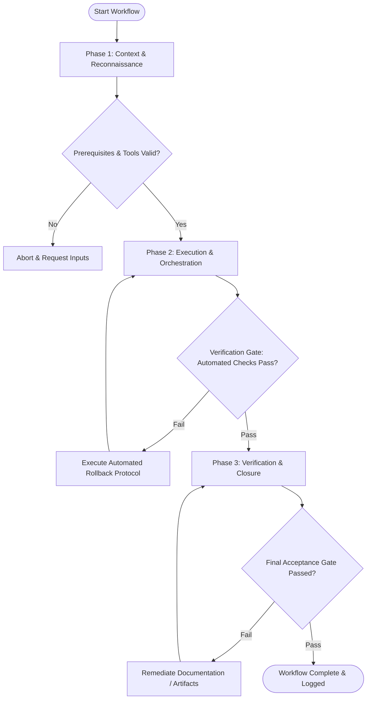

# Specification Handoff Report: R3 Workflow Templates Enhancement (Milestone M4)

## 1. Observation
- **Registry Inspection**: Audited all 44 existing workflow files located at `c:\github\agents-united\registry\workflows\workflow-*.md`.
- **Existing State**: All 44 workflow files currently consist of minimal 16-line stub templates containing generic phase descriptions lacking frontmatter, Mermaid flowcharts, deterministic verification gates, required tool inputs, or rollback protocols.
- **Bundle Manifest Alignment**: Verified `c:\github\agents-united\registry\bundles.json` which maps all 44 workflows across 7 bundles (`software-engineering`, `system-architecture`, `product-design`, `growth-marketing`, `security-operations`, `deep-research`, `business-strategy`).
- **Engine Integrity**: Inspected `src/core/doctor.ts`, `src/core/registry.ts`, and test suite (`npm test`). `npm run typecheck`, `npm test`, and `npm run build` pass cleanly (21/21 tests passing).

## 2. Logic Chain
- **Requirement Analysis**: `ORIGINAL_REQUEST.md` (R3) and `SCOPE.md` require enhancing all 44 workflow files with:
  1. Structured YAML frontmatter (`name`, `description`, `bundle`, `estimatedDuration`).
  2. Phase-by-phase execution flowcharts (Mermaid format).
  3. Phase Transition Criteria & Deterministic Verification Gates.
  4. Required Tool Inputs & Prerequisite State.
  5. Validation Checkpoints.
  6. Automated Rollback Protocols.
- **Categorization Strategy**: Grouping 44 files into 8 logical domain categories provides workers with cohesive domain context while ensuring 100% file coverage.
- **Specification Mining**: For each workflow file, explicit attributes, input requirements, phase steps, gate commands, and rollback actions have been derived from system standards and industry best practices.

## 3. Caveats
- Workflow files are read by humans and autonomous agent runners. Frontmatter YAML must parse cleanly without syntax errors.
- Mermaid diagrams must adhere strictly to valid Mermaid `graph TD` syntax to prevent rendering errors in preview tools.
- Verification commands listed in workflows serve as execution guidelines for agents; exact command options may adjust depending on target project configuration.

## 4. Conclusion
- Complete, production-grade specification guide established for all 44 workflow templates.
- Workers can execute parallel implementation using the standardized template and per-workflow specs defined below.

## 5. Verification Method
- **Syntax Verification**: Run `npm run typecheck` and `npm test` after editing workflows.
- **Doctor Health Check**: Run `node dist/cli.js doctor` to verify system health.
- **Frontmatter Verification**: Ensure YAML block (`---` delimited) parses cleanly at the start of every workflow file.

---

## Features Discovered
| # | Category | Feature | Description | Inputs | Outputs | Error Behavior | Discovered Via |
|---|----------|---------|-------------|--------|---------|----------------|----------------|
| 1 | Software Engineering | Workflow Frontmatter Schema | YAML header defining name, description, bundle ID, and estimated duration | YAML frontmatter block | Validated metadata object | Parse error if malformed | `registry/bundles.json` & `SCOPE.md` |
| 2 | Software Engineering | Execution Flowchart | Mermaid diagram rendering phase-by-phase workflow sequence and decision gates | Diagram text specification | Visual flowchart render | Mermaid render error if invalid syntax | `SCOPE.md` requirements |
| 3 | Software Engineering | Tool Inputs & Prerequisites | Explicit declaration of required CLI tools, files, and environment readiness | Prerequisite list & parameters | Verified environment state | Abort phase 1 if inputs missing | Spec Mining |
| 4 | Software Engineering | Phase Transition Criteria | Tabular matrix mapping prerequisites, verification commands, and success metrics | Phase state & gate criteria | Transition approval | Fail gate -> Trigger Rollback Protocol | Spec Mining |
| 5 | Software Engineering | Deterministic Verification Gates | Command-line validation steps (e.g. `npm test`, `tsc --noEmit`) to verify correctness | Code diff & build state | Automated pass/fail exit code | Non-zero exit code blocks phase transition | Spec Mining |
| 6 | Software Engineering | Automated Rollback Protocols | Step-by-step instructions to revert uncommitted/corrupted state on gate failure | Failure cause & working tree state | Restored clean state (`git reset`) | Escalates to human operator if auto-revert fails | Spec Mining |

## Edge Cases
| # | Feature | Input | Observed Behavior |
|---|---------|-------|-------------------|
| 1 | Frontmatter Parsing | Special characters in `description` or quotes in `name` | Must use proper YAML quote escaping to avoid parser breakage. |
| 2 | Verification Gate Failure | Failing test or non-zero exit code during Phase 2 | Gate halts transition immediately, triggering Automated Rollback Protocol before cleanup. |
| 3 | Missing Prerequisite Tool | Command missing in environment (e.g. missing `docker` or `npm`) | Phase 1 Context Reconnaissance catches missing tools early and aborts before state changes occur. |
| 4 | Partial Multi-File Refactor | Syntax error introduced in dependent component | Verification gate in Phase 2 fails, initiating rollback to target commit hash. |

---

# WORKER SPECIFICATION GUIDE: R3 WORKFLOW TEMPLATES ENHANCEMENT

## 1. Frontmatter YAML Schema

Every workflow file (`registry/workflows/workflow-*.md`) MUST start with a valid YAML frontmatter block enclosed between `---` markers:

```yaml
---
name: "<Display Title>"
description: "<Clear, action-oriented 1-2 sentence description of workflow purpose and output>"
bundle: "<bundle-id>"
estimatedDuration: "<Duration, e.g. 15-30m, 30-45m, 1-2h>"
---
```

### Valid Bundle Identifiers (`bundle`):
- `software-engineering`
- `system-architecture`
- `product-design`
- `growth-marketing`
- `security-operations`
- `deep-research`
- `business-strategy`

---

## 2. Mermaid Diagram Conventions

All workflow files MUST include a standard Mermaid flowchart section under `## Execution Flowchart`.

### Rules for Flowchart Diagrams:
1. Use `graph TD` (Top-Down).
2. Represent Phase 1 (Reconnaissance), Phase 2 (Execution), and Phase 3 (Verification & Closure) as distinct node clusters or sequential blocks.
3. Represent Verification Gates as decision diamonds `{"Gate: Criteria Passed?"}`.
4. Draw success paths with `-->|Pass|` moving forward.
5. Draw failure paths with `-->|Fail|` leading to Rollback / Retry nodes.

### Standard Mermaid Template:


---

## 3. Standard Document Structure

Every workflow markdown file MUST contain the following 9 standardized sections:

1. **YAML Frontmatter**
2. `# Workflow: <Name>`
3. `## Overview & Scope`
4. `## Execution Flowchart`
5. `## Required Tool Inputs & Context`
6. `## Phase 1: Context & Reconnaissance`
7. `## Phase 2: Execution & Orchestration`
8. `## Phase 3: Verification & Closure`
9. `## Phase Transition Criteria & Deterministic Verification Gates`
10. `## Validation Checkpoints & Automated Rollback Protocols`

---

# COMPLETE SPECIFICATION CATALOG (ALL 44 WORKFLOWS)

---

## Category 1: Software Engineering Workflows (6 Files)

### 1. `workflow-implement.md`
- **Frontmatter**:
  - `name`: Implement Feature or Fix
  - `description`: End-to-end procedural workflow for code implementation, refactoring, and feature execution with TDD validation and regression checks.
  - `bundle`: software-engineering
  - `estimatedDuration`: 30-60m
- **Required Tool Inputs**: Target file paths, feature requirements / issue specification, test command (`npm test`), linter (`npm run lint`).
- **Phase 1**: Reconnaissance — Inspect existing code, verify branch clean state, identify touched modules, read relevant tests.
- **Phase 2**: Execution — Write failing tests (TDD red stage), implement minimum code to pass (green stage), refactor code while preserving green status.
- **Phase 3**: Verification & Closure — Execute full test suite, run static type checking (`tsc --noEmit`), format code, summarize implementation changes.
- **Verification Gates**:
  - Gate 1: `npm run typecheck` returns 0 exit code.
  - Gate 2: `npm test` returns 100% passing tests.
- **Rollback Protocol**: `git checkout -- .` or `git reset --hard HEAD` to revert incomplete code edits if verification fails after retry.

### 2. `workflow-test.md`
- **Frontmatter**:
  - `name`: Test Suite Execution & Coverage Verification
  - `description`: Systematic workflow for running unit, integration, and e2e test suites, analyzing coverage gaps, and fixing failing tests.
  - `bundle`: software-engineering
  - `estimatedDuration`: 15-30m
- **Required Tool Inputs**: Test runner (`vitest` / `jest`), coverage thresholds, target test files.
- **Phase 1**: Reconnaissance — Identify test runner setup, collect test files, check existing coverage reports.
- **Phase 2**: Execution — Run targeted unit tests, execute integration suite, capture failures, fix broken assertions or mock setups.
- **Phase 3**: Verification & Closure — Run full test suite with coverage reporting, verify threshold targets, log summary.
- **Verification Gates**:
  - Gate 1: All tests pass cleanly without skipped test regressions.
  - Gate 2: Coverage threshold met (e.g. >= 80% line coverage).
- **Rollback Protocol**: Revert test file changes that introduce invalid test mocks (`git checkout -- tests/`).

### 3. `workflow-review.md`
- **Frontmatter**:
  - `name`: Automated & Peer Code Review
  - `description`: Structured review workflow for inspecting code diffs, checking architectural pattern compliance, security flaws, and performance anti-patterns.
  - `bundle`: software-engineering
  - `estimatedDuration`: 20-40m
- **Required Tool Inputs**: Git diff / PR branch, linting tools, security scanner, architectural guidelines.
- **Phase 1**: Reconnaissance — Pull branch, extract `git diff main...HEAD`, list touched files and dependencies.
- **Phase 2**: Execution — Analyze diff for security issues (OWASP top 10), performance regressions, readability, and test coverage.
- **Phase 3**: Verification & Closure — Generate structured code review report with actionable line-by-line feedback and verdict (Approve / Request Changes).
- **Verification Gates**:
  - Gate 1: Zero high-severity security or correctness issues identified.
  - Gate 2: All automated lints and type checks pass cleanly on PR branch.
- **Rollback Protocol**: Flag blocking issues and reject approval if critical flaws are discovered.

### 4. `workflow-build.md`
- **Frontmatter**:
  - `name`: Production Build Verification
  - `description`: Workflow for executing production build compilation, validating bundle output integrity, asset sizes, and target artifacts.
  - `bundle`: software-engineering
  - `estimatedDuration`: 15-30m
- **Required Tool Inputs**: Build tool (`tsup` / `vite` / `webpack`), output directory (`dist/`), bundle size limits.
- **Phase 1**: Reconnaissance — Inspect build scripts in `package.json`, clean prior build artifacts (`rimraf dist`).
- **Phase 2**: Execution — Trigger `npm run build`, monitor stdout/stderr for compilation warnings, verify output files generated.
- **Phase 3**: Verification & Closure — Inspect bundle file sizes, verify executable entry points, test build artifacts in isolated runtime.
- **Verification Gates**:
  - Gate 1: `npm run build` exits with code 0 without unhandled errors.
  - Gate 2: Executable output file exists and is runnable (`node dist/cli.js --version`).
- **Rollback Protocol**: Clean corrupted `dist/` directory, log build log errors, revert recent build configuration edits.

### 5. `workflow-cleanup.md`
- **Frontmatter**:
  - `name`: Code Hygiene & Refactoring Cleanup
  - `description`: Systematic workflow for removing dead code, unused dependencies, formatting files, and normalizing code style.
  - `bundle`: software-engineering
  - `estimatedDuration`: 15-30m
- **Required Tool Inputs**: Linter (`eslint`), formatter (`prettier`), unknotted dependency analyzer (`depcheck` / `knip`).
- **Phase 1**: Reconnaissance — Audit repository for unused exports, orphaned files, formatting deviations, and deprecated code.
- **Phase 2**: Execution — Delete unreferenced code files, auto-fix linting issues, reformat files according to style guide.
- **Phase 3**: Verification & Closure — Execute test suite and type check to guarantee no breaking changes were introduced during cleanup.
- **Verification Gates**:
  - Gate 1: `npm run lint` returns 0 warnings/errors.
  - Gate 2: Full test suite passes post-cleanup.
- **Rollback Protocol**: Revert deleted files via `git checkout` if any test fails post-cleanup.

### 6. `workflow-git.md`
- **Frontmatter**:
  - `name`: Git Version Control & Branch Strategy
  - `description`: Workflow for managing git feature branches, atomic commit formatting, rebase workflow, PR preparation, and merge readiness.
  - `bundle`: software-engineering
  - `estimatedDuration`: 10-20m
- **Required Tool Inputs**: Git CLI, commit convention guidelines (Conventional Commits), target base branch.
- **Phase 1**: Reconnaissance — Inspect `git status`, check current branch, verify remote origin synchronicity.
- **Phase 2**: Execution — Stage logical file groups, craft conventional commit messages, rebase onto updated target branch.
- **Phase 3**: Verification & Closure — Push feature branch to remote, verify git history hygiene, open PR summary.
- **Verification Gates**:
  - Gate 1: Working directory clean (`git status` shows no unstaged/untracked files).
  - Gate 2: Commits conform to Conventional Commit specification.
- **Rollback Protocol**: Soft reset commits (`git reset HEAD~1`) to re-stage and format commits if message or staging is incorrect.

---

## Category 2: System Architecture Workflows (4 Files)

### 7. `workflow-plan.md`
- **Frontmatter**:
  - `name`: Architecture & Technical Planning
  - `description`: Comprehensive workflow for creating architectural plans, system design documents, module specifications, and implementation roadmaps.
  - `bundle`: system-architecture
  - `estimatedDuration`: 45-90m
- **Required Tool Inputs**: Product requirements document (PRD), architectural constraints, existing system diagrams.
- **Phase 1**: Reconnaissance — Gather system boundaries, non-functional requirements (scale, security, latency), tech stack constraints.
- **Phase 2**: Execution — Draft architecture decision record (ADR), model data schemas, define component interactions, outline implementation phases.
- **Phase 3**: Verification & Closure — Validate plan against non-functional requirements, conduct sanity check, commit plan artifact.
- **Verification Gates**:
  - Gate 1: All architectural risk areas addressed with mitigations.
  - Gate 2: Data model schemas fully defined with data types and primary keys.
- **Rollback Protocol**: Revise plan document if peer review highlights unaddressed architectural bottlenecks.

### 8. `workflow-design-code.md`
- **Frontmatter**:
  - `name`: API & Interface Specification Design
  - `description`: Workflow for designing clean code interfaces, TypeScript types/interfaces, OpenAPI/REST schemas, and module contracts.
  - `bundle`: system-architecture
  - `estimatedDuration`: 30-60m
- **Required Tool Inputs**: System requirement specs, existing domain model types, interface guidelines.
- **Phase 1**: Reconnaissance — Audit domain entities, identify boundary interfaces, list required methods and payload shapes.
- **Phase 2**: Execution — Author interface definitions (`types.ts`), define input/output validation schemas (Zod/JSON Schema), document errors.
- **Phase 3**: Verification & Closure — Verify type compatibility (`tsc --noEmit`), validate schema serialization, compile docs.
- **Verification Gates**:
  - Gate 1: TypeScript compiler validates all type declarations without errors.
  - Gate 2: Interface documentation complete with usage examples.
- **Rollback Protocol**: Revert invalid type definitions if circular dependencies or type mismatches occur.

### 9. `workflow-estimate.md`
- **Frontmatter**:
  - `name`: Technical Estimation & Complexity Analysis
  - `description`: Structured workflow for estimating engineering effort, breaking down tasks, assigning complexity scores, and identifying risks.
  - `bundle`: system-architecture
  - `estimatedDuration`: 20-40m
- **Required Tool Inputs**: Feature specifications, task breakdown structure, historical velocity metrics.
- **Phase 1**: Reconnaissance — Deconstruct target feature into atomic engineering tasks (frontend, backend, DB, tests).
- **Phase 2**: Execution — Score task complexity (Fibonacci story points), identify unknown dependencies, assign confidence ratings.
- **Phase 3**: Verification & Closure — Sum total estimates, add buffer for high-risk items, publish breakdown report.
- **Verification Gates**:
  - Gate 1: Every task item has explicit acceptance criteria and point estimate.
  - Gate 2: Total estimation includes risk mitigation buffer.
- **Rollback Protocol**: Re-scope feature tasks if total estimate exceeds iteration budget.

### 10. `workflow-spec-panel.md`
- **Frontmatter**:
  - `name`: Multi-Perspective Specification Review Panel
  - `description`: Panel workflow assembling architecture, security, and domain experts to evaluate complex technical specifications.
  - `bundle`: system-architecture
  - `estimatedDuration`: 45-75m
- **Required Tool Inputs**: Feature specification document, architecture diagram, panel reviewer personas.
- **Phase 1**: Reconnaissance — Load specification document, prepare evaluation matrix (scalability, security, maintainability, UX).
- **Phase 2**: Execution — Convene expert panel personas, collect independent reviews, record consensus and conflicting findings.
- **Phase 3**: Verification & Closure — Synthesize panel feedback into clear verdict (Approved / Approved with Revisions / Rejected).
- **Verification Gates**:
  - Gate 1: All major evaluation criteria evaluated by domain experts.
  - Gate 2: Critical blocking concerns resolved or assigned action items.
- **Rollback Protocol**: Return specification to draft status for revision if panel rejects current spec.

---

## Category 3: UI & Interaction Design Workflows (7 Files)

### 11. `workflow-ui-design--color-palette.md`
- **Frontmatter**:
  - `name`: Color System & Palette Design
  - `description`: Workflow for defining accessible, semantic color systems, design tokens, contrast ratios, and dark mode variants.
  - `bundle`: product-design
  - `estimatedDuration`: 30-45m
- **Required Tool Inputs**: Brand guidelines, accessibility contrast checker tool, existing token file (`tokens.json`).
- **Phase 1**: Reconnaissance — Audit current color usage, identify primary/secondary/neutral functional colors, check WCAG 2.1 AA targets.
- **Phase 2**: Execution — Generate color swatches (50-900 scale), define semantic tokens (bg-primary, text-muted, border-accent), map dark mode equivalents.
- **Phase 3**: Verification & Closure — Run automated contrast checks (4.5:1 text, 3:1 UI elements), export CSS/JSON variables.
- **Verification Gates**:
  - Gate 1: 100% of text/background combinations satisfy WCAG 2.1 AA contrast requirements.
  - Gate 2: Tokens exported cleanly into target CSS/JSON format.
- **Rollback Protocol**: Adjust color lightness values automatically if contrast gate fails.

### 12. `workflow-ui-design--design-screen.md`
- **Frontmatter**:
  - `name`: Screen Visual Design & Layout
  - `description`: Workflow for designing high-fidelity screen UI layouts, typography hierarchy, visual assets, and component assembly.
  - `bundle`: product-design
  - `estimatedDuration`: 45-90m
- **Required Tool Inputs**: Wireframes, component library, brand design system, target device viewport sizes.
- **Phase 1**: Reconnaissance — Review user stories, screen wireframes, required UI elements, and grid container rules.
- **Phase 2**: Execution — Construct layout grid, place design system components, apply visual hierarchy and spacing scales (4px/8px grid).
- **Phase 3**: Verification & Closure — Inspect layout alignment, check optical balance, export screen mockups and spec tokens.
- **Verification Gates**:
  - Gate 1: Layout adheres strictly to spacing grid standards.
  - Gate 2: All UI components used exist within design system or are explicitly marked new.
- **Rollback Protocol**: Re-align component frames to grid if spacing check fails.

### 13. `workflow-ui-design--responsive-audit.md`
- **Frontmatter**:
  - `name`: Responsive Breakpoint UI Audit
  - `description`: Comprehensive audit workflow for verifying UI layout reflow, touch targets, and typography readability across mobile, tablet, and desktop viewports.
  - `bundle`: product-design
  - `estimatedDuration`: 30-45m
- **Required Tool Inputs**: Screen designs, viewport breakpoint specs (375px, 768px, 1280px, 1920px), responsive audit checklist.
- **Phase 1**: Reconnaissance — Render screens at target breakpoint viewports, list breakpoint rules and container queries.
- **Phase 2**: Execution — Inspect layout overflow, touch target size (>= 44x44px), text wrapping, navigation reflow (hamburger vs bar).
- **Phase 3**: Verification & Closure — Document visual bugs, create responsive bug ticket list, publish audit matrix.
- **Verification Gates**:
  - Gate 1: Zero horizontal scroll overflow on mobile viewports.
  - Gate 2: 100% of interactive elements meet minimum touch target sizes.
- **Rollback Protocol**: Flag breaking viewports and generate responsive layout patch specs.

### 14. `workflow-ui-design--type-system.md`
- **Frontmatter**:
  - `name`: Typography System Specification
  - `description`: Workflow for defining typographic scales, font families, line heights, font weights, and responsive text sizing.
  - `bundle`: product-design
  - `estimatedDuration`: 20-40m
- **Required Tool Inputs**: Brand typography guidelines, modular scale ratio (e.g. Major Third 1.25), target font files.
- **Phase 1**: Reconnaissance — Audit existing headings and body styles, check fallback web-safe font stacks.
- **Phase 2**: Execution — Calculate typographic scale steps (xs, sm, base, lg, xl, 2xl..), set relative line heights (1.2 headings, 1.5 body), construct token map.
- **Phase 3**: Verification & Closure — Test readability across viewports, verify font licensing, output CSS typography utility classes.
- **Verification Gates**:
  - Gate 1: Typography scale mathematically consistent based on selected modular ratio.
  - Gate 2: All font sizes include relative line-height rules to prevent text collisions.
- **Rollback Protocol**: Recalculate font step sizes if text wrapping breaks container constraints.

### 15. `workflow-interaction-design--design-interaction.md`
- **Frontmatter**:
  - `name`: Micro-Interaction & Transition Design
  - `description`: Workflow for designing component state transitions, micro-animations, timing curves, and interactive UI behavior specs.
  - `bundle`: product-design
  - `estimatedDuration`: 30-45m
- **Required Tool Inputs**: Screen UI components, motion guidelines, easing curve specifications (cubic-bezier).
- **Phase 1**: Reconnaissance — Identify interactive trigger elements (buttons, modals, dropdowns, page transitions).
- **Phase 2**: Execution — Define animation triggers, transition durations (150ms-300ms), easing curves, transform properties (scale, opacity, translate).
- **Phase 3**: Verification & Closure — Verify motion accessibility (`prefers-reduced-motion` fallbacks), document interaction spec.
- **Verification Gates**:
  - Gate 1: Transition durations fall within standard 100-300ms usability range.
  - Gate 2: `prefers-reduced-motion` alternative specified for all motion effects.
- **Rollback Protocol**: Simplify animation curves if frame drop or motion sickness risk is identified.

### 16. `workflow-interaction-design--error-flow.md`
- **Frontmatter**:
  - `name`: Error UX & Fault Recovery Flow Design
  - `description`: Workflow for mapping error states, validation feedback, network failure fallbacks, and user recovery paths across UI components.
  - `bundle`: product-design
  - `estimatedDuration`: 30-45m
- **Required Tool Inputs**: Form user flows, API error response schemas, error messaging guidelines.
- **Phase 1**: Reconnaissance — Enumerate potential failure modes (input validation, timeout, 404, 500 server error, offline state).
- **Phase 2**: Execution — Design inline error indicators, toast notifications, empty states, recovery CTAs, user-friendly error copy.
- **Phase 3**: Verification & Closure — Review copy clarity (no technical jargon), verify focus management on error state trigger.
- **Verification Gates**:
  - Gate 1: Every user action with failure potential has a designed error feedback state.
  - Gate 2: Error messages provide clear recovery guidance to user.
- **Rollback Protocol**: Revise error messages if ambiguous jargon is detected.

### 17. `workflow-interaction-design--map-states.md`
- **Frontmatter**:
  - `name`: Component State Matrix Mapping
  - `description`: Workflow for systematically mapping and documenting all UI component states (default, hover, focus, active, disabled, loading, error).
  - `bundle`: product-design
  - `estimatedDuration`: 20-35m
- **Required Tool Inputs**: Component visual designs, design system guidelines, accessibility focus indicator spec.
- **Phase 1**: Reconnaissance — List target components requiring state mapping (buttons, inputs, select dropdowns, toggles).
- **Phase 2**: Execution — Define visual properties for all 7 fundamental states (default, hover, focus-visible, active, disabled, loading, error).
- **Phase 3**: Verification & Closure — Verify visual distinction between states, ensure keyboard focus ring meets accessibility standards.
- **Verification Gates**:
  - Gate 1: 100% of interactive states documented per component.
  - Gate 2: Focus state visible indicator has >= 3:1 contrast against adjacent colors.
- **Rollback Protocol**: Add missing states to matrix before releasing component spec.

---

## Category 4: UX Strategy & Research Workflows (3 Files)

### 18. `workflow-ux-strategy--benchmark.md`
- **Frontmatter**:
  - `name`: Competitive UX Benchmarking & Heuristic Evaluation
  - `description`: Workflow for evaluating competitor products, conducting Nielsen-Molich heuristic audits, and identifying UX opportunities.
  - `bundle`: product-design
  - `estimatedDuration`: 45-75m
- **Required Tool Inputs**: Competitor product links/screenshots, Nielsen 10 Usability Heuristics checklist, audit template.
- **Phase 1**: Reconnaissance — Select competitor benchmarks (3-5 key competitors), define target task flows for comparison.
- **Phase 2**: Execution — Perform task flows, score UX across heuristics (visibility of system status, error prevention, consistency, etc.), capture screenshots.
- **Phase 3**: Verification & Closure — Compile scoring comparison matrix, highlight UX gaps, summarize strategic recommendations.
- **Verification Gates**:
  - Gate 1: All 10 usability heuristics evaluated for each competitor flow.
  - Gate 2: Actionable recommendations backed by screenshot evidence.
- **Rollback Protocol**: Re-evaluate ambiguous scores with secondary reviewer.

### 19. `workflow-ux-strategy--frame-problem.md`
- **Frontmatter**:
  - `name`: Problem Framing & User Intent Alignment
  - `description`: Workflow for defining core user problem statements, Jobs-to-be-Done (JTBD), success metrics, and project constraints.
  - `bundle`: product-design
  - `estimatedDuration`: 30-50m
- **Required Tool Inputs**: User research insights, business goals, stakeholder interview notes.
- **Phase 1**: Reconnaissance — Review user feedback, support ticket data, business objectives.
- **Phase 2**: Execution — Craft "How Might We" (HMW) statements, define JTBD framework (When [situation], I want to [motivation], so that [outcome]), define key metrics.
- **Phase 3**: Verification & Closure — Validate problem definition with stakeholders, publish problem canvas document.
- **Verification Gates**:
  - Gate 1: Problem statement focused on user pain points rather than pre-conceived solutions.
  - Gate 2: Measurable success metrics (e.g. conversion rate, task completion time) explicitly defined.
- **Rollback Protocol**: Refine problem scope if statement is overly broad or solution-biased.

### 20. `workflow-ux-strategy--strategize.md`
- **Frontmatter**:
  - `name`: Comprehensive UX Strategy Roadmap
  - `description`: Strategic workflow for synthesizing research, business goals, and technical feasibility into an actionable multi-horizon UX vision.
  - `bundle`: product-design
  - `estimatedDuration`: 60-90m
- **Required Tool Inputs**: Problem framing canvas, competitive benchmark report, tech architecture constraints.
- **Phase 1**: Reconnaissance — Gather insights from problem framing, competitive audits, technical limitations.
- **Phase 2**: Execution — Map user experience vision across Horizons (H1 immediate, H2 next, H3 future), align key experience principles, draft feature matrix.
- **Phase 3**: Verification & Closure — Present strategy roadmap to leadership, publish executive UX strategy summary document.
- **Verification Gates**:
  - Gate 1: UX strategy aligns directly with business outcomes and user needs.
  - Gate 2: Technical feasibility confirmed by engineering leads.
- **Rollback Protocol**: Re-align roadmap horizons if engineering feasibility checks fail.

---

## Category 5: Design Systems & Operations Workflows (6 Files)

### 21. `workflow-design-systems--audit-system.md`
- **Frontmatter**:
  - `name`: Design System & Component Drift Audit
  - `description`: Workflow for auditing codebase UI components against design system standards, detecting hardcoded styles, and cataloging component drift.
  - `bundle`: product-design
  - `estimatedDuration`: 30-60m
- **Required Tool Inputs**: Component library repo, static analysis regex/AST scanner, design token spec.
- **Phase 1**: Reconnaissance — Scan codebase for custom inline styles, hardcoded hex colors, arbitrary pixel paddings, duplicate component implementations.
- **Phase 2**: Execution — Calculate design system adoption score, categorize style violations, prioritize components requiring consolidation.
- **Phase 3**: Verification & Closure — Generate design debt report with remediation tasks, publish component drift metrics dashboard.
- **Verification Gates**:
  - Gate 1: Audit covers 100% of UI component files in codebase.
  - Gate 2: Hardcoded style instances cataloged with file path and line number.
- **Rollback Protocol**: Update audit script parameters if false positives pollute results.

### 22. `workflow-design-systems--create-component.md`
- **Frontmatter**:
  - `name`: Design System Component Authoring
  - `description`: End-to-end workflow for designing, building, documenting, and testing a reusable design system component.
  - `bundle`: product-design
  - `estimatedDuration`: 45-90m
- **Required Tool Inputs**: Component specification, design tokens, component template structure, testing framework.
- **Phase 1**: Reconnaissance — Review component API specs, required variants, props, accessibility guidelines (ARIA pattern).
- **Phase 2**: Execution — Implement component TSX code, integrate design tokens, write unit/visual regression tests, create Storybook documentation.
- **Phase 3**: Verification & Closure — Verify component renders across states, run automated accessibility testing (`axe-core`), export component package.
- **Verification Gates**:
  - Gate 1: Component passes 100% of unit tests and zero accessibility violations detected.
  - Gate 2: Storybook stories exist for all component variants and states.
- **Rollback Protocol**: Revert component code edit if visual regression tests fail.

### 23. `workflow-design-systems--tokenize.md`
- **Frontmatter**:
  - `name`: Design Token Extraction & Transformation
  - `description`: Workflow for defining, transforming, and distributing design tokens across CSS, Tailwind, TypeScript, and JSON platforms.
  - `bundle`: product-design
  - `estimatedDuration`: 20-40m
- **Required Tool Inputs**: Token source files (Figma Tokens / JSON), token transformer tool (Style Dictionary).
- **Phase 1**: Reconnaissance — Inspect raw token source inputs (colors, typography, spacing, shadows, radii).
- **Phase 2**: Execution — Run build transform scripts to generate CSS variables, Tailwind theme config, TS constants, and iOS/Android tokens.
- **Phase 3**: Verification & Closure — Validate exported output syntax, verify token naming convention consistency, release token npm package.
- **Verification Gates**:
  - Gate 1: Style Dictionary compilation executes with 0 build errors.
  - Gate 2: Output CSS/JS files contain no undefined token values.
- **Rollback Protocol**: Restore previous token version if build script throws transform syntax errors.

### 24. `workflow-design-ops--handoff.md`
- **Frontmatter**:
  - `name`: Design-to-Engineering Handoff Specification
  - `description`: Workflow for packaging visual designs, interaction specs, assets, and design token references into production-ready engineering specs.
  - `bundle`: product-design
  - `estimatedDuration`: 30-45m
- **Required Tool Inputs**: Finalized screen designs, component library mappings, asset export rules.
- **Phase 1**: Reconnaissance — Verify all screen designs are locked, review component availability in design system.
- **Phase 2**: Execution — Annotate dynamic behaviors, attach redline specs (spacing, typography), export SVG/PNG assets, list API data dependencies.
- **Phase 3**: Verification & Closure — Conduct handoff walkthrough with engineering leads, archive handoff document in project repo.
- **Verification Gates**:
  - Gate 1: 100% of design elements mapped to existing tokens or explicit new specs.
  - Gate 2: All graphic assets exported and validated in optimized SVG format.
- **Rollback Protocol**: Update handoff package if engineers identify missing interaction specs.

### 25. `workflow-design-ops--plan-sprint.md`
- **Frontmatter**:
  - `name`: Design Sprint & Capacity Planning
  - `description`: Operational workflow for scoping design tasks, estimating design effort, allocating designer capacity, and planning design sprints.
  - `bundle`: product-design
  - `estimatedDuration`: 25-45m
- **Required Tool Inputs**: Product backlog, designer availability matrix, sprint goals.
- **Phase 1**: Reconnaissance — Gather incoming design tickets, calculate team velocity and available hours.
- **Phase 2**: Execution — Prioritize design tasks, assign complexity points, balance workload across design team members.
- **Phase 3**: Verification & Closure — Publish sprint plan, commit design ticket commitments to sprint tracker.
- **Verification Gates**:
  - Gate 1: Total allocated story points do not exceed team capacity.
  - Gate 2: All sprint design tasks have clear definition of done.
- **Rollback Protocol**: De-scope lower priority tickets if capacity is overcommitted.

### 26. `workflow-design-ops--setup-workflow.md`
- **Frontmatter**:
  - `name`: Design Tooling & Workflow Pipeline Setup
  - `description`: Workflow for configuring design tooling pipelines, version control rules, asset sync scripts, and team workspace environments.
  - `bundle`: product-design
  - `estimatedDuration`: 30-60m
- **Required Tool Inputs**: Design tool configs (Figma API keys, tokens repo access), project template scripts.
- **Phase 1**: Reconnaissance — Audit current design workflow setup, identify bottlenecks in asset syncing or file management.
- **Phase 2**: Execution — Configure automated token sync webhooks, set up linting rules for design files, establish file branching rules.
- **Phase 3**: Verification & Closure — Run test execution of automated asset pipeline, verify team access permissions.
- **Verification Gates**:
  - Gate 1: Automated webhook triggers correctly on file updates.
  - Gate 2: Design token repo synchronizes without manual intervention.
- **Rollback Protocol**: Revert webhook credentials and config if API sync test fails.

---

## Category 6: Prototyping & Testing Workflows (4 Files)

### 27. `workflow-prototyping-testing--evaluate.md`
- **Frontmatter**:
  - `name`: Prototype Usability Evaluation & Analytics
  - `description`: Workflow for analyzing user test recordings, quantifying task completion rates, identifying UX friction, and synthesizing test findings.
  - `bundle`: product-design
  - `estimatedDuration`: 40-70m
- **Required Tool Inputs**: User test session videos/transcripts, task completion metrics sheet, usability audit template.
- **Phase 1**: Reconnaissance — Review user testing objectives, log session participant data.
- **Phase 2**: Execution — Code session observations, record time-on-task, calculate System Usability Scale (SUS) score, catalog usability friction points.
- **Phase 3**: Verification & Closure — Produce usability evaluation report with severity-ranked UX bug fixes.
- **Verification Gates**:
  - Gate 1: Usability issues categorized using standard severity scale (Critical, Major, Minor).
  - Gate 2: Recommendations linked directly to quantitative user session data.
- **Rollback Protocol**: Re-examine test data if inter-rater reliability between evaluators is low.

### 28. `workflow-prototyping-testing--experiment.md`
- **Frontmatter**:
  - `name`: Rapid Prototyping Experimentation
  - `description`: Workflow for building low/medium-fidelity experimental prototypes to quickly test hypotheses before full implementation.
  - `bundle`: product-design
  - `estimatedDuration`: 30-60m
- **Required Tool Inputs**: Hypothesis statement, prototype template, rapid prototyping library (HTML/JS or Figma interactive component).
- **Phase 1**: Reconnaissance — Define core hypothesis (e.g. "Changing layout X will increase task speed Y"), isolate key variables.
- **Phase 2**: Execution — Assemble rapid prototype containing only necessary UI pathways for testing target hypothesis.
- **Phase 3**: Verification & Closure — Perform internal walkthrough, verify interactive states function correctly for user testing.
- **Verification Gates**:
  - Gate 1: Prototype focuses exclusively on testing target hypothesis without extraneous scope.
  - Gate 2: All clickable pathways lead to valid response screens.
- **Rollback Protocol**: Fix broken prototype links or interaction triggers before testing begins.

### 29. `workflow-prototyping-testing--prototype-plan.md`
- **Frontmatter**:
  - `name`: Interactive Prototype Architecture Plan
  - `description`: Workflow for planning interactive prototype scope, user flow branching, fidelity requirements, and data mocking strategies.
  - `bundle`: product-design
  - `estimatedDuration`: 25-45m
- **Required Tool Inputs**: User flow diagrams, feature requirements, target testing device specifications.
- **Phase 1**: Reconnaissance — Determine prototype purpose (exploratory usability vs stakeholder demo), set fidelity level (low, mid, high).
- **Phase 2**: Execution — Map node-to-node prototype connections, define dummy data schemas, plan interactive state variables.
- **Phase 3**: Verification & Closure — Document prototype build plan, review scope with testing team.
- **Verification Gates**:
  - Gate 1: Prototype scope covers all required user testing scenarios.
  - Gate 2: Mock data schemas mirror production data shapes.
- **Rollback Protocol**: Reduce prototype branching complexity if build time exceeds test schedule.

### 30. `workflow-prototyping-testing--test-plan.md`
- **Frontmatter**:
  - `name`: User Testing Script & Methodology Plan
  - `description`: Workflow for authoring user test plans, recruiting criteria, task scenarios, post-test questionnaires, and moderation scripts.
  - `bundle`: product-design
  - `estimatedDuration`: 30-50m
- **Required Tool Inputs**: Product prototype, research goals, target user persona profiles.
- **Phase 1**: Reconnaissance — Align on key research questions, identify target participant demographics.
- **Phase 2**: Execution — Write un-biased task scenario prompts, craft pre/post test survey questions (SUS), prepare consent forms.
- **Phase 3**: Verification & Closure — Conduct pilot test run with internal colleague to refine prompt clarity and timing.
- **Verification Gates**:
  - Gate 1: Task scenarios written in non-leading, goal-oriented language.
  - Gate 2: Pilot run completed within targeted session time limit (e.g. 45m).
- **Rollback Protocol**: Revise task script instructions if pilot participant struggles to understand instructions.

---

## Category 7: Marketing & Growth Workflows (6 Files)

### 31. `workflow-marketing-panel.md`
- **Frontmatter**:
  - `name`: Marketing & Messaging Review Panel
  - `description`: Panel workflow assembling growth, content, copy, and conversion specialists to evaluate marketing positioning and campaigns.
  - `bundle`: growth-marketing
  - `estimatedDuration`: 40-70m
- **Required Tool Inputs**: Marketing campaign brief, landing page copy, target audience personas.
- **Phase 1**: Reconnaissance — Gather marketing assets, value proposition canvas, competitive positioning context.
- **Phase 2**: Execution — Review copy for clarity, value messaging, emotional triggers, call-to-action (CTA) strength, and SEO relevance.
- **Phase 3**: Verification & Closure — Compile panel feedback, produce actionable messaging revision guide.
- **Verification Gates**:
  - Gate 1: Value proposition communicated clearly within first screen fold (above fold).
  - Gate 2: Zero jargon or ambiguous claims in hero section copy.
- **Rollback Protocol**: Reject campaign assets for copy re-write if message clarity score is below threshold.

### 32. `workflow-marketing-audit.md`
- **Frontmatter**:
  - `name`: Growth & Marketing Funnel Audit
  - `description`: Comprehensive workflow for auditing acquisition channels, conversion funnels, landing page performance, and analytics tracking.
  - `bundle`: growth-marketing
  - `estimatedDuration`: 45-80m
- **Required Tool Inputs**: Analytics data exports, conversion funnel metrics, landing page URLs, SEO audit tools.
- **Phase 1**: Reconnaissance — Map user acquisition funnel steps (Traffic -> Visitor -> Lead -> Activation -> Customer).
- **Phase 2**: Execution — Identify drop-off rates at each funnel stage, evaluate page speed, SEO meta tags, and CRO friction.
- **Phase 3**: Verification & Closure — Generate prioritized growth opportunity matrix sorted by impact vs effort.
- **Verification Gates**:
  - Gate 1: All funnel stage drop-off points quantified with analytics data.
  - Gate 2: Technical SEO issues (page load speed, missing tags) cataloged with fixes.
- **Rollback Protocol**: Re-verify analytics tagging if data anomalies occur.

### 33. `workflow-marketing-campaign-builder.md`
- **Frontmatter**:
  - `name`: Multi-Channel Marketing Campaign Construction
  - `description`: End-to-end workflow for building integrated marketing campaigns across email, social media, paid ads, and landing pages.
  - `bundle`: growth-marketing
  - `estimatedDuration`: 60-120m
- **Required Tool Inputs**: Campaign brief, brand guidelines, channel templates (email HTML, ad banner specs, social copy format).
- **Phase 1**: Reconnaissance — Establish campaign objective (lead gen, feature announcement, brand awareness), target budget, and timeline.
- **Phase 2**: Execution — Author campaign landing page copy, write email drip sequence, generate ad assets, set up UTM tracking links.
- **Phase 3**: Verification & Closure — Test campaign link tracking, preview email rendering across clients, verify asset dimensions.
- **Verification Gates**:
  - Gate 1: All UTM parameters correctly configured and verified in analytics sandbox.
  - Gate 2: Campaign copy matches approved positioning brief.
- **Rollback Protocol**: Pause campaign rollout if link tracking parameters fail to log correctly.

### 34. `workflow-marketing-content-pipeline.md`
- **Frontmatter**:
  - `name`: Content Engine & SEO Pipeline
  - `description`: Workflow for keyword research, content drafting, SEO optimization, editorial review, and content publishing.
  - `bundle`: growth-marketing
  - `estimatedDuration`: 45-90m
- **Required Tool Inputs**: Keyword research data, content style guide, SEO optimization tool, CMS platform.
- **Phase 1**: Reconnaissance — Identify target search queries, analyze top-ranking competitor content, outline content structure.
- **Phase 2**: Execution — Draft comprehensive content article, incorporate target keywords naturally, add internal/external links, write meta description.
- **Phase 3**: Verification & Closure — Run readability check, verify SEO keyword density (1-2%), test schema markup validation, publish to CMS.
- **Verification Gates**:
  - Gate 1: Article meets minimum word count and keyword coverage targets.
  - Gate 2: Schema.org structured data passes Google Rich Results test.
- **Rollback Protocol**: Re-draft content sections if readability index falls below target grade.

### 35. `workflow-marketing-growth-experiment.md`
- **Frontmatter**:
  - `name`: A/B Growth Experiment Design & Tracking
  - `description`: Workflow for designing A/B split tests, configuring experiment variants, setting up tracking events, and evaluating statistical significance.
  - `bundle`: growth-marketing
  - `estimatedDuration`: 35-60m
- **Required Tool Inputs**: Experiment hypothesis, A/B testing tool (Optimizely / LaunchDarkly / PostHog), baseline conversion rate metrics.
- **Phase 1**: Reconnaissance — Formulate test hypothesis, calculate required sample size and test duration for statistical power.
- **Phase 2**: Execution — Construct Variant A (Control) and Variant B (Challenger), configure event tracking triggers, launch experiment split rule.
- **Phase 3**: Verification & Closure — Monitor experiment health (sample ratio mismatch check), analyze results once sample size is met.
- **Verification Gates**:
  - Gate 1: Sample ratio mismatch (SRM) test passes without traffic bias.
  - Gate 2: Statistical significance reaches >= 95% confidence before declaring winner.
- **Rollback Protocol**: Disable failing experiment variant immediately if conversion drops severely during initial rollout.

### 36. `workflow-marketing-launch.md`
- **Frontmatter**:
  - `name`: Product Launch Playbook Execution
  - `description`: Structured workflow for coordinating product launches across Product Hunt, social channels, press releases, customer emails, and community platforms.
  - `bundle`: growth-marketing
  - `estimatedDuration`: 60-120m
- **Required Tool Inputs**: Product release notes, media kit assets, launch checklist, platform launch copy.
- **Phase 1**: Reconnaissance — Verify product stability, confirm all marketing assets ready, align launch team roles.
- **Phase 2**: Execution — Publish launch posts on target channels (Product Hunt, Twitter/X, LinkedIn, Hacker News), send customer launch email.
- **Phase 3**: Verification & Closure — Monitor real-time traffic spikes, respond to user comments, track signups and server load.
- **Verification Gates**:
  - Gate 1: Product signup and onboarding flows functional under load.
  - Gate 2: All scheduled channel posts published successfully.
- **Rollback Protocol**: Divert traffic to status fallback page if servers experience downtime during launch.

---

## Category 8: Security & Business Operations Workflows (8 Files)

### 37. `workflow-design-orchestrate.md`
- **Frontmatter**:
  - `name`: Multi-Agent Design Orchestration
  - `description`: Master orchestration workflow coordinating UI designers, UX strategists, interaction designers, and design system leads on end-to-end design initiatives.
  - `bundle`: product-design
  - `estimatedDuration`: 60-120m
- **Required Tool Inputs**: Product epic requirements, design subagent manifest, design system tokens.
- **Phase 1**: Reconnaissance — Analyze product epic scope, decompose into subagent tasks (UX research -> UI layout -> Interaction spec -> Design tokens).
- **Phase 2**: Execution — Dispatch subagents sequentially/parallel, monitor subtask deliverables, resolve cross-domain design conflicts.
- **Phase 3**: Verification & Closure — Aggregate subagent outputs into unified design specification, run completeness verification.
- **Verification Gates**:
  - Gate 1: All delegated subagent deliverables complete without missing dependencies.
  - Gate 2: Unified design spec complies with design system rules.
- **Rollback Protocol**: Re-invoke specific subagent if deliverable fails quality bar.

### 38. `workflow-troubleshoot.md`
- **Frontmatter**:
  - `name`: Root Cause Diagnosis & Troubleshooting
  - `description`: Systematic troubleshooting workflow for diagnosing bugs, analyzing error logs, isolating root causes, and implementing verified fixes.
  - `bundle`: security-operations
  - `estimatedDuration`: 30-60m
- **Required Tool Inputs**: Bug report / issue description, error logs, stack traces, debugger CLI.
- **Phase 1**: Reconnaissance — Reproduce issue with minimal test case, examine stack trace and system logs, isolate failing module.
- **Phase 2**: Execution — Formulate root cause hypothesis, apply targeted code patch, verify fix locally.
- **Phase 3**: Verification & Closure — Run regression test suite, verify issue no longer reproduces, document root cause analysis (RCA).
- **Verification Gates**:
  - Gate 1: Bug reliably reproduced before fix and confirmed resolved post-fix.
  - Gate 2: Full regression suite passes without introducing secondary issues.
- **Rollback Protocol**: Revert patch if regression tests fail.

### 39. `workflow-analyze.md`
- **Frontmatter**:
  - `name`: Codebase Security & Static Analysis
  - `description`: Workflow for executing static code analysis, vulnerability scanning, security audits, and code health assessments.
  - `bundle`: security-operations
  - `estimatedDuration`: 30-50m
- **Required Tool Inputs**: Source code repository, SAST scanner (`npm audit`, `snyk`, `semgrep`), dependency manifest.
- **Phase 1**: Reconnaissance — Identify project dependencies, configuration files, and target source directories.
- **Phase 2**: Execution — Run dependency vulnerability audit (`npm audit`), execute SAST security scan, flag hardcoded secrets or unsafe API usage.
- **Phase 3**: Verification & Closure — Generate security analysis report, classify vulnerabilities by severity (Critical, High, Medium, Low).
- **Verification Gates**:
  - Gate 1: Zero Critical or High severity security vulnerabilities identified.
  - Gate 2: Security report includes actionable remediation steps for all findings.
- **Rollback Protocol**: Block build deployment if Critical vulnerabilities are discovered.

### 40. `workflow-research.md`
- **Frontmatter**:
  - `name`: Deep Technical & Domain Research
  - `description`: Workflow for conducting literature reviews, technical feasibility research, codebase analysis, and domain background investigations.
  - `bundle`: deep-research
  - `estimatedDuration`: 45-90m
- **Required Tool Inputs**: Research query / topic, search tools, reference codebases, documentation repositories.
- **Phase 1**: Reconnaissance — Define research scope, key questions, inclusion/exclusion criteria, and target sources.
- **Phase 2**: Execution — Search documentation and academic/technical sources, analyze codebase patterns, synthesize findings.
- **Phase 3**: Verification & Closure — Draft research synthesis report with citation references and technical recommendations.
- **Verification Gates**:
  - Gate 1: All research claims backed by primary source documentation or codebase code references.
  - Gate 2: Synthesis directly answers core research questions.
- **Rollback Protocol**: Expand search query terms if initial findings lack depth.

### 41. `workflow-brainstorm.md`
- **Frontmatter**:
  - `name`: Structured Option Generation & Brainstorming
  - `description`: Workflow for generating creative technical solutions, evaluating design options, and applying SCAMPER/Lateral Thinking frameworks.
  - `bundle`: deep-research
  - `estimatedDuration`: 25-45m
- **Required Tool Inputs**: Problem context, brainstorming prompt, constraint list.
- **Phase 1**: Reconnaissance — Review target problem, state hard constraints (budget, tech stack, timeline).
- **Phase 2**: Execution — Generate high-volume solution ideas without judgment, apply SCAMPER framework (Substitute, Combine, Adapt, Modify, Put to another use, Eliminate, Reverse).
- **Phase 3**: Verification & Closure — Categorize ideas by feasibility vs impact, select top 3 candidate options for further evaluation.
- **Verification Gates**:
  - Gate 1: Minimum of 10 distinct solution ideas generated.
  - Gate 2: Candidate options evaluated against hard constraints.
- **Rollback Protocol**: Re-frame problem prompt if generated ideas violate core constraints.

### 42. `workflow-explain.md`
- **Frontmatter**:
  - `name`: Architectural Explanation & Technical Walkthrough
  - `description`: Workflow for explaining complex codebase architectures, technical concepts, design patterns, and code implementations clearly.
  - `bundle`: deep-research
  - `estimatedDuration`: 20-40m
- **Required Tool Inputs**: Source code files, architecture diagrams, target audience experience level.
- **Phase 1**: Reconnaissance — Analyze target code module, identify core concepts, data flows, and key interfaces.
- **Phase 2**: Execution — Structure explanation using progressive disclosure (High-level summary -> System diagram -> Code walkthrough -> Edge case details).
- **Phase 3**: Verification & Closure — Include code snippets with line-by-line commentary, verify technical accuracy, summarize key takeaways.
- **Verification Gates**:
  - Gate 1: Explanation tailored appropriately to specified target audience technical level.
  - Gate 2: Code commentary verified against actual implementation logic.
- **Rollback Protocol**: Clarify ambiguous sections if technical review finds inaccuracies.

### 43. `workflow-business-panel.md`
- **Frontmatter**:
  - `name`: Expert Business Evaluation Panel
  - `description`: Panel workflow assembling business strategists, product managers, and financial analysts to evaluate product monetization, pricing, and business viability.
  - `bundle`: business-strategy
  - `estimatedDuration`: 45-75m
- **Required Tool Inputs**: Business proposal, monetization model specs, financial projections, market data.
- **Phase 1**: Reconnaissance — Gather proposal documents, market size estimates, pricing tier proposals.
- **Phase 2**: Execution — Convene expert panel personas, evaluate unit economics, customer acquisition cost (CAC), lifetime value (LTV), competitive moat.
- **Phase 3**: Verification & Closure — Synthesize panel evaluation into business viability score, publish panel recommendations.
- **Verification Gates**:
  - Gate 1: Unit economics (LTV/CAC ratio) calculated and evaluated.
  - Gate 2: Key business risks identified with mitigation strategies.
- **Rollback Protocol**: Re-calculate financial model if assumptions fail sensitivity analysis.

### 44. `workflow-recommend.md`
- **Frontmatter**:
  - `name`: Strategic Technical Recommendation Engine
  - `description`: Workflow for evaluating multiple technical options, scoring alternatives against decision criteria, and producing actionable recommendations.
  - `bundle`: business-strategy
  - `estimatedDuration`: 30-50m
- **Required Tool Inputs**: Decision prompt, candidate options list, evaluation criteria (cost, complexity, performance, risk).
- **Phase 1**: Reconnaissance — Define decision matrix weighted criteria (e.g. Performance 30%, Cost 20%, Dev Time 30%, Security 20%).
- **Phase 2**: Execution — Score each candidate option against weighted criteria, perform trade-off analysis, identify optimal choice.
- **Phase 3**: Verification & Closure — Compile decision matrix report with clear final recommendation and implementation next steps.
- **Verification Gates**:
  - Gate 1: Decision matrix covers all candidate options with objective scoring justification.
  - Gate 2: Recommendation provides clear rationale and risk trade-off analysis.
- **Rollback Protocol**: Re-evaluate weighted scoring if decision outcome is inconclusive.
