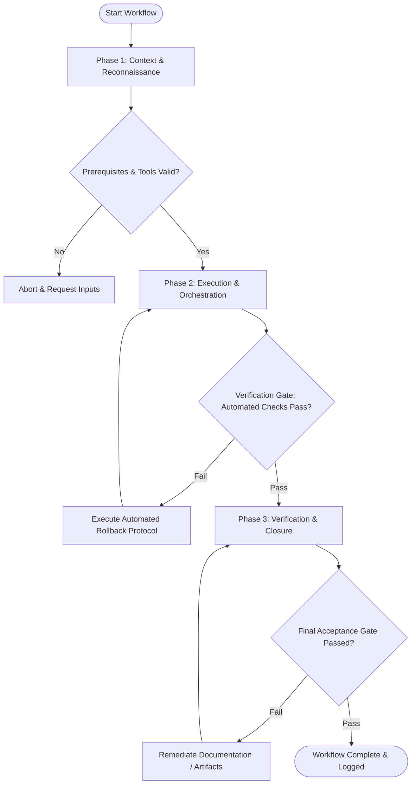

# Workflow: Production Build Verification

## Overview & Scope
The Build workflow ensures project code compiles cleanly into production-ready build artifacts, validating bundle sizes, entry point executables, and asset integrity prior to deployment.

## Execution Flowchart

## Required Tool Inputs & Context
- Build script and bundling tool (`tsup` / `vite` / `webpack` / `esbuild`)
- Target output directory (`dist/` or `build/`)
- Maximum allowable bundle size thresholds

## Phase 1: Context & Reconnaissance
- Inspect build tool configuration files (`tsconfig.json`, `tsup.config.ts`, `vite.config.ts`).
- Clean prior build artifacts and temporary files (`rimraf dist`).
- Verify all required build dependencies and environment variables are present.

## Phase 2: Execution & Orchestration
- Execute production compilation process via `npm run build`.
- Monitor stdout/stderr streams for compilation warnings, deprecation notices, or missing exports.
- Inspect generated output artifacts to confirm expected entry point scripts and source maps are emitted.

## Phase 3: Verification & Closure
- Run post-build asset verification scripts to check bundle file sizes against thresholds.
- Test executable CLI entry points or bundled modules in an isolated node process.
- Publish build verification summary detailing artifact sizes, compilation time, and entry signatures.

## Phase Transition Criteria & Deterministic Verification Gates
| Transition | Prerequisites | Verification Command / Gate | Success Criteria |
|---|---|---|---|
| Phase 1 -> Phase 2 | Tool inputs verified & environment ready | `node dist/cli.js doctor` | Doctor health check succeeds with 0 errors |
| Phase 2 -> Phase 3 | Execution steps complete | `npm run build` | Compilation completes with exit code 0 and zero fatal errors |
| Phase 3 -> Completion | Verification complete & artifacts signed off | `node dist/cli.js --version` | Built CLI entry point executes cleanly without module resolution errors |

## Validation Checkpoints & Automated Rollback Protocols
- **Validation Checkpoint 1**: Output directory contains all expected JavaScript, type declaration (`.d.ts`), and map files.
- **Validation Checkpoint 2**: Bundle size measurements fall within acceptable performance budget limits.
- **Automated Rollback Protocol**: Clean corrupted `dist/` artifacts and revert build configuration changes if compilation fails.
