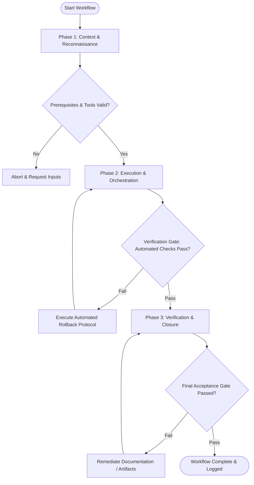

# Workflow: Expert Business Evaluation Panel

## Overview & Scope
The Business Panel workflow evaluates commercial viability. It convenes Business Strategists, Financial Analysts, and Product Managers to audit monetization models, pricing strategy, unit economics, and ROI.

## Execution Flowchart

## Required Tool Inputs & Context
- Business proposal or feature specification
- Monetization model & pricing tier specs
- Financial projections and market size data

## Phase 1: Context & Reconnaissance
- Gather business proposals, financial estimates, and target market analysis.
- Establish evaluation dimensions (Monetization feasibility, Unit economics, Customer CAC/LTV, Competitive defensibility).
- Distribute proposal to business panel personas.

## Phase 2: Execution & Orchestration
- Conduct panel review session collecting structured evaluation from business expert personas.
- Audit pricing tiers, margin expectations, and go-to-market assumptions.
- Identify commercial risks and strategic opportunities.

## Phase 3: Verification & Closure
- Synthesize panel feedback into Business Evaluation Verdict (Approved, Approved with Adjustments, Rejected).
- Formulate actionable commercial recommendations and financial model updates.
- Publish Business Panel Evaluation Summary.

## Phase Transition Criteria & Deterministic Verification Gates
| Transition | Prerequisites | Verification Command / Gate | Success Criteria |
|---|---|---|---|
| Phase 1 -> Phase 2 | Tool inputs verified & environment ready | `node dist/cli.js doctor` | Doctor health check succeeds with 0 errors |
| Phase 2 -> Phase 3 | Execution steps complete | `node dist/cli.js doctor` | Doctor health check validates business panel report format |
| Phase 3 -> Completion | Verification complete & artifacts signed off | `npm test` | Validation test suite confirms presence of financial metrics |

## Validation Checkpoints & Automated Rollback Protocols
- **Validation Checkpoint 1**: Monetization model and unit economics evaluated across all proposed pricing tiers.
- **Validation Checkpoint 2**: Commercial risks cataloged with explicit mitigation recommendations.
- **Automated Rollback Protocol**: Return proposal to draft state if panel issues commercial rejection verdict.
