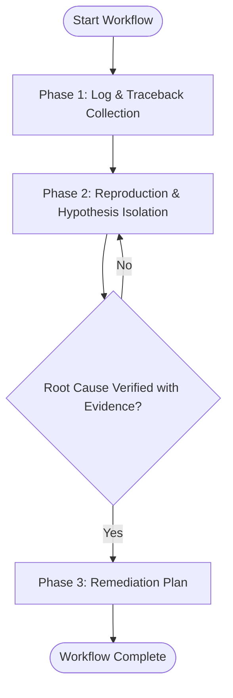

# Workflow: Evidence-Driven Bug Diagnosis

## Overview & Scope
The Evidence-Driven Bug Diagnosis workflow guides orchestrators and developers through evidence gathering, symptom reproduction, and root-cause isolation without resorting to blind trial-and-error edits.

## Execution Flowchart

## Required Tool Inputs & Context
- Stack trace, error log output, or reproduction context.
- Access to project codebase and test framework.

## Phase 1: Log & Traceback Collection
- Run `diagnosing-bugs` skill to parse error tracebacks and locate fault sites.
- Inspect surrounding source files and recent commit history.

## Phase 2: Reproduction & Hypothesis Isolation
- Formulate testable hypotheses for defect cause.
- Author minimal reproduction test case demonstrating 100% reliable failure.

## Phase 3: Remediation Plan
- Document verified root cause mechanism.
- Hand off minimal failing test and root cause summary to `workflow-implement.md`.

## Phase Transition Criteria & Deterministic Verification Gates
| Transition | Prerequisites | Verification Gate | Success Criteria |
|---|---|---|---|
| Phase 1 -> Phase 2 | Traceback logged | File & line isolated | Target crash site identified |
| Phase 2 -> Phase 3 | Hypotheses tested | Reproduction test | Test fails with exact reported error |
| Phase 3 -> Completion | Root cause proven | Plan documented | Remediate plan ready for implementation |
