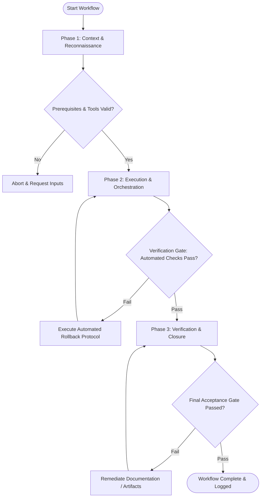

# Workflow: Technical Estimation & Complexity Analysis

## Overview & Scope
The Estimate workflow standardizes task breakdown and effort estimation. It leverages story points, complexity scoring, risk identification, and confidence intervals to produce reliable project estimates.

## Execution Flowchart

## Required Tool Inputs & Context
- Feature spec or architecture design document
- Task breakdown structure (WBS) template
- Historical velocity and estimation baseline metrics

## Phase 1: Context & Reconnaissance
- Deconstruct overall feature or epic into granular, atomic engineering tasks.
- Identify technical dependencies across frontend, backend, infrastructure, and QA domains.
- Flag high-uncertainty areas requiring spikes or research.

## Phase 2: Execution & Orchestration
- Assign Fibonacci story point scores (1, 2, 3, 5, 8, 13) to each decomposed task.
- Assess technical risk factors (low, medium, high) and assign confidence ratings.
- Calculate total duration range (best-case, worst-case, expected) including buffer for risks.

## Phase 3: Verification & Closure
- Review task estimates with engineering leads to ensure consensus.
- Document estimation assumptions, risk mitigations, and prerequisite dependencies.
- Publish technical estimation matrix to project management repository.

## Phase Transition Criteria & Deterministic Verification Gates
| Transition | Prerequisites | Verification Command / Gate | Success Criteria |
|---|---|---|---|
| Phase 1 -> Phase 2 | Tool inputs verified & environment ready | `node dist/cli.js doctor` | Doctor health check succeeds with 0 errors |
| Phase 2 -> Phase 3 | Execution steps complete | `node dist/cli.js doctor` | Project tasks properly formatted with explicit acceptance criteria |
| Phase 3 -> Completion | Verification complete & artifacts signed off | `npm run build` | Verification build runs cleanly without broken task dependencies |

## Validation Checkpoints & Automated Rollback Protocols
- **Validation Checkpoint 1**: Every task item has assigned story points, risk rating, and explicit owner role.
- **Validation Checkpoint 2**: Summed estimate includes explicit contingency buffer for identified risks.
- **Automated Rollback Protocol**: Re-scope and re-estimate feature breakdown if total duration exceeds iteration budget capacity.
