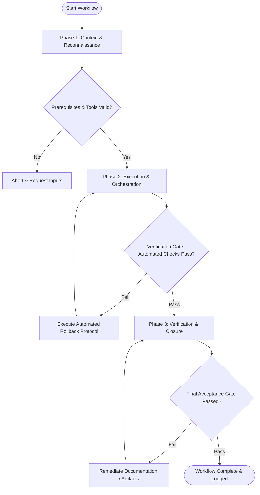

# Workflow: Git Version Control & Branch Strategy

## Overview & Scope
The Git workflow establishes best practices for version control operations. It covers branch creation, atomic Conventional Commits, interactive rebasing, merge conflict resolution, and pull request preparation.

## Execution Flowchart

## Required Tool Inputs & Context
- Git CLI tool
- Conventional Commit naming convention guidelines
- Target base branch (`main` / `dev`)

## Phase 1: Context & Reconnaissance
- Inspect `git status` to verify current working directory state.
- Fetch latest remote branches (`git fetch origin`) and check rebase status against base branch.
- Review pending uncommitted changes and organize them into logical, atomic change sets.

## Phase 2: Execution & Orchestration
- Stage changes incrementally (`git add -p`) and craft conventional commit messages (`feat:`, `fix:`, `docs:`).
- Perform interactive rebase onto target base branch (`git rebase origin/main`) to maintain linear history.
- Resolve any merge conflicts cleanly, running tests after each resolved conflict.

## Phase 3: Verification & Closure
- Verify git commit history hygiene (no fixup commits, clean messages).
- Push feature branch to remote origin (`git push -u origin feature-branch`).
- Prepare PR description linking related issues, summarizing changes, and listing verification commands.

## Phase Transition Criteria & Deterministic Verification Gates
| Transition | Prerequisites | Verification Command / Gate | Success Criteria |
|---|---|---|---|
| Phase 1 -> Phase 2 | Tool inputs verified & environment ready | `node dist/cli.js doctor` | Doctor health check succeeds with 0 errors |
| Phase 2 -> Phase 3 | Execution steps complete | `git status` | Working tree is clean with no unstaged changes or untracked files |
| Phase 3 -> Completion | Verification complete & artifacts signed off | `git log -n 5 --oneline` | Commit history is linear and messages adhere to Conventional Commits |

## Validation Checkpoints & Automated Rollback Protocols
- **Validation Checkpoint 1**: Branch rebased onto current remote base branch without remaining conflict markers.
- **Validation Checkpoint 2**: Remote feature branch synchronized and PR ready for review.
- **Automated Rollback Protocol**: Use `git rebase --abort` to cancel rebase if conflicts become unmanageable, returning to pre-rebase state.
