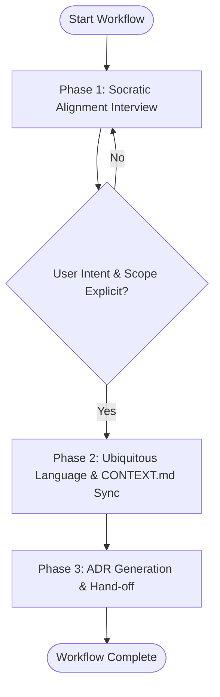

# Workflow: Socratic Alignment & Domain Grilling

## Overview & Scope
The Socratic Alignment & Domain Grilling workflow aligns developers and orchestrators on problem scope, edge cases, and non-goals. It invokes the `grill-with-docs`, `grill-me`, and `domain-modeling` skills to build a shared vocabulary in `CONTEXT.md` and record decisions in ADRs (`docs/adr/`).

## Execution Flowchart

## Required Tool Inputs & Context
- Project root with `CONTEXT.md` (or authorization to create `CONTEXT.md`).
- Feature request or architectural proposal details.

## Phase 1: Socratic Alignment Interview
- Execute `/grill-with-docs` or `/grill-me` skill runbook.
- Interrogate assumptions, data flows, edge cases, failure states, and performance constraints.
- Collect explicit user decisions on every trade-off.

## Phase 2: Ubiquitous Language & CONTEXT.md Sync
- Extract candidate domain terms from the interview.
- Update `CONTEXT.md` with definitions for new domain entities and rules.

## Phase 3: ADR Generation & Hand-off
- Document chosen architectural strategy in `docs/adr/ADR-XXXX-<title>.md`.
- Summarize agreed scope and hand off to technical specification (`workflow-spec.md`) or implementation (`workflow-implement.md`).

## Phase Transition Criteria & Deterministic Verification Gates
| Transition | Prerequisites | Verification Gate | Success Criteria |
|---|---|---|---|
| Phase 1 -> Phase 2 | Grilling questions answered | User approval | All ambiguities resolved |
| Phase 2 -> Phase 3 | Terms extracted | `CONTEXT.md` check | `CONTEXT.md` contains defined terms |
| Phase 3 -> Completion | ADR formatted | `docs/adr/*.md` exists | ADR saved cleanly |

## Validation Checkpoints & Automated Rollback Protocols
- **Validation Checkpoint 1**: All questions answered before drafting ADR.
- **Validation Checkpoint 2**: `CONTEXT.md` contains valid domain definitions.
- **Rollback Protocol**: Revert draft ADR files if grilling reveals invalid assumptions.
