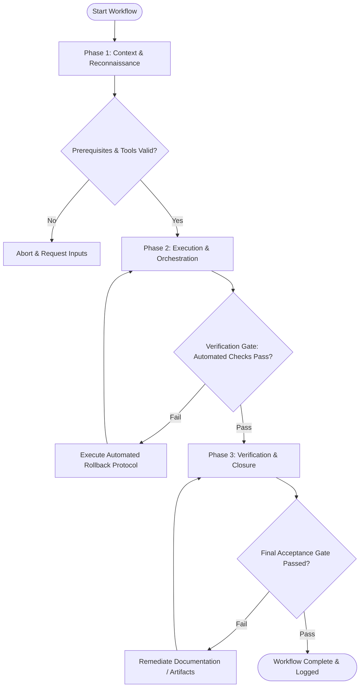

# Workflow: Implement Feature or Fix

## Overview & Scope
The Implement workflow guides developers and autonomous agents through a rigorous implementation process. It enforces Test-Driven Development (TDD) principles, incremental code modifications, and strict phase verification gates to ensure code quality and zero regressions.

## Execution Flowchart

## Required Tool Inputs & Context
- Target file paths & module interfaces
- Feature requirements or issue specification document
- Test suite execution command (`npm test`)
- Linter & static type-checker (`npm run typecheck`, `npm run lint`)

## Phase 1: Context & Reconnaissance
- Analyze the feature specification or issue report to understand functional goals and constraints.
- Inspect existing codebase state, git branch status, and relevant module dependencies.
- Identify target test files and code components that will be affected by the implementation.

## Phase 2: Execution & Orchestration
- Write red unit tests covering expected new functionality or bug reproduction.
- Implement minimum viable code changes required to transition tests from failing to passing (green state).
- Refactor implementation for readability, performance, and style consistency while maintaining passing tests.

## Phase 3: Verification & Closure
- Run the full project test suite to verify no regressions were introduced in existing functionality.
- Execute static type checking (`tsc --noEmit`) and linter checks to ensure compliance with codebase standards.
- Summarize implementation details, updated files, and test results for reviewer handoff.

## Phase Transition Criteria & Deterministic Verification Gates
| Transition | Prerequisites | Verification Command / Gate | Success Criteria |
|---|---|---|---|
| Phase 1 -> Phase 2 | Tool inputs verified & environment ready | `node dist/cli.js doctor` | Doctor health check succeeds with 0 errors |
| Phase 2 -> Phase 3 | Execution steps complete | `npm run typecheck` | 0 type errors across all project files |
| Phase 3 -> Completion | Verification complete & artifacts signed off | `npm test` | 100% of unit and integration tests passing cleanly |

## Validation Checkpoints & Automated Rollback Protocols
- **Validation Checkpoint 1**: Red-Green-Refactor test cycle verified before staging changes.
- **Validation Checkpoint 2**: Static type checking and linting pass without errors or warnings.
- **Automated Rollback Protocol**: Execute `git checkout -- .` or `git reset --hard HEAD` to revert incomplete or failing edits if verification fails.
