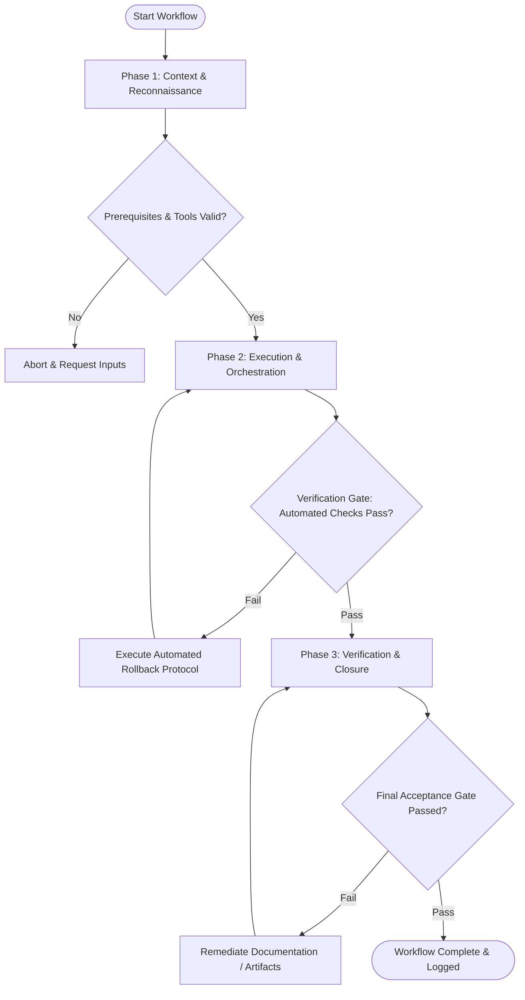

# Workflow: Automated & Peer Code Review

## Overview & Scope
The Review workflow standardizes code review procedures. It combines static analysis, security vulnerability scanning, design pattern verification, and clear actionable feedback formatting for pull requests.

## Execution Flowchart

## Required Tool Inputs & Context
- Git diff or Pull Request branch reference (`main...HEAD`)
- Linter and security static analyzer configs
- Architectural style guide & code review checklists

## Phase 1: Context & Reconnaissance
- Fetch latest branch changes and extract comprehensive `git diff main...HEAD`.
- Catalog modified, added, and deleted files along with external dependency additions.
- Run automated static analysis tools (`eslint`, `tsc`, `security scan`) on the diff.

## Phase 2: Execution & Orchestration
- Inspect code changes for architectural consistency, modularity, and adherence to design patterns.
- Audit diff for common security flaws (OWASP top 10), unhandled edge cases, and performance anti-patterns.
- Verify that newly added features or fixes include appropriate unit test coverage.

## Phase 3: Verification & Closure
- Synthesize review findings into a structured review report.
- Categorize feedback into blocking issues, non-blocking suggestions, and praise.
- Issue review verdict (Approve, Request Changes, Comment) with clear remediation guidelines.

## Phase Transition Criteria & Deterministic Verification Gates
| Transition | Prerequisites | Verification Command / Gate | Success Criteria |
|---|---|---|---|
| Phase 1 -> Phase 2 | Tool inputs verified & environment ready | `node dist/cli.js doctor` | Doctor health check succeeds with 0 errors |
| Phase 2 -> Phase 3 | Execution steps complete | `git diff main...HEAD` | Zero high-severity security vulnerabilities or architectural violations in diff |
| Phase 3 -> Completion | Verification complete & artifacts signed off | `npm run lint && npm run typecheck` | All automated lints and type checks pass cleanly on PR branch |

## Validation Checkpoints & Automated Rollback Protocols
- **Validation Checkpoint 1**: Diff review covers 100% of modified lines and new export signatures.
- **Validation Checkpoint 2**: Automated checks pass without warnings before manual review sign-off.
- **Automated Rollback Protocol**: Flag blocking concerns in PR and set status to "Request Changes", preventing branch merge until issues are resolved.
