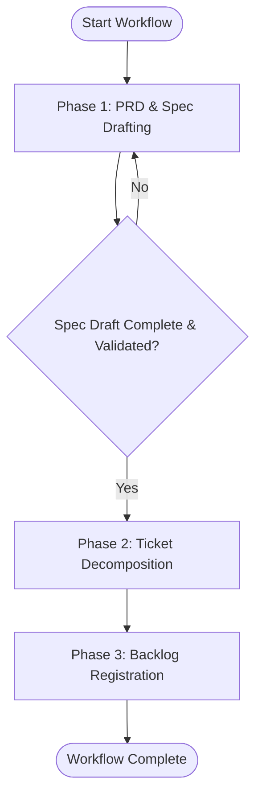

# Workflow: Technical Specification & Backlog Breakdown

## Overview & Scope
The Technical Specification & Backlog Breakdown workflow turns high-level requirements into formal technical specifications (`to-spec`) and decomposes them into atomic, executable task tickets (`to-tickets`).

## Execution Flowchart

## Required Tool Inputs & Context
- Feature requirements, grilling notes, or ADR reference.
- Output directory for specs (`docs/specs/`).

## Phase 1: PRD & Spec Drafting
- Run `to-spec` skill to outline goals, architecture, data structures, and acceptance criteria.
- Store artifact in `docs/specs/<feature-name>.md`.

## Phase 2: Ticket Decomposition
- Run `to-tickets` skill on the generated specification file.
- Break down implementation steps into atomic tasks with explicit verification steps.

## Phase 3: Backlog Registration
- Output tickets in requested target format (GitHub issues, Linear, or markdown task list).

## Phase Transition Criteria & Deterministic Verification Gates
| Transition | Prerequisites | Verification Gate | Success Criteria |
|---|---|---|---|
| Phase 1 -> Phase 2 | Notes collected | `docs/specs/*.md` exists | Spec file created with required sections |
| Phase 2 -> Phase 3 | Spec analyzed | Task list checklist | All spec requirements covered by tickets |
| Phase 3 -> Completion | Breakdown finished | Ticket validation | Tasks are self-contained with criteria |
