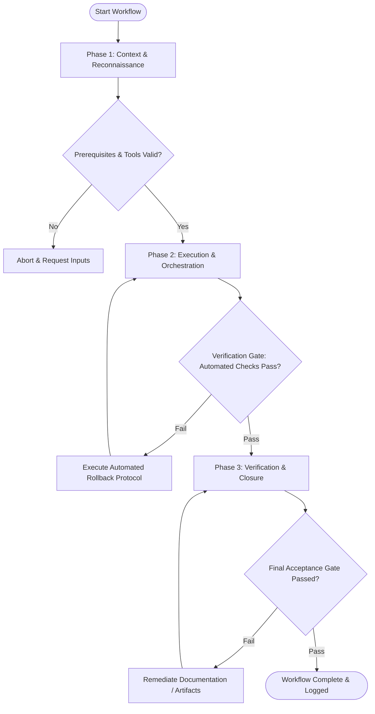

# Workflow: Test Suite Execution & Coverage Verification

## Overview & Scope
This workflow provides a structured approach for executing test suites across multiple tiers (unit, integration, e2e), evaluating code coverage metrics, and systematically isolating and repairing test failures.

## Execution Flowchart

## Required Tool Inputs & Context
- Test framework runner configuration (`vitest` / `jest`)
- Coverage threshold targets (e.g. >= 80% line coverage)
- Target test paths or suite filter expressions

## Phase 1: Context & Reconnaissance
- Identify project test environment configuration and existing coverage baselines.
- Inspect test directory layout and locate relevant test setup files.
- Verify test runner dependencies and clean cached test results if required.

## Phase 2: Execution & Orchestration
- Run targeted unit test files for modified components to get fast feedback.
- Execute integration and end-to-end test suites across affected modules.
- Analyze test output logs, stack traces, and coverage reports to pinpoint failures and untested code branches.

## Phase 3: Verification & Closure
- Re-run full test suite with coverage collection enabled.
- Verify that code coverage metrics satisfy configured threshold requirements.
- Generate test execution report summarizing test counts, duration, and coverage metrics.

## Phase Transition Criteria & Deterministic Verification Gates
| Transition | Prerequisites | Verification Command / Gate | Success Criteria |
|---|---|---|---|
| Phase 1 -> Phase 2 | Tool inputs verified & environment ready | `node dist/cli.js doctor` | Doctor health check succeeds with 0 errors |
| Phase 2 -> Phase 3 | Execution steps complete | `npm test` | All tests pass without skipped test regressions |
| Phase 3 -> Completion | Verification complete & artifacts signed off | `npm run test:coverage` | Statement and line coverage meet or exceed configured target percentage |

## Validation Checkpoints & Automated Rollback Protocols
- **Validation Checkpoint 1**: Test runner executes cleanly with zero unhandled promise rejections.
- **Validation Checkpoint 2**: Coverage report confirms all new code paths have corresponding unit test coverage.
- **Automated Rollback Protocol**: Revert test file modifications via `git checkout -- tests/` if invalid mock setups break test isolation.
