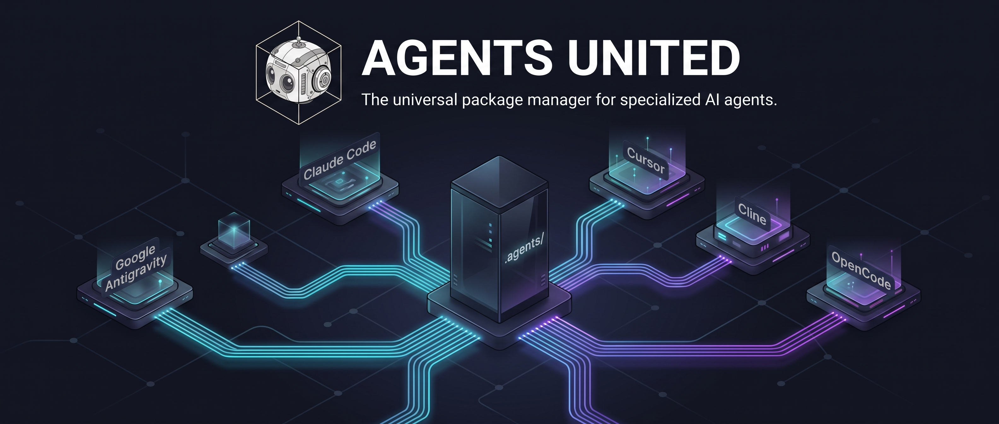

# Agents United

[](https://www.npmjs.com/package/agents-united)
[](https://opensource.org/licenses/MIT)
[](https://vitest.dev/)
[](https://www.typescriptlang.org/)

### The universal package manager for AI agents.

Curated teams of orchestrators, sub-agents, skills, and workflows — installed once, projected across **Google Antigravity 2.0 / Gemini**, **Anthropic Claude Code**, **Cursor**, **Cline**, **OpenCode**, and **Codex / AGENTS.md**.

---

## 🌟 Key Features

- **🪶 Essentials-First & On-Demand Growth**: Every department installs as a lean **Essentials bundle** by default. When a task requires specialized capabilities, the Lead Orchestrator automatically detects the gap, recommends the exact addon, and can auto-install it directly into your project scope.
- **🌐 One Library, Every Assistant**: Author in `.agents/` as your single source of truth. Agents United automatically projects and translates compatible configurations to **Google Antigravity 2.0 / Gemini**, **Anthropic Claude Code**, **Cursor**, **Cline**, **OpenCode**, and **Codex / AGENTS.md**.
- **🚀 Cline Native Activation**: Launch specialized teams into Cline CLI sessions with `agents start`, featuring compound role projections, skill toolkits, coordinator rules, and declarative team manifests.
- **🏛️ 8 Department Domains & 26 Bundles**: Complete coverage across Software Engineering, System Architecture, Product Design, Growth & Marketing, Security, Deep Research, Business Strategy, and Universal Meta-Skills.
- **🤖 58 Specialized Agents, 91 Skills & 69 Workflows**: 8 Lead Orchestrators coordinating 50 domain sub-agents, backed by 91 production-grade runbooks and 69 deterministic workflows.
- **⚡ Modern Cloud & AI Tooling**: First-class runbooks for Modal.com, Replicate, RunPod, local LLMs/vLLM, LangChain, LlamaIndex, Qdrant, Vercel, Supabase, Turso, and Azure Bicep.
- **🏢 Organization Bundles (Tier 2 / Experimental)**: Cross-functional multi-disciplinary teams with Tri-Tier MCP execution modes and smart auto-remediation (`digital-agency`).
- **🛡️ Built-in Zero-Trust Safety & Git Guardrails**: Hard-coded branch protection (`main`/`master`), zero force-push policy, secret redaction, serverless GPU cost ceilings, and PII scrubbing.
- **🧙 Interactive 2-Stage TUI Wizard**: Guided terminal interface powered by `@clack/prompts`, visual Unicode catalog tree (`agents list`), and fast search (`agents find`).
- **📦 Flexible Scopes & Installation Modes**: Install to **Project Scope** (Git-tracked team lockfiles) or **Global Scope** (`~/.agents/`), using instant **Symlink Mode** or standalone **Copy Mode**.
- **🩺 Deterministic Health Doctor**: Comprehensive diagnostic suite (`agents doctor`) validating frontmatter schemas, declarative lifecycle hooks, host capabilities, and lockfile synchronization.

---

## 🚀 Quickstart

### 1. Run with `npx` (Zero Installation)
Try immediately without installing anything:
```bash
npx agents-united add
```

### 2. Project-Level Installation (Recommended for Teams)
Install into your project repository to track agents and share lockfiles with your team:
```bash
# Install as a dev dependency
npm install -D agents-united
# or: pnpm add -D agents-united | yarn add -D agents-united

# Launch interactive setup for your repository (installs into ./.agents/)
npx agents add
```

### 3. Global Installation
Install globally to use the `agents` CLI anywhere on your machine:
```bash
npm install -g agents-united
```

Once installed, use the `agents` CLI command anywhere:
```bash
# Launch interactive onboarding wizard
agents add

# List all bundles in a visual folder tree
agents list

# Search for specific skills or workflows
agents find playwright -i

# Validate agent environment health
agents doctor
```

---

## 🪶 Essentials-First Philosophy — Small Footprint, On-Demand Growth

Agents United is designed so that every project starts **lean**. When you install a department, you get the **Essentials bundle** only — the minimum viable team needed to handle the majority of everyday tasks within that domain:

```bash
# Install only the core Growth & Marketing essentials team
agents add growth-marketing
# Installs: orchestrator-marketing + 5 core agents + 6 workflows + foundational skills
# Does NOT install: SEO specialists, PPC analysts, PLG strategists, email sequencers
```

When a task exceeds the installed capability, the **Lead Orchestrator takes over**. It recognizes the gap, names the exact addon bundle that covers it, and provides the install command — or in CLI-enabled environments, installs it automatically **into the scope of the active main domain**:

```
User: "Run a programmatic SEO audit and set up a content pipeline."

orchestrator-marketing: "This task requires the SEO & Content Marketing team.
  Your current installation (growth-marketing) covers strategy and campaigns.
  Installing the required addon now:

  $ agents add seo-content-marketing

  This adds: subagent-seo-specialist, programmatic-seo skill, technical-seo-audit skill,
  schema-markup-strategy skill, and the content pipeline workflow.
  Proceeding with installation into project scope..."
```

This model gives you:
- ✅ **Minimal context footprint** — only agents and skills relevant to your project live in the workspace
- ✅ **Intelligent gap detection** — orchestrators know exactly which addon covers which capability
- ✅ **Zero manual discovery** — the orchestrator installs the right addon for you
- ✅ **Scoped installs** — addons install into the same project scope as the parent essentials bundle

---


Agents United provides **24 curated bundles**, **46 specialized agents** (8 Orchestrators — 7 Lead + 1 Prime + 38 Sub-Agents), **90 skills**, and **63 workflows** across 8 department domains:

| Department Domain | Essentials Base | Specialized Addon Bundles | Lead Orchestrator |
| :--- | :--- | :--- | :--- |
| **🌐 Universal Department** | `universal-skills` ⭐ | `universal-orchestration` (guided routing), `full` (Universal Suite) | `orchestrator-universal` (Prime) |
| **🛠️ Software Engineering & Delivery** | `software-engineering` | `ai-ml-engineering`, `mobile-development`, `frontend-engineering`, `backend-distributed-systems`, `qa-automation`, `devops-engineering` | `orchestrator-engineering` |
| **🏛️ System Architecture & SRE** | `system-architecture` | `sysops-sre` | `orchestrator-system-architecture` |
| **🎨 Product Design & UI/UX** | `product-design` | `design-systems-ops`, `design-research-testing` | `orchestrator-design` |
| **📈 Growth & Marketing Operations** | `growth-marketing` | `seo-content-marketing`, `performance-paid-acquisition`, `product-led-growth`, `lifecycle-email-marketing` | `orchestrator-marketing` |
| **🔒 Security Operations** | `security-operations` | — | `orchestrator-security` |
| **🔬 Deep Technical Research** | `deep-research` | — | `orchestrator-research` |
| **💼 Business Strategy & Economics** | `business-strategy` | — | `orchestrator-business` |
| **🏢 Organization Bundles (Experimental)** | `digital-agency` 🚧 | *(Currently under development)* | `orchestrator-digital-agency-director` |

<details>
<summary><strong>🔍 Click to expand full Department & Agent Roster Breakdown</strong></summary>

<br>

#### 🌐 Universal Autonomous Department
- **Baseline**: `universal-skills` ⭐ *(Recommended Baseline — Socratic grilling, PRD generation, ADRs, session handoff)*
- **Guided Routing (optional)**: `universal-orchestration` *(Prime Orchestrator front door — grills ambiguous requests, routes to the correct department Essentials bundle via its Domain Atlas, installs with consent, and hands off. An optional way to use Agents United without the full suite.)*
- **Universal Suite**: `full` *(Complete enterprise suite containing all bundles, agents, skills, workflows)*

#### 🛠️ Software Engineering & Delivery
- **Lead Orchestrator**: `orchestrator-engineering`
- **Essentials Base (`software-engineering`)**: `subagent-backend-architect`, `subagent-frontend-architect`, `subagent-code-reviewer`, `subagent-repo-index`
- **AI/ML Engineering (`ai-ml-engineering`)**: `subagent-ml-platform-engineer`, `subagent-ai-model-architect`
- **Mobile Development (`mobile-development`)**: `subagent-ios-architect`, `subagent-android-architect`, `subagent-cross-platform-specialist`
- **Frontend Engineering (`frontend-engineering`)**: `subagent-frontend-architect`, `subagent-accessibility-lead`
- **Backend & Distributed Systems (`backend-distributed-systems`)**: `subagent-distributed-systems-architect`, `subagent-data-engineer`
- **QA Automation (`qa-automation`)**: `subagent-qa-automation-lead`, `subagent-e2e-tester`
- **DevOps Engineering (`devops-engineering`)**: `subagent-devops-engineer`

#### 🏛️ System Architecture & SRE
- **Lead Orchestrator**: `orchestrator-system-architecture`
- **Essentials Base (`system-architecture`)**: `subagent-system-architect`, `subagent-backend-architect`
- **SysOps & SRE (`sysops-sre`)**: `subagent-sysops-sre-lead`

#### 🎨 Product Design & UI/UX
- **Lead Orchestrator**: `orchestrator-design`
- **Essentials Base (`product-design`)**: `subagent-ui-designer`, `subagent-ux-strategist`, `subagent-interaction-designer`, `subagent-design-systems-architect`, `subagent-design-researcher`, `subagent-design-ops-lead`, `subagent-designer-toolkit-expert`, `subagent-prototype-tester`
- **Design Systems Ops (`design-systems-ops`)**: `subagent-design-systems-architect`, `subagent-design-ops-lead`
- **Design Research & Testing (`design-research-testing`)**: `subagent-design-researcher`, `subagent-prototype-tester`

#### 📈 Growth & Marketing Operations
- **Lead Orchestrator**: `orchestrator-marketing`
- **Essentials Base (`growth-marketing`)**: `subagent-marketing-growth-strategist`, `subagent-marketing-content-strategist`, `subagent-marketing-conversion-specialist`, `subagent-marketing-campaign-specialist`, `subagent-marketing-creative-designer`
- **SEO & Content Marketing (`seo-content-marketing`)**: `subagent-seo-specialist`
- **Performance & Paid Acquisition (`performance-paid-acquisition`)**: `subagent-paid-acquisition-specialist`
- **Product-Led Growth (`product-led-growth`)**: `subagent-plg-strategist`
- **Lifecycle & Email Marketing (`lifecycle-email-marketing`)**: `subagent-lifecycle-email-specialist`

#### 🔒 Security Operations
- **Lead Orchestrator**: `orchestrator-security`
- **Essentials Base (`security-operations`)**: `subagent-security-engineer`

#### 🔬 Deep Technical Research
- **Lead Orchestrator**: `orchestrator-research`
- **Essentials Base (`deep-research`)**: `subagent-deep-research`, `subagent-socratic-mentor`, `subagent-repo-index`

#### 💼 Business Strategy & Economics
- **Lead Orchestrator**: `orchestrator-business`
- **Essentials Base (`business-strategy`)**: `subagent-business-panel-experts`

#### 🏢 Organization Bundles (Tier 2 / Experimental)
- **Digital Product Agency (`digital-agency` 🚧)**: *(Currently under development)*

</details>

---

## ⚡ Platform & Cloud Tooling Ecosystem

Agents United comes pre-configured with operational playbooks for modern cloud, AI, and edge infrastructure:

- **Modal.com** (`modal-serverless-python`): Serverless Python apps, GPU functions (A10G/H100), cold-start layer caching, persistent volumes.
- **Replicate** (`replicate-model-inference`): Hosted model inference, prediction polling/webhooks, hardware provisioning.
- **RunPod** (`runpod-gpu-orchestration`): Cloud & serverless GPU orchestration, vLLM worker containers, network storage.
- **Local LLMs & vLLM** (`local-llm-inference`): Self-hosted LLM serving with Ollama & vLLM, PagedAttention, quantization (AWQ/GPTQ/GGUF).
- **RAG & Vector Pipelines** (`rag-vector-pipeline`, `vector-database-design`): Production RAG with LangChain & LlamaIndex, hybrid search (BM25 + dense), rerankers, Qdrant / Pinecone / Chroma indexing.
- **Hugging Face** (`hf-model-evaluation`): Standardized model evaluation benchmarks (MMLU, GSM8k, RAGAS faithfulness).
- **Vercel** (`vercel-deploy-best-practices`): Edge Middleware (<25ms), Server Actions, ISR revalidation, preview deployments.
- **Lovable / v0 / Bolt** (`ai-prototype-refactoring`): Refactoring single-file AI prototype exports into modular React component hierarchies, design tokens, and a11y standards.
- **Supabase** (`supabase-backend-architecture`): PostgreSQL schemas, Row Level Security (RLS) policies, Deno Edge Functions, Auth triggers, Realtime channels.
- **Turso** (`turso-distributed-sqlite`): LibSQL distributed SQLite, local embedded replicas with auto-sync, CI/CD database branching (`turso db branch`).
- **Microsoft Azure** (`azure-infrastructure-bicep`): Enterprise Bicep IaC, Azure Container Apps (ACA) with Dapr & KEDA scaling, AKS, Azure OpenAI private endpoints.

---

## 💻 CLI Command Reference

### `agents add [bundle|item]`
Installs a bundle, agent, skill, workflow, or whole department. If run without arguments in a terminal, launches the interactive 2-stage wizard.

```bash
# Interactive mode (Guides through Host -> Scope -> Method -> Department -> Bundle)
agents add

# Install by bundle name or alias
agents add software-engineering
agents add mobile-development
agents add ai-ml-engineering

# Install whole department domain
agents add domain:engineering
agents add domain:marketing
agents add domain:architecture

# Install globally to user home directory (~/.agents/)
agents add frontend-engineering -g

# Install as standalone independent copy (offline modifications)
agents add qa-automation --copy

# Install directly to specific agent hosts
agents add full -t gemini,claude,cursor -y
```

**Options:**
- `-g, --global`: Install globally into home directory (`~/.agents/`).
- `-s, --symlink`: Create symbolic links to central registry cache (default / recommended).
- `--copy`: Create independent standalone copies of asset files.
- `-t, --target <hosts>`: Target agent host runtimes (`agents`, `gemini`, `claude`, `cursor`, `cline`, `opencode`, `codex`). Default: `agents`.
- `--fanout <hosts>`: Also project translated copies into other assistant folders.
- `--mode <operational|limited-operational|brainstorming>`: Execution mode for organization bundles. Default: `operational`.
- `--allow-missing-prereqs`: Proceed with installation even if some prerequisites are missing.
- `--allow-under-construction`: Bypass the Under-Construction Gate for in-development bundles.
- `-y, --yes`: Skip confirmation prompts.
- `-f, --force`: Force overwrite user-modified files.
- `--dry-run`: Simulate installation without writing files.

---

### `agents list` (alias: `agents ls`)
Displays all registry bundles grouped by department domain in an ASCII/Unicode folder tree view showing orchestrators, sub-agents, skills, and workflows.

```bash
# Formatted folder tree view
agents list

# Output raw JSON manifest
agents list --json
```

---

### `agents find [query]` (alias: `agents search`)
Searches the registry across bundles, agents, skills, and workflows.

```bash
# Search by keyword
agents find modal
agents find seo
agents find playwright
agents find bicep

# Filter by domain category
agents find -c engineering
agents find -c marketing

# Filter by item type (bundle, agent, skill, workflow)
agents find gpu -t skill

# Interactive selection to install match
agents find qdrant -i

# Output search results as JSON
agents find security --json
```

---

### `agents remove [identifier]` (alias: `agents rm`, `agents uninstall`)
Discovers installed packages across project and global scopes with **Scope Location Badges** (`[project: ./.agents]`, `[global: ~/.agents]`), presenting only active installed bundles and standalone assets for safe uninstallation.

```bash
# Interactive installed package selection with scope badges
agents remove

# Remove specific bundle from project workspace
agents remove mobile-development

# Remove global bundle
agents remove mobile-development -g -y
```

---

### `agents start <bundle> [prompt]`
Starts an installed team bundle in its host runtime (such as Cline CLI). Automatically resolves project vs. global installations, verifies compound projection integrity, probes host runtime capabilities, constructs safe non-shell evaluated arguments, and launches the session.

```bash
# Start an installed team in Cline
agents start software-engineering

# Start a team with an initial task prompt
agents start software-engineering "Implement user authentication with Vitest TDD test coverage"

# Start with pre-authorized addon auto-installation for this session
agents start software-engineering --allow-addons

# Override generated team name
agents start software-engineering --team my-custom-squad

# Run headlessly (non-interactive mode)
agents start software-engineering "Run security audit" --headless

# Preview activation plan, strategy, and argv without launching
agents start software-engineering --dry-run
```

**Options:**
- `--host <host>`: Host runtime to activate (auto-detected from lockfile fanout, e.g. `cline`).
- `-g, --global`: Activate globally installed bundle (`~/.agents/`).
- `--team <name>`: Override generated team name (must match `[A-Za-z0-9_-]` max 64 chars).
- `--allow-addons`: Pre-authorize recommended addon installations for this session without prompting.
- `--headless`: Run non-interactively without launching interactive TUI.
- `--dry-run`: Print activation resolution and argv summary without launching.

---

### `agents update [identifier]` (alias: `agents upgrade`)
Inspects installed packages across project and global scopes, detects **Upstream Version Drift** against registry releases, and provides an interactive TUI to batch update all packages or selectively pick specific bundles with user-modification conflict guardrails.

```bash
# Interactive update TUI (shows outdated packages, version diffs, and selective/batch updates)
agents update

# Batch update all installed packages in workspace
agents update --all -y

# Update specific package and re-sync projections across runtimes
agents update software-engineering --fanout cline,claude

# Update and immediately start in Cline
agents update software-engineering --fanout cline --start

# Update specific package with force overwrite of local modifications
agents update software-engineering --force

# Simulate update without modifying files
agents update --dry-run
```

---

### `agents doctor`
Audits workspace agent directories, verifies frontmatter schema validity, validates declarative lifecycle hooks, and reports synchronization status. Can also audit specific host runtimes and capability probing.

```bash
# General workspace health audit
agents doctor

# Audit Cline runtime installation, capability probe, and compound projection integrity
agents doctor --host cline
```

---

## 🏢 Organization Bundles & Tri-Tier Execution Framework

Organization Bundles (Tier 2 / Experimental, such as `digital-agency`) orchestrate cross-functional teams spanning Strategy, Copywriting, Design, Engineering, and Compliance. They integrate **Model Context Protocol (MCP)** tool calling, external packages, and APIs.

When installing an organization bundle (`agents add <bundle>`), the CLI evaluates prerequisites (MCP servers, npm packages, environment variables). If items are missing, the interactive wizard provides dynamic remediation options:

```text
o Prerequisite Evaluation: digital-agency (Organization Bundle) ----------+
|   ✗ [MCP] github: Missing (Not found in host MCP configuration)         |
|   ✓ [MCP] firecrawl: Detected (Configured in gemini)                     |
|   ✓ [MCP] context7: Detected (Configured in gemini)                      |
|   ✗ [MCP] playwright: Missing (Not found in host MCP configuration)     |
|   ✗ [MCP] markitdown: Missing (Not found in host MCP configuration)     |
|   ✓ [MCP] chrome-devtools-mcp: Detected (Configured in gemini)          |
|   ✗ [MCP] stitch: Missing (Not found in host MCP configuration)          |
|   ✗ [MCP] figma: Missing (Not found in host MCP configuration)           |
|   ✗ [Pkg] @playwright/test: Missing (Not found in node_modules)         |
+-------------------------------------------------------------------------+
```

### Dynamic Prerequisite Options Comparison

| Option | What It Does | Best For |
| :--- | :--- | :--- |
| **⚡ Auto-configure (Recommended)** | Automatically writes missing MCP definitions to your client config (`.cursor/mcp.json`, `cline_mcp_settings.json`, `.claude/mcp.json`) & installs missing packages | One-click instant setup |
| **🌿 Limited Operational** | Uses the MCPs you already have; subagents gracefully use native fallbacks (`git`, `curl`) for the rest | Partial setups where you only want some tools |
| **💡 Brainstorming Mode** | Pure ideation/planning; turns off all MCP tool-calling | Offline / air-gapped environments |
| **⚠️ Force Operational** | Installs full live tool definitions as-is without touching your files | Custom setups, remote MCP proxies, or manual config later |

---
## 🌐 One Library, Every Assistant

The `.agents/` folder is the **main library** — the *one* folder you edit. **Antigravity reads it directly** for interactive sessions (CLI TUI and desktop); see [ADR 0009](./docs/adr/0009-host-conformance-targets.md). Every other assistant (Claude Code, Cursor, Cline, OpenCode, Codex) can't read it natively, so Agents United writes **translated copies** it keeps in sync for you.

- **Edit only `.agents/`.** That's your source of truth — the `agents-united.json` lockfile tracks it.
- **Other assistants get their own translated copies**, in their own folders (`.claude/agents/`, `.cline/agents/`, …). Don't edit those — they're machine-managed and rewritten on every `agents update`.
- **`--fanout` tells Agents United which assistants to make copies for.** It's remembered in the lockfile, so a plain `agents update` keeps them in sync afterwards.

```bash
# Main library + translated copies for Claude, Cursor, Cline, OpenCode, and Codex
agents add software-engineering -t agents --fanout claude,cursor,cline,opencode,codex -y --copy

# Prefer picking an assistant directly? The main library is added and translated copies are made for you.
agents add software-engineering -t cline -y --copy

# Dry-run first to preview exactly what will be written
agents add software-engineering -t agents --fanout claude,cursor -y --copy --dry-run

# You already installed to .agents/ only? Add Cline's translated copies now:
agents update software-engineering --fanout cline
```

```bash
# Canonical .agents/ tree + translated copies for Claude, Cursor, Cline, OpenCode, and Codex
agents add software-engineering -t agents --fanout claude,cursor,cline,opencode,codex -y --copy

# Dry-run first to preview exactly which projections will be written
agents add software-engineering -t agents --fanout claude,cursor -y --copy --dry-run
```

| Flag | Meaning |
| :--- | :--- |
| `--fanout <hosts>` | Comma-separated runtime ids to project into (`claude`, `cursor`, `cline`, `opencode`, `codex`). Invalid ids are dropped with a warning. |

What each runtime receives:
- **Claude Code** → `.claude/agents/`
- **Cursor** → `.cursor/agents/`
- **Cline** → `.cline/agents/`
- **OpenCode** → `.opencode/agent/`
- **Codex & AGENTS.md readers** → a generated root **`AGENTS.md`** bridge indexing the canonical `.agents/` tree (no subagent loader exists for these).

Every projected file is a **copy** (never a symlink) stamped with a managed marker:
```html
<!-- managed-by: agents-united | profile: claude-code | canonical: .agents/agents/<file> | do not edit -->
```
All projections are recorded in `agents-united.json` under `projectedTo`, so `remove`, `update`, and `doctor` stay deterministic — they rewrite or delete exactly the managed files and never touch unmanaged/user-modified ones (unless `--force`).

> ⚠️ **Per-runtime caveats.** Antigravity-only frontmatter keys — `hooks:`, `permissionMode:`, `commandExecutionPolicy:`, `mainAgent:`, `subagent:`, and `type:` — **do not execute** in other runtimes. Projected orchestrator agents degrade gracefully to "system prompt + tool list" subagents; behavior is documented, not faked. Cross-agent `invoke_subagent` orchestration works only in Antigravity and is dropped elsewhere with a warning. To add more runtimes later, re-run `agents add <bundle> -t agents --fanout <hosts>`.

---

## 🛡️ Built-in Safety & Git Guardrails

Agents United keeps your codebases safe by enforcing hard-coded version control and operational safety policies across all installed orchestrators and sub-agents:

- **Protected Branch Guard**: Prevents autonomous agents from directly committing to `main`, `master`, `production`, or `release/*` branches.
- **Zero Force-Pushes**: Hard-coded safety policies disallow destructive force pushes (`git push --force` or `git push -f`) under all circumstances.
- **Pre-Staging Secret Scanning & Redaction**: Intercepts accidental staging of `.env` files, API keys (`OPENAI_API_KEY`, `MODAL_TOKEN_ID`, `REPLICATE_API_TOKEN`, `RUNPOD_API_KEY`), private tokens, or credentials before any commit is generated.
- **GPU Cost Ceilings**: Enforces automatic scale-to-zero timeouts (60–300s) and concurrency limits on serverless compute workloads.
- **Training Data PII Scrubbing**: Pre-processing guardrails to mask sensitive personal data before vector embedding or fine-tuning.
- **Deterministic Health Doctor**: Run `agents doctor` anytime to audit local agent directories, verify schema validity, and ensure clean working tree states.

---

## 🛠️ Developer Setup & Contributing Guide

We welcome open-source contributions from developers across the agentic engineering community!

### 1. Prerequisites
- **Node.js**: `v20.0.0` or higher (`node -v`)
- **Package Manager**: `npm` (v10+) or `pnpm`
- **Git**: Configured with a clean working tree

### 2. Local Environment Setup
```bash
# 1. Clone the repository
git clone https://github.com/NeoAnthropocene/agents-united.git
cd agents-united

# 2. Install development dependencies
npm install

# 3. Build the project with tsup
npm run build

# 4. Link binary globally for local development testing
npm link
```

### 3. Running Tests
Agents United enforces a strict **4-Tier Test-Driven Development (TDD)** standard with **100% deterministic testing** (no arbitrary sleeps).

```bash
# Run full Vitest test suite
npm test

# Run tests in watch mode
npm run test:watch
```

### 4. Code Quality & Architecture Guidelines
- **Strict TypeScript**: Never use implicit or explicit `any`. All shared interfaces belong in `src/core/types.ts`.
- **Seams & Decoupling**: Keep business logic (`src/core/`) decoupled from terminal I/O (`src/cli.ts`).
- **Idempotency**: All installer and uninstaller operations must be reversible and tracked in `agents-united.json`.
- **[ ] Essentials Bundle Audit & CLI Guard** *(Development Task)*: Audit all 7 Essentials bundle compositions to verify they contain only core agents/skills. Migrate any non-essential assets into their matching Addon bundle. Add a CLI enforcement layer so that `agents add domain:<dept>` installs only the Essentials bundle by default — Addon bundles must be explicitly requested (`agents add <addon>`) or triggered by the orchestrator's On-Demand Auto-Install protocol. Track progress in [`ROADMAP.md`](ROADMAP.md).
- **[ ] GitHub Pages Site Design** *(Design Task)*: Design and build the public marketing & documentation site at `https://neoanthropocene.github.io/agents-united`. Covers: hero section, interactive CLI demo, ecosystem matrix visualization, quickstart steps, and platform ecosystem showcase. Full brief and wireframe outline tracked in [`ROADMAP.md`](ROADMAP.md).

### 5. Skill & Agent Contribution Standard
When contributing new skills or adapting external skills:
1. **Frontmatter Metadata**: Declare author attribution in `SKILL.md` YAML frontmatter:
   ```yaml
   ---
   name: your-skill-name
   description: High-level summary of capability
   metadata:
     author: "Your Name (@yourhandle)"
     version: "1.0.0"
     source: "https://github.com/your-org/your-repo"
     license: "MIT"
   ---
   ```
2. **Attribution in README**: Add credit under `## Credits & Acknowledgments`.
3. **Deterministic Verifications**: Include clear validation commands, error recovery procedures, and code exemplars.

### 6. Pull Request (PR) Workflow
1. **Create a Feature Branch**: Always branch from `dev`:
   ```bash
   git checkout dev
   git pull origin dev
   git checkout -b feat/your-feature-name
   ```
2. **Follow TDD (Red-Green-Refactor)**: Author failing unit/E2E tests in `tests/` before implementing code.
3. **Run Pre-PR Verification**:
   ```bash
   npm run build
   npm test
   git diff --cached   # Audit staged files for accidental secrets or temp files
   ```
4. **Submit Pull Request**: Open a PR targeting the `dev` branch with a concise description of changes and test results.

---

## 🤝 Credits & Acknowledgments

Agents United proudly builds upon, adapts, and integrates contributions from creators across the open AI agent, cloud platform, and developer tooling ecosystem:

<details>
<summary><strong>Matt Pocock (<a href="https://github.com/mattpocock">@mattpocock</a> / <a href="https://github.com/mattpocock/skills">mattpocock/skills</a>)</strong></summary>

- **`/grill-with-docs`** & **`/grill-me`**: Socratic alignment grilling, requirements clarification, and ADR authoring.
- **`/domain-modeling`**: Ubiquitous language definition and `CONTEXT.md` domain dictionary maintenance.
- **`/to-spec`** & **`/to-tickets`**: PRD/spec generation and task ticket decomposition.
- **`/diagnosing-bugs`**: Evidence-driven bug diagnosis and root-cause analysis.
- **`/git-guardrails`**: Version control safety rules and protection policies.
- **`/handoff`**: Session progress persistence and context handoff notes.
</details>

<details>
<summary><strong>Modal Labs (<a href="https://github.com/modal-labs">@modal-labs</a> / <a href="https://modal.com">modal.com</a>)</strong></summary>

- **`modal-serverless-python`**: Serverless Python execution, container image definition, and GPU acceleration patterns.
</details>

<details>
<summary><strong>Replicate (<a href="https://github.com/replicate">@replicate</a> / <a href="https://replicate.com">replicate.com</a>)</strong></summary>

- **`replicate-model-inference`**: Hosted machine learning model inference API, webhook callbacks, and prediction streaming.
</details>

<details>
<summary><strong>RunPod (<a href="https://github.com/runpod">@runpod</a> / <a href="https://runpod.io">runpod.io</a>)</strong></summary>

- **`runpod-gpu-orchestration`**: Serverless GPU handler architecture and containerized worker management.
</details>

<details>
<summary><strong>Ollama & vLLM Teams (<a href="https://ollama.com">ollama.com</a> / <a href="https://vllm.ai">vllm.ai</a>)</strong></summary>

- **`local-llm-inference`**: Self-hosted LLM execution, quantization formats, and high-throughput PagedAttention serving.
</details>

<details>
<summary><strong>LangChain & LlamaIndex (<a href="https://langchain.com">langchain.com</a> / <a href="https://llamaindex.ai">llamaindex.ai</a>)</strong></summary>

- **`rag-vector-pipeline`**: Retrieval-Augmented Generation architectures, hybrid retrieval, and re-ranking pipelines.
</details>

<details>
<summary><strong>Hugging Face (<a href="https://github.com/huggingface">@huggingface</a> / <a href="https://huggingface.co">huggingface.co</a>)</strong></summary>

- **`hf-model-evaluation`**: Model benchmarking, Evaluate metrics, and model scorecard methodologies.
</details>

<details>
<summary><strong>Qdrant, Pinecone & Chroma (<a href="https://qdrant.tech">qdrant.tech</a> / <a href="https://pinecone.io">pinecone.io</a> / <a href="https://www.trychroma.com">trychroma.com</a>)</strong></summary>

- **`vector-database-design`**: Production vector indexing, HNSW graph tuning, and payload filtering.
</details>

<details>
<summary><strong>Vercel Engineering (<a href="https://github.com/vercel">@vercel</a> / <a href="https://vercel.com">vercel.com</a>)</strong></summary>

- **`vercel-deploy-best-practices`**: Edge Middleware routing, Server Actions, and Preview environments.
- **`react-best-practices`**: Next.js App Router, Server Components & Core Web Vitals optimization.
</details>

<details>
<summary><strong>Lovable, v0 (Vercel) & Bolt (StackBlitz) (<a href="https://lovable.dev">lovable.dev</a> / <a href="https://v0.dev">v0.dev</a> / <a href="https://bolt.new">bolt.new</a>)</strong></summary>

- **`ai-prototype-refactoring`**: Ingestion and modularization methodologies for rapid AI-generated frontend prototypes.
</details>

<details>
<summary><strong>Supabase (<a href="https://github.com/supabase">@supabase</a> / <a href="https://supabase.com">supabase.com</a>)</strong></summary>

- **`supabase-backend-architecture`**: PostgreSQL database design, Row Level Security (RLS), Edge Functions, and Realtime sync.
</details>

<details>
<summary><strong>ChiselStrike & Turso Community (<a href="https://github.com/tursodatabase">@tursodatabase</a> / <a href="https://turso.tech">turso.tech</a>)</strong></summary>

- **`turso-distributed-sqlite`**: LibSQL distributed SQLite, embedded replicas with auto-sync, and database branching.
</details>

<details>
<summary><strong>Microsoft Azure Community (<a href="https://learn.microsoft.com/azure/bicep">learn.microsoft.com/azure/bicep</a>)</strong></summary>

- **`azure-infrastructure-bicep`**: Enterprise Bicep Infrastructure-as-Code, Azure Container Apps (ACA), and Azure OpenAI private networking.
</details>

<details>
<summary><strong>Currents & Microsoft Playwright Community (<a href="https://github.com/currents-dev/playwright-best-practices-skill">currents-dev/playwright-best-practices-skill</a>)</strong></summary>

- **`playwright-best-practices`**: Resilient Page Object Models and deterministic auto-waiting browser tests.
</details>

<details>
<summary><strong>wshobson (<a href="https://github.com/wshobson/agents">wshobson/agents</a>)</strong></summary>

- **`mobile-ios-design`** & **`mobile-android-design`**: SwiftUI & Jetpack Compose design system patterns.
</details>

<details>
<summary><strong>Salesforce (<a href="https://github.com/forcedotcom/sf-skills">forcedotcom/sf-skills</a>)</strong></summary>

- **`mobile-platform-offline-validate`**: Offline-first local database caching and conflict resolution.
</details>

<details>
<summary><strong>tovimx (<a href="https://github.com/tovimx/maestro-mobile-testing-skill">tovimx/maestro-mobile-testing-skill</a>)</strong></summary>

- **`maestro-mobile-testing`**: Declarative cross-platform mobile UI test automation.
</details>

---

## 📄 License

MIT © [NeoAnthropocene & Agents United Contributors](LICENSE)
