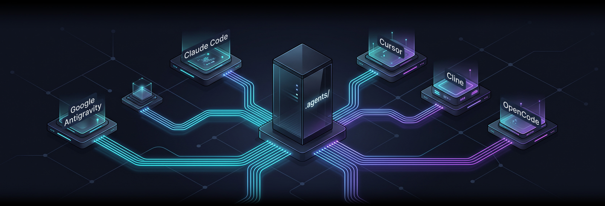

# Agents United

[](https://www.npmjs.com/package/agents-united)
[](https://opensource.org/licenses/MIT)
[](https://vitest.dev/)
[](https://www.typescriptlang.org/)
[](https://badge.socket.dev/npm/package/agents-united/latest)

### Expert AI agent teams on your preferred platform.

Agents United is the package manager for **expert AI agent teams**. Install a curated team once — **orchestrators** (team leads), **sub-agents** (specialists), **skills** (runbooks and playbooks) and **guardrails** — and run it in the **AI agent harness** you already use. Each team is wired as a **delegation graph**: the lead plans with you, specialists work in parallel, and nothing ships until it has been verified.

| Assistant | Status | Where the team lands |
| :--- | :--- | :--- |
| **Google Antigravity** (desktop app and `agy` CLI) | ✅ Supported | `.agents/` (read natively) |
| **Anthropic Claude Code** | ✅ Supported | `.claude/agents/`, `.claude/skills/`, `.claude/rules/` |
| **Cline** (CLI and VS Code extension) | ✅ Supported | `.cline/` plus `.agents/plugins/<bundle>/` |
| Cursor, OpenCode, Codex / `AGENTS.md` readers | 🚧 Under development | Shown as unavailable in the wizard, and `--fanout` refuses them |

**In numbers:** 34 bundles (including the `full` suite; `registry/bundles.json` also holds one placeholder, `mock-organization-under-construction`, which is not counted) · 59 agents (9 orchestrators + 50 sub-agents) · 190 skills (121 domain skills + 69 workflow playbooks) · 8 department domains.

---

## ✨ Why Agents United

| | |
| :--- | :--- |
| **🧩 Built for your harness** | Every AI agent harness (Claude Code, Cline, Antigravity) has its own tools, hooks, plugin format and orchestration primitives. Agents United is moving each one to a **native package authored from that vendor's own documentation** ([ADR 0025](./docs/adr/0025-native-host-packages-and-host-docs-library.md)), so agents use the harness's full toolset instead of a translated subset. |
| **🕸️ Graph-engineered teams** | Orchestrator → specialist **delegation graphs**: a planning dialogue, a written delegation map, parallel fan-out, one structured hand-back per specialist, a single synthesis point and verification gates. Multi-agent orchestration you can read, audit and rerun. |
| **🪶 Context engineering by default** | Every department installs as a lean **Essentials** bundle. When the work needs more, the orchestrator names the exact addon and offers to install it, so your context window carries only what the project needs. |
| **🛡️ Guardrails that don't move** | A locked **Contract Floor** (identity, scope, output contract, safety) stays identical on every harness, on top of built-in git guardrails, secret scanning and test-first discipline. |

---

## 📑 Contents

- [Why Agents United](#-why-agents-united)
- [Quick Start](#-quick-start)
- [How It Works](#-how-it-works)
- [Supported Assistants](#-supported-assistants)
- [What You Can Install](#-what-you-can-install)
- [Platform & Cloud Tooling](#-platform--cloud-tooling)
- [CLI Reference](#-cli-reference)
- [Organization Bundles](#-organization-bundles)
- [MCP Servers](#-mcp-servers)
- [Safety & Guardrails](#-safety--guardrails)
- [Contributing](#-contributing)
- [Documentation Map](#-documentation-map)
- [Credits & Acknowledgments](#-credits--acknowledgments)
- [License](#-license)

---

## 🚀 Quick Start

**You need:** Node.js 24 or newer, and a project folder that is a Git repository.

### 1. Install a team

```bash
# Try it without installing anything (opens the interactive wizard)
npx agents-united add

# Or install the CLI, then run it
npm install -g agents-united
agents add
```

For a team project, add it as a dev dependency instead (`npm install -D agents-united`) so everyone shares the same lockfile.

The wizard asks for your assistant, scope, and department. To skip the questions, name the bundle and the assistant:

```bash
# Software engineering team for Claude Code
agents add software-engineering -t claude -y

# Same team for Antigravity (main library in .agents/) plus copies for Claude and Cline
agents add software-engineering -t agents --fanout claude,cline -y
```

> [!TIP]
> **Windows PowerShell:** `--fanout claude,cline` and `--fanout claude cline` both work. PowerShell turns an unquoted comma list into a space-separated argument, and the CLI accepts either form.

### 2. Start working with it

```bash
# Launch the team's lead orchestrator in the assistant you installed for
agents start software-engineering "Add user authentication with tests"

# Check that everything is wired up
agents doctor
```

`agents start` works with Claude Code, Antigravity (`agy`), and Cline. See [Supported Assistants](#-supported-assistants) for how each one is launched.

### 3. Explore the catalog

```bash
agents list                 # every bundle, grouped by department
agents find playwright      # search bundles, agents, skills, and workflows
agents update               # pull newer catalog versions into your project
agents remove               # uninstall a bundle safely
```

---

## 🧭 How It Works

Three ideas explain most of Agents United.

### Start small, grow on demand

Installing a department gives you its **Essentials bundle** only: a lead orchestrator plus the few specialists most tasks need. When a task needs more, the orchestrator names the exact **addon bundle** that covers it and offers to install it.

```
You:  "Run a programmatic SEO audit and set up a content pipeline."

orchestrator-marketing: "This needs the SEO & Content Marketing team.
  Your growth-marketing install covers strategy and campaigns.
  Installing the addon now:  agents add seo-content-marketing"
```

You keep a small context footprint, the orchestrator picks the right addon, and addons install into the same scope as the Essentials bundle they extend.

### One library, every assistant

> [!NOTE]
> **Where this is heading.** Translation is being replaced by *creation*: a shared Contract Floor plus a **native package per harness**, authored from each vendor's documentation and installed by plain copying — no LLM runs on your machine. The rollout is incremental: today a native package exists for the **`software-engineering`** bundle only, on all three harnesses, and it is **opt-in** (`agents add software-engineering --native`); every other bundle is still translated. It was checked in interactive sessions on Claude Code 2.1.288, the Cline CLI 3.0.68 and the Antigravity CLI `agy` 1.2.16, on Windows; the VS Code and IDE surfaces, macOS and Linux were not exercised ([observations](./host-library)). This section describes how installs work today. Design: [ADR 0025](./docs/adr/0025-native-host-packages-and-host-docs-library.md), [Plan 032](./plans/032-native-host-packages.md).

`.agents/` is the **main library**, the one folder you edit, tracked by the `agents-united.json` lockfile. Antigravity reads it directly. Other assistants cannot, so Agents United writes **translated copies** in their own folders and keeps them in sync.

- **Edit only `.agents/`.** Translated copies are machine-managed and are rewritten on every `agents update`.
- **`--fanout <hosts>`** chooses which assistants get copies (`claude`, `cline`). The choice is remembered in the lockfile.
- **Claude-only installs are store-less by default.** They write only `.claude/` and keep their state in the hidden `.claude/.agents-united/` folder. Add `--canonical-store` if you also want `.agents/` ([ADR 0022](./docs/adr/0022-canonical-store-optional-installs.md)).
- Every projected file is a real **copy** (never a symlink) that starts with a managed marker, so `update`, `remove`, and `doctor` only touch files Agents United owns:

  ```html
  <!-- managed-by: agents-united | profile: claude-code | canonical: .agents/agents/<file> | do not edit -->
  ```

Features that cannot cross over one-to-one are **declared, not faked**. Every gap is recorded as `mapped`, `approximated`, `degraded`, or `unsupported` in `registry/translation-ledger.json`, and `agents doctor --host <host>` prints the entries for your install. The full comparison is in the [Host Primitive Matrix](./docs/host-primitive-matrix.md).

### Orchestrators plan, specialists do

Every department has a **lead orchestrator** that talks to you, plans, and delegates to **sub-agents**. This is what we call **graph engineering**: align with you, plan a delegation map, fan out to specialists in parallel, collect one structured hand-back from each, then synthesize once and verify before delivery. Each specialist follows the same layout: role, a **Skill Consultation Map** (which skill to open for which kind of work), protocol, safety rules, and report format. Code samples and best-practice detail live in the skills, so roles stay short.

| Tier | Bundles | How the orchestrator behaves |
| :--- | :--- | :--- |
| **Tier 1: Domain** | Everything except organization bundles | **Planner-Orchestrator Mode** ([ADR 0015](./docs/adr/0015-planner-orchestrator-mode-for-domain-bundles.md)): plans alone with you (Socratic `/grill-me`, direct skill consultation), then delegates through a written Delegation Map |
| **Tier 2: Organization** | `digital-agency` | **Subagent-First Mode** ([ADR 0014](./docs/adr/0014-subagent-first-planning-loop.md)): plans with you and the team, and runs a bounded specialist council before any execution |

---

## 🤖 Supported Assistants

Agents United calls the tool that runs the agent loop an **AI agent harness**. Teams are packaged for each harness's own conventions:

| Assistant | What Agents United writes | How to launch a team |
| :--- | :--- | :--- |
| **Claude Code** | Agents in `.claude/agents/`, skills in `.claude/skills/` (including each skill's `references/` and `scripts/` folders), rules in `.claude/rules/`, and a guard hook | `agents start <bundle> --host claude` (also `--bg`, `--teams`, `--plugin`) |
| **Antigravity** | The `.agents/` library, read natively by the desktop app and `agy` CLI | `agents start <bundle> --host antigravity`, or open the workspace in the desktop app and @-mention the orchestrator file in `.agents/agents/` |
| **Cline** | Agents in `.cline/agents/*.yml` (spawnable `subagent_*` tools), rules in `.cline/rules/`, workflows in `.cline/workflows/`, and a spec-conformant plugin package in `.agents/plugins/<bundle>/`. Skills are discovered from `.agents/skills/` | Automatic in any `cline` session, no install step. `agents start <bundle>` is an optional pre-seeded team session |

`agents start` picks the assistant from your lockfile when it can. Pass `--host claude|antigravity|cline` to choose. If the chosen assistant has no launcher, the command says so and starts nothing.

> [!IMPORTANT]
> **Tested environments.** Agents United has been manually verified on **Cline**, the **Google Antigravity desktop app** and CLI, and **Claude Code** (guards, delegation, and the Windows PowerShell paths). Cursor, OpenCode, and Codex projections exist in the code but are unverified, so those hosts are marked under development. Feedback and issue reports for any assistant are welcome.

> [!NOTE]
> **Antigravity CLI caveat.** In owner probes on `agy` 1.2.13, `--agent <name>` did not load agents from the workspace in either folder layout ([Plan 031](./plans/031-antigravity-agent-discovery-spike.md)). Until that changes, the supported route is the desktop app: open the workspace and @-mention the orchestrator file. `agents start --host antigravity` prints that route when `agy` is missing.

Antigravity-only frontmatter (`hooks:`, `permissionMode:`, `commandExecutionPolicy:`, and similar) does not run on other assistants, and cross-agent `invoke_subagent` works only in Antigravity. Projected agents degrade to "system prompt plus tool list" and the ledger records each difference.

---

## 📦 What You Can Install

### Bundles by department

An **Essentials** bundle is the starting team for a department. **Addons** extend it, and each one inherits its Essentials bundle.

| Department | Essentials | Addon bundles | Lead orchestrator |
| :--- | :--- | :--- | :--- |
| **🌐 Universal** | `universal-skills` ⭐ (recommended baseline) | `universal-orchestration` (guided routing), `full` (everything) | `orchestrator-universal` |
| **🛠️ Software Engineering** | `software-engineering` | `frontend-engineering`, `backend-distributed-systems`, `mobile-development`, `qa-automation`, `devops-engineering`, `ai-ml-engineering` | `orchestrator-engineering` |
| **🏛️ System Architecture & SRE** | `system-architecture` | `sysops-sre`, `system-architecture-cloud`, `system-architecture-data`, `system-architecture-finops` | `orchestrator-system-architecture` |
| **🎨 Product Design** | `product-design` | `design-systems-ops`, `design-research-testing` | `orchestrator-design` |
| **📈 Growth & Marketing** | `growth-marketing` | `seo-content-marketing`, `performance-paid-acquisition`, `product-led-growth`, `lifecycle-email-marketing` | `orchestrator-marketing` |
| **🔒 Security Operations** | `security-operations` | `secops-cloud-security`, `secops-application-security`, `secops-compliance-grc` | `orchestrator-security` |
| **🔬 Deep Research** | `deep-research` | `deep-research-analytics` | `orchestrator-research` |
| **💼 Business Strategy** | `business-strategy` | `business-financial-modeling`, `business-market-intelligence`, `business-operations-legal` | `orchestrator-business` |
| **🏢 Organization** | `digital-agency` ⚡ | n/a (cross-functional team) | `orchestrator-digital-agency` |

```bash
agents add software-engineering        # one bundle
agents add domain:marketing            # a whole department, picked interactively
agents add qa-automation               # an addon
agents add full                        # everything
```

> [!NOTE]
> **Maturity.** `software-engineering`, `product-design`, and `universal-orchestration` are marked **stable**. `digital-agency` and the other bundles are usable but still being hardened. The CLI gates bundles marked under construction behind `--allow-under-construction`.

<details>
<summary><strong>🔍 Full roster: which agents each bundle contains</strong></summary>

<br>

#### 🌐 Universal
- **`universal-skills`** ⭐: Socratic grilling, PRD generation, ADRs, session handoff, MCP setup. No agents, skills only.
- **`universal-orchestration`**: `orchestrator-universal`, the Prime Orchestrator front door. It grills ambiguous requests, routes to the right department using its Domain Atlas, installs with consent, and hands off.
- **`full`**: every bundle, agent, and skill.

#### 🛠️ Software Engineering
- **Lead**: `orchestrator-engineering`
- **`software-engineering`**: `subagent-backend-architect`, `subagent-frontend-architect`, `subagent-code-reviewer`, `subagent-repo-index`
- **`ai-ml-engineering`**: `subagent-ml-platform-engineer`, `subagent-ai-model-architect`
- **`mobile-development`**: `subagent-ios-architect`, `subagent-android-architect`, `subagent-cross-platform-specialist`
- **`frontend-engineering`**: `subagent-frontend-architect`, `subagent-accessibility-lead`
- **`backend-distributed-systems`**: `subagent-distributed-systems-architect`, `subagent-data-engineer`
- **`qa-automation`**: `subagent-qa-automation-lead`, `subagent-e2e-tester`
- **`devops-engineering`**: `subagent-devops-engineer`

#### 🏛️ System Architecture & SRE
- **Lead**: `orchestrator-system-architecture`
- **`system-architecture`**: `subagent-system-architect`, `subagent-backend-architect`
- **`sysops-sre`**: `subagent-sysops-sre-lead`
- **`system-architecture-cloud`**: `subagent-cloud-infrastructure-architect`, `subagent-system-architect`
- **`system-architecture-data`**: `subagent-database-administrator`, `subagent-backend-architect`
- **`system-architecture-finops`**: `subagent-finops-cost-engineer`, `subagent-system-architect`

#### 🎨 Product Design
- **Lead**: `orchestrator-design`
- **`product-design`**: `subagent-ui-designer`, `subagent-ux-strategist`, `subagent-interaction-designer`
- **`design-systems-ops`**: `subagent-design-systems-architect`, `subagent-design-ops-lead`
- **`design-research-testing`**: `subagent-design-researcher`, `subagent-designer-toolkit-expert`, `subagent-prototype-tester`

#### 📈 Growth & Marketing
- **Lead**: `orchestrator-marketing`
- **`growth-marketing`**: `subagent-marketing-growth-strategist`, `subagent-marketing-content-strategist`, `subagent-marketing-conversion-specialist`, `subagent-marketing-campaign-specialist`, `subagent-marketing-creative-designer`
- **`seo-content-marketing`**: `subagent-seo-specialist`, `subagent-marketing-content-strategist`
- **`performance-paid-acquisition`**: `subagent-paid-acquisition-specialist` plus creative, campaign, and conversion specialists
- **`product-led-growth`**: `subagent-plg-strategist` plus growth and conversion specialists
- **`lifecycle-email-marketing`**: `subagent-lifecycle-email-specialist`, `subagent-marketing-campaign-specialist`

#### 🔒 Security Operations
- **Lead**: `orchestrator-security`
- **`security-operations`**: `subagent-security-engineer`
- **`secops-cloud-security`**: `subagent-cloud-security-architect`, `subagent-security-engineer`
- **`secops-application-security`**: `subagent-appsec-penetration-tester`, `subagent-security-engineer`
- **`secops-compliance-grc`**: `subagent-compliance-grc-specialist`, `subagent-security-engineer`

#### 🔬 Deep Research
- **Lead**: `orchestrator-research`
- **`deep-research`**: `subagent-deep-research`, `subagent-socratic-mentor`, `subagent-repo-index`
- **`deep-research-analytics`**: `subagent-statistical-analyst`, `subagent-literature-patent-analyst`, `subagent-deep-research`

#### 💼 Business Strategy
- **Lead**: `orchestrator-business`
- **`business-strategy`**: `subagent-business-panel-experts`
- **`business-financial-modeling`**: `subagent-financial-analyst`, `subagent-business-panel-experts`
- **`business-market-intelligence`**: `subagent-market-intelligence-analyst`, `subagent-business-panel-experts`
- **`business-operations-legal`**: `subagent-legal-contract-analyst`, `subagent-operations-strategist`, `subagent-business-panel-experts`

#### 🏢 Organization
- **`digital-agency`** ⚡: a 9-specialist cross-functional AstrolabsAI team led by `orchestrator-digital-agency` (Chris): growth strategist, campaign, content, creative, and conversion specialists, SEO specialist, frontend architect, QA automation lead, and compliance/GRC specialist. See [Organization Bundles](#-organization-bundles).

</details>

### Skills

The 190 skills are open-standard [Agent Skills](https://agentskills.io) (`SKILL.md` folders). 121 are **domain skills** (best practices, runbooks, platform guides) and 69 are **workflow playbooks** (`workflow-*`) that guide a multi-step task such as `/workflow-implement` or `/workflow-review`. Third-party skills keep their upstream licence in their own folder; see [Credits](#-credits--acknowledgments) and [`docs/skill-intake.md`](./docs/skill-intake.md).

---

## ⚡ Platform & Cloud Tooling

Operational playbooks for modern cloud, AI, and edge infrastructure ship as skills:

| Platform | Skill | Covers |
| :--- | :--- | :--- |
| **Modal.com** | `modal-serverless-python` | Serverless Python, GPU functions (A10G/H100), cold-start layer caching, persistent volumes |
| **Replicate** | `replicate-model-inference` | Hosted model inference, prediction polling and webhooks, hardware provisioning |
| **RunPod** | `runpod-gpu-orchestration` | Cloud and serverless GPU orchestration, vLLM worker containers, network storage |
| **Local LLMs & vLLM** | `local-llm-inference` | Ollama and vLLM serving, PagedAttention, quantization (AWQ/GPTQ/GGUF) |
| **RAG & vector search** | `rag-vector-pipeline`, `vector-database-design` | LangChain and LlamaIndex RAG, hybrid search, rerankers, Qdrant / Pinecone / Chroma |
| **Hugging Face** | `hf-model-evaluation`, `hf-model-training`, `hf-managed-jobs` | Benchmarks (MMLU, GSM8k, RAGAS), TRL/PEFT fine-tuning, managed `hf jobs` |
| **Vercel** | `vercel-deploy-best-practices` | Edge Middleware, Server Actions, ISR revalidation, preview deployments |
| **Lovable / v0 / Bolt** | `ai-prototype-refactoring` | Turning single-file AI prototypes into modular React with design tokens and a11y |
| **Supabase** | `supabase-backend-architecture`, `postgres-best-practices` | Postgres schemas, Row Level Security, Deno Edge Functions, Auth, Realtime |
| **Turso** | `turso-distributed-sqlite` | LibSQL, embedded replicas with auto-sync, database branching |
| **Microsoft Azure** | `azure-infrastructure-bicep` | Bicep IaC, Container Apps with Dapr and KEDA, AKS, Azure OpenAI private endpoints |
| **Cloudflare / Sentry / ClickHouse / Expo** | `edge-security-audit`, `sentry-incident-triage`, `clickhouse-architecture-advisor`, `expo-cicd-workflows` | Edge audits, incident triage, MergeTree design, EAS CI pipelines |
| **Terraform** | `terraform-test-patterns`, `terraform-style-guide` | Native `terraform test`, HashiCorp style conventions |
| **Security tooling** | `semgrep-scanning`, `codeql-scanning`, `sarif-triage`, `supply-chain-risk-audit`, `threat-modeling`, `security-best-practices` | Approval-gated scans, SARIF triage, dependency risk, threat models |

> [!NOTE]
> The Semgrep and CodeQL helper scripts are pure Python (standard library only). They need `python`, `git`, and the `semgrep` / `codeql` binaries on your `PATH`, including on Windows.

---

## 💻 CLI Reference

Every command also runs as `npx agents-united <command>`. Add `--dry-run` to `add`, `remove`, `update`, and `start` to preview without changing anything.

| Command | What it does |
| :--- | :--- |
| [`agents add [bundle]`](#agents-add-bundle) | Install a bundle, agent, skill, or department (wizard when run bare) |
| [`agents list`](#agents-list-and-agents-find) | Show every bundle as a tree (`--json` for machines) |
| [`agents find [query]`](#agents-list-and-agents-find) | Search bundles, agents, skills, and workflows |
| [`agents update [bundle]`](#agents-update-bundle) | Update installed packages and re-sync translated copies |
| [`agents remove [bundle]`](#agents-remove-bundle) | Uninstall safely, touching only managed files |
| [`agents start <bundle> [prompt]`](#agents-start-bundle-prompt) | Launch a team's orchestrator in Claude Code, Antigravity, or Cline |
| [`agents doctor`](#agents-doctor) | Audit installs, frontmatter, hooks, MCP servers, and host capabilities |
| `agents init` | Set up a workspace and install a default bundle (`-b`, default `software-engineering`) |

### `agents add [bundle]`

```bash
agents add                                      # interactive wizard
agents add software-engineering                 # one bundle, by name or alias
agents add domain:engineering                   # a whole department
agents add frontend-engineering -g              # global scope (~/.agents/)
agents add qa-automation --copy                 # standalone copies instead of symlinks
agents add full -t claude,cline -y              # several assistants, no prompts
agents add software-engineering -t claude       # Claude only: no .agents/ folder
agents add software-engineering -t agents --fanout claude,cline -y --copy --dry-run
```

**Where and how to install**

| Option | Meaning |
| :--- | :--- |
| `-g, --global` | Install into your home directory (`~/.agents/`) instead of the project |
| `-s, --symlink` | Link to the central registry cache (default) |
| `--copy` | Independent standalone copies you can edit offline |
| `-t, --target <hosts>` | Assistants to set up: `agents` (main library), `gemini`, `claude`, `cline`. Default: `agents` |
| `--fanout <hosts>` | Also write translated copies for these assistants (`claude`, `cline`). Under-development hosts are refused |
| `--canonical-store` | Keep `.agents/` even on a Claude-only install |
| `--start` | Launch the team in Cline right after setup |

**Claude Code extras**

| Option | Meaning |
| :--- | :--- |
| `--session-guard[=project\|local\|user]` / `--no-session-guard` | Also guard plain Claude sessions with one managed hook entry. Default location: `.claude/settings.json`. Existing settings are preserved, and invalid JSON is never rewritten |
| `--permission-preset[=verify\|build]` / `--no-permission-preset` | Opt-in pre-approval of a small fixed command set in `.claude/settings.local.json`. Never implied by `-y`. `build` also allows `npm install/run/test`, which executes project code |
| `--plugin` / `--no-plugin` | Also emit the distribution-only Claude plugin package for `claude --plugin-dir` |
| `--native` / `--no-native` | Claude and Cline lanes, recorded per host: install the committed native files instead of projections. Claude: the native agents (orchestrator-engineering, code-reviewer, repo-index, backend-architect, frontend-architect) and the dynamic workflows (`workflow-review`, `workflow-implement`, `workflow-test`) in `.claude/workflows/` in place of the skills of the same name. Cline: the four configured agents, the orchestrator rule and skill (in place of the orchestrator agent), the three markdown workflows in `.cline/workflows/` and the CLI-only guard plugin. Antigravity (the `.agents/` main library): the native agents and rules replace the library copies, so the rules carry the frontmatter the host requires, and the guard hook is installed in `.agents/hooks/` and registered by merging one key (`agents-united-guard`) into `.agents/hooks.json`, which keeps your own hooks and loses only that key on removal. The legacy `.agents/rules/GEMINI.md` is left out while a native rule is installed, because agy reads it as well and the same policy would arrive twice. The MCP servers its agents declare are merged into `.agents/mcp_config.json` the same way (your own servers stay, only our keys are removed, a name you already have stays yours); no credential is ever written, and a server that needs one (`github`, `firecrawl`, `stitch`, `figma`) is not written at all: the install prints its entry and the variable to set, for you to add once you hold the credential. The skills in `.agents/skills/` are installed as real copies, not links, because agy 1.2.16 did not list a skill folder that is a link (an existing link install migrates on `agents update`). The Antigravity files in `.agents/` are written only when Antigravity is a target (the default `-t agents`, or `--canonical-store`); a Cline- or plugin-only install keeps `.agents/` for Cline and leaves out the three generic skills (`workflow-implement`, `workflow-review`, `workflow-test`) that would otherwise answer `/<name>` instead of the native Cline workflows. Anything without a native file keeps its projection. Sticky across `agents update` |

**Safety and control**

| Option | Meaning |
| :--- | :--- |
| `--mode <operational\|limited-operational\|brainstorming>` | Execution mode for [organization bundles](#-organization-bundles) |
| `--allow-missing-prereqs` | Install even if MCP servers or packages a bundle expects are missing |
| `--allow-under-construction` | Bypass the gate on bundles still under construction |
| `-y, --yes` | Skip confirmation prompts |
| `-f, --force` | Overwrite files you have modified |
| `--dry-run` | Preview without writing |

### `agents list` and `agents find`

```bash
agents list                        # tree grouped by department
agents list --json                 # raw manifest

agents find seo                    # keyword search
agents find -c engineering         # filter by department
agents find gpu -t skill           # filter by type: bundle, agent, skill, workflow
agents find qdrant -i              # pick a match and install it
agents find security --json
```

### `agents update [bundle]`

Detects upstream version drift, offers a batch or per-bundle update, and never overwrites your edits unless you pass `--force`.

```bash
agents update                                            # interactive
agents update --all -y                                   # everything
agents update software-engineering --fanout cline,claude # also (re)sync these assistants
agents update software-engineering --fanout cline --start
agents update --dry-run
```

### `agents remove [bundle]`

Lists installed packages with scope badges (`[project: ./.agents]`, `[global: ~/.agents]`) and removes only what Agents United installed. A bundle shared with another installed bundle keeps the files the other one still needs.

```bash
agents remove                              # interactive
agents remove mobile-development           # project scope
agents remove mobile-development -g -y     # global scope
```

### `agents start <bundle> [prompt]`

Launches the bundle's lead orchestrator in the assistant you installed for. Activation is automatic on Cline (native discovery), so `start` mainly adds a ready-made session.

```bash
agents start software-engineering
agents start software-engineering "Implement user authentication with Vitest coverage"
agents start software-engineering --host claude --dry-run     # print the resolved command, launch nothing
agents start secops-application-security --host antigravity
agents start software-engineering "Run a security audit" --headless
```

| Option | Applies to | Meaning |
| :--- | :--- | :--- |
| `--host <claude\|antigravity\|cline>` | all | Choose the assistant. Default: read from the lockfile |
| `-g, --global` | all | Use the global install |
| `--dry-run` | all | Print the plan and argv without launching |
| `--headless` | Cline | Run non-interactively |
| `--team <name>` | Cline | Name the resumable team board (`[A-Za-z0-9_-]`, up to 64 chars) |
| `--allow-addons` | Cline | Pre-authorize addon installs for the session |
| `--bg` | Claude Code | Run the session in the background |
| `--teams` / `--no-teams` | Claude Code | Force the experimental Agent Teams scaffold on or off. Default: on for organization bundles, off for domain bundles. Set for the spawned process only, never saved |
| `--plugin` | Claude Code | Pass `--plugin-dir` with the bundle's plugin root |

On Antigravity, the `agy` binary is found on `PATH` or through `AGY_BIN_PATH`. On Cline, the `cline` executable is found on `PATH` or through `CLINE_BIN_PATH`. Sessions are launched from an argument array with no shell, so prompt text is never word-split or expanded.

### `agents doctor`

Audits your workspace: frontmatter schemas, lifecycle hooks, lockfile sync, projection drift, and whether the guard hook is wired. It also warns when an installed role expects an MCP server your assistant has not configured, and prints that assistant's own command to add it.

```bash
agents doctor                    # general audit
agents doctor --host claude      # Claude capabilities and translation-ledger entries
agents doctor --host cline       # Cline runtime, capability probe, and projection integrity
```

---

## 🏢 Organization Bundles

Organization bundles such as `digital-agency` run a whole cross-functional team (strategy, copy, design, engineering, compliance) through the **Model Context Protocol (MCP)** tools you have configured. Installing one prints a prerequisite report and finishes in under a second with no blocking prompts:

```text
o Prerequisite Evaluation: digital-agency (Organization Bundle) -------------------+
|   ✓ [MCP] github: Detected (Configured in Antigravity)                            |
|   ✓ [MCP] firecrawl: Detected (Configured in Antigravity)                         |
|   ~ [MCP] stitch: Partial (Configured in Antigravity; Missing in Cline CLI)       |
|   ✗ [MCP] playwright: Missing (Not found in host MCP configuration)               |
|   ✗ [Pkg] @playwright/test: Missing (Not found in node_modules or package.json)   |
+------------------------------------------------------------------------------------+
```

### Three execution modes

| Mode | Needs | Behavior |
| :--- | :--- | :--- |
| **🚀 Fully Operational** | Authenticated MCP tools (`github`, `firecrawl`, `context7`, `playwright`, `chrome-devtools-mcp`, `figma`); `markitdown` and `stitch` are optional extras that the lead reports when it can call them | Live browser automation, deep crawling, design token extraction, automated GitHub PRs |
| **🌿 Limited Operational** | Local tools only (`git`, `curl`, code generators) | Real work with local browsers and the terminal, no API keys needed |
| **💡 Brainstorming** | Nothing | Strategy, copywriting, and specifications with zero tool calls; suits offline or air-gapped use |

> [!TIP]
> You can start with native tools right away. If a task needs a live integration (for example, "set up Playwright browser testing"), the orchestrator inspects your OS, guides you through configuring the MCP server, tests the connection, and switches modes.

### Planning loop and delivery pipeline

`digital-agency` uses the **Subagent-First Planning Dialogue Loop** ([ADR 0014](./docs/adr/0014-subagent-first-planning-loop.md)): the orchestrator grills you, spawns up to two Planning Sidekicks, runs a Specialist Council (each returns a Scope-of-Work statement of at most 150 words), and shows a **Delegation Map** before any execution. Discussion is bounded by a declarative budget:

| Budget cap | Default | Meaning |
| :--- | :--- | :--- |
| `maxPlanningRounds` | 2 | Orchestrator and council cycles per task |
| `maxPeerExchangesPerPair` | 2 | Directed questions per specialist pair |
| `summaryWordCap` | 150 | Words per Scope-of-Work statement |
| `maxIterations` | 8 | Per-invocation iteration cap (`.cline/agents/*.yml`) |

Execution then flows through a four-tier assembly line, so technical and creative work cross-check each other:

```text
Ava (Growth / LTV:CAC) + Chris (Director)
  │ audience brief, target economics, core offer
  ▼
Kaan (Direct Response CRO) + Jamileh (Design System) + Yavuz (SEO Content)
  │ design tokens, persuasive hooks, article pillars, copy schemas
  ▼
Frontend Architect (React / Tailwind) + SEO Specialist + Jale (Social / Ads)
  │ production components, data-testid, GTM dataLayer, ad carousels, UTM taxonomy
  ▼
QA Automation Lead (Playwright E2E) + Compliance GRC Specialist (FTC / GDPR / CASL)
  │ green test assertions, consent-gating checks, disclosure compliance
  ▼
🚀 Production-ready campaign artifacts and a verified PR
```

---

### Build your own organization bundle

Organization (Tier-2) bundles are the most open area for contributors. The registry keeps one deliberate template for them: **`mock-organization-under-construction`** in [`registry/bundles.json`](./registry/bundles.json). It is not a real team and is not counted in the bundle total above; it exists to show the shape of an organization bundle and to exercise the CLI's under-construction gate in tests.

- Copy its entry and set `tier: "organization"`, a `status` (`under-construction` while you build, then `experimental`), `orchestrator`, `agents` and `skills`.
- Add `prerequisites` (`requiredMcps`, packages, environment variables; mark an extra the bundle can use but does not need with `optional: true`, so that the doctor and the install gate do not count it, as `digital-agency` does for `markitdown` and `stitch`) and `modes` (`operational`, `limited-operational`, `brainstorming`), as `digital-agency` does.
- Opt into the planning loop with `planningLoop` (`mode: "subagent-first"` plus a consultation budget) and add `personaAliases` if your team has named personas.
- Try it: `agents add mock-organization-under-construction --allow-under-construction --mode brainstorming --dry-run` resolves the bundle without writing anything. Drop `--allow-under-construction` to watch the gate block it.

Keep the fixture in place while you work; the CLI tests rely on it (`tests/prerequisites.test.ts`). Follow [`docs/skill-intake.md`](./docs/skill-intake.md) for any skills your team adds.

---

## 🔌 MCP Servers

Agents United never installs or configures MCP servers for you, and never writes credentials into projected files. Roles list the servers they use by name, and the assistant's own MCP configuration supplies the connection.

- **Every orchestrator** declares `context7`, `firecrawl`, and `github`. Engineering, architecture, and security specialists that need current vendor docs also get `context7`, and the security specialists get `github`.
- **On Claude Code**, projected roles carry these servers in their `mcpServers:` frontmatter, so they can call the tools despite each role's explicit `tools:` list.
- **`agents doctor --host <host>`** warns about each declared server your assistant has not configured and prints the matching command: `claude mcp add ...`, `agy mcp add ...`, or the `cline mcp` wizard. A server that an installed bundle lists as an optional extra (`optional: true`, as `digital-agency` does for `markitdown` and `stitch`) is not warned about.
- **The `mcp-setup` skill** (in `universal-skills`) walks an orchestrator through configuring a server with you.

---

## 🔐 Safety & Guardrails

Safety is layered: policies that every role follows, plus a hook that enforces the most dangerous ones on Claude Code.

**Policies in every orchestrator and sub-agent** (rules such as `git-guardrails`):

- **Protected branches:** no direct commits to `main`, `master`, `production`, or `release/*`.
- **No force-pushes:** `git push --force` and `git push -f` are never allowed.
- **Secret hygiene:** `.env` files, API keys, and tokens are kept out of commits and redacted from output.
- **GPU cost ceilings:** serverless GPU workloads scale to zero (60–300 s) and have concurrency limits.
- **PII scrubbing:** sensitive personal data is masked before embedding or fine-tuning.

**Enforced by the managed guard hook (Claude Code):** a `PreToolUse` hook blocks `git push --force` (but not `--force-with-lease`), `vercel --prod`, and writes to `.env` files (but not `.env.example`). The hook runs in exec form with no shell, so it behaves the same on Windows PowerShell as on macOS and Linux.

- It always runs while an Agents United role is active.
- Add `--session-guard` at install time to cover plain `claude` sessions too.
- To confirm it fires, follow the model-proof steps in [`docs/guard-testing.md`](./docs/guard-testing.md). Asking the model "would you run this?" tests the model, not the hook.

**Least privilege:** each role gets only the tools it needs. For example, `security-engineer` and `appsec-penetration-tester` may run shell commands, but a guard denies `rm -rf`, `DROP`, `shutdown`, and `sudo`.

Run `agents doctor` at any time to audit schemas, hooks, and lockfile state.

---

## 🧰 Contributing

Contributions are welcome. The short version:

```bash
git clone https://github.com/NeoAnthropocene/agents-united.git
cd agents-united
npm install
npm run build
npm link            # optional: use your local build as the `agents` command
npm test            # full Vitest suite
npm run typecheck   # build plus type-check of source and tests
```

**Requirements:** Node.js 24+, npm 10+ or pnpm, and Git.

### Code standards

- **Strict TypeScript:** no implicit or explicit `any`. Shared interfaces live in `src/core/types.ts`.
- **Decoupled core:** business logic in `src/core/`, terminal I/O in `src/cli.ts`.
- **Idempotent and reversible:** installers and uninstallers record everything in `agents-united.json`.
- **Test-driven:** write failing tests in `tests/` first. Tests are deterministic (no arbitrary sleeps) and run in four tiers, from unit tests to full catalog audits.
- **Open work:** the Essentials-only guard for `agents add domain:<dept>` and the public GitHub Pages site are tracked in [`ROADMAP.md`](./ROADMAP.md).

### Host docs library and host updates

Each harness has a documentation library under [`host-library/`](./host-library) (not shipped in the npm package): the vendor's machine-readable `llms.txt` index, changelog, curated page snapshots and a lockfile of content hashes. Authoring a native agent, skill, hook or plugin for a harness starts there, never from memory. The library feeds the [Host Primitive Matrix](./docs/host-primitive-matrix.md).

```bash
npm run hostlib:check      # changelog first: what did each harness ship since the last sync?
npm run hostlib:refresh -- --host claude --types hook,tools --advance-changelog
npm run hostlib:verify     # snapshots still match their lockfile hashes
npm run hostlib:audit -- <dir>   # security audit for a quarantined upstream skill folder
npm run hostlib:provenance      # pin each third-party skill to its upstream repo, path and commit
```

The `host-update-sync` maintainer skill (`.claude/skills/`) turns a new upstream release into an adaptation-plan PR against `dev`. Refreshed docs snapshots and upstream skills only enter the repo after a security audit (prompt-injection, obfuscation and risky-script scan, plus a read-only review), which runs before the licence check below. Details: [ADR 0025](./docs/adr/0025-native-host-packages-and-host-docs-library.md).

### Adding or adapting a skill

Follow the checklist in [`docs/skill-intake.md`](./docs/skill-intake.md). In short:

1. **Check the licence first.** Permissive licences (MIT, Apache-2.0, BSD, ISC, CC-BY) may be vendored with credit. MPL-2.0 and CC-BY-SA-4.0 skills may be vendored only if the skill folder keeps the upstream `LICENSE`, a `NOTICE.md` of what changed, and a SHA-pinned `metadata.source`, and stays under that licence. NonCommercial, NoDerivatives, and GPL-family content is never vendored ([ADR 0024](./docs/adr/0024-licence-tiered-skill-intake.md)). A test enforces this catalog-wide.
2. **Declare metadata** in the `SKILL.md` frontmatter:

   ```yaml
   ---
   name: your-skill-name
   description: High-level summary of capability
   metadata:
     author: "Your Name (@yourhandle)"
     version: "1.0.0"
     source: "https://github.com/your-org/your-repo"
     license: "MIT"
   ---
   ```

3. **Credit the source** under [Credits & Acknowledgments](#-credits--acknowledgments).
4. **Show how to verify it:** validation commands, error recovery, and code examples.

### Pull request workflow

`main` is the release line and `dev` is the **protected** integration line, so changes reach `dev` by pull request only. The full walkthrough is in [`docs/workflow-guide.md`](./docs/workflow-guide.md).

1. **Branch from a fresh `dev`:**

   ```bash
   git switch dev && git pull origin dev
   git switch -c feat/your-feature-name   # or fix/, docs/, ci/
   ```

2. **Verify before pushing:**

   ```bash
   npm run typecheck && npm test
   npm run build
   git diff --cached   # look for stray secrets or temp files
   ```

3. **Open a PR against `dev`.** CI runs typecheck, build, and the full test suite on `ubuntu-latest`, and the required **`test`** check must pass.
4. **Release via a PR from `dev` into `main`.** Merging runs semantic-release (`feat:` bumps the minor version, `fix:` the patch) and a sync workflow merges `main` back into `dev`.

Commit messages follow **Conventional Commits**. `feat:` and `fix:` drive releases, while `docs:`, `ci:`, `chore:`, `refactor:`, `test:`, and `perf:` do not. Emergency hotfixes branch from `main` and PR straight into it.

---

## 📚 Documentation Map

| Read this | To learn |
| :--- | :--- |
| [`docs/session-start.md`](./docs/session-start.md) | What to read and which rules apply before any AI session on this repo starts |
| [`docs/workflow-guide.md`](./docs/workflow-guide.md) | Branching, releases, and everyday contributor workflow |
| [`docs/host-primitive-matrix.md`](./docs/host-primitive-matrix.md) | How skills, subagents, rules, hooks, and workflows behave on Claude Code, Antigravity, and Cline |
| [`docs/skill-intake.md`](./docs/skill-intake.md) | The checklist for adding any new skill, including licence tiers |
| [`docs/guard-testing.md`](./docs/guard-testing.md) | How to prove the guard hook actually fires |
| [`docs/creation-engine.md`](./docs/creation-engine.md) | The Semantic Core (the Contract Floor of every native role) and the retired creation engine |
| [`docs/adr/0025-native-host-packages-and-host-docs-library.md`](./docs/adr/0025-native-host-packages-and-host-docs-library.md) | Native host packages, the host docs library, and the changelog-driven update workflow |
| [`host-library/`](./host-library) | Per-harness documentation snapshots, changelog baselines, and lockfiles |
| [`docs/adr/`](./docs/adr) | Architecture decision records (0001 to 0025) |
| [`plans/`](./plans) | Numbered implementation plans and their status ([index](./plans/README.md)) |
| [`PROJECT.md`](./PROJECT.md), [`CONTEXT.md`](./CONTEXT.md), [`ROADMAP.md`](./ROADMAP.md), [`CHANGELOG.md`](./CHANGELOG.md) | Project overview, domain glossary, roadmap, and release notes |

---

## 🤝 Credits & Acknowledgments

Agents United proudly builds upon, adapts, and integrates contributions from creators across the open AI agent, cloud platform, and developer tooling ecosystem:

<details>
<summary><strong>Matt Pocock (<a href="https://github.com/mattpocock">@mattpocock</a> / <a href="https://github.com/mattpocock/skills">mattpocock/skills</a>)</strong></summary>

- **`/grill-with-docs`** & **`/grill-me`**: Socratic alignment grilling, requirements clarification, and ADR authoring.
- **`/domain-modeling`**: Ubiquitous language definition and `CONTEXT.md` domain dictionary maintenance.
- **`/to-spec`** & **`/to-tickets`**: PRD/spec generation and task ticket decomposition.
- **`/diagnosing-bugs`**: Evidence-driven bug diagnosis and root-cause analysis.
- **`/git-guardrails`**: Version control safety rules and protection policies.
- **`/handoff`**: Session progress persistence and context handoff notes.
</details>

<details>
<summary><strong>Jesse Vincent (<a href="https://github.com/obra">@obra</a> / <a href="https://github.com/obra/superpowers">obra/superpowers</a>), Garry Tan (<a href="https://github.com/garrytan">@garrytan</a> / <a href="https://github.com/garrytan/gstack">garrytan/gstack</a>) and Affaan Mustafa (<a href="https://github.com/affaan-m">@affaan-m</a> / <a href="https://github.com/affaan-m/ECC">affaan-m/ECC</a>)</strong></summary>

Three MIT-licensed skill collections read as reference material (Plan 035): obra/superpowers at `8ca22db`, garrytan/gstack at `2db0b3a`, affaan-m/ECC at `ef648e0`. **Ideas and inspiration only; no text or file was copied.** The agency skills were rewritten in this project's own words after reading them:

- **`agency-brief-and-premises`**: classify the request first and say so, gate work on approval, state the client's words apart from assumptions, one question at a time (superpowers `brainstorming`); challenge premises and compare a minimal, an ideal and a lateral approach (gstack `office-hours`).
- **The growth, content, design, QA and SEO skills** (`growth-experiment-design`, `conversion-funnel-optimization`, `copywriting-frameworks`, `social-media-campaign`, `product-launch-playbook`, `accessibility-audit`, `seo-audit` and neighbours): habits taken from ECC's `growth-log`, `click-path-audit`, `content-engine`, `brand-voice`, `marketing-campaign`, `accessibility` and `seo` skills and gstack's `plan-design-review`, `design-review` and `qa`.
</details>

<details>
<summary><strong>Modal Labs (<a href="https://github.com/modal-labs">@modal-labs</a> / <a href="https://modal.com">modal.com</a>)</strong></summary>

- **`modal-serverless-python`**: Serverless Python execution, container image definition, and GPU acceleration patterns.
</details>

<details>
<summary><strong>Replicate (<a href="https://github.com/replicate">@replicate</a> / <a href="https://replicate.com">replicate.com</a>)</strong></summary>

- **`replicate-model-inference`**: Hosted machine learning model inference API, webhook callbacks, and prediction streaming.
</details>

<details>
<summary><strong>RunPod (<a href="https://github.com/runpod">@runpod</a> / <a href="https://runpod.io">runpod.io</a>)</strong></summary>

- **`runpod-gpu-orchestration`**: Serverless GPU handler architecture and containerized worker management.
</details>

<details>
<summary><strong>Ollama & vLLM Teams (<a href="https://ollama.com">ollama.com</a> / <a href="https://vllm.ai">vllm.ai</a>)</strong></summary>

- **`local-llm-inference`**: Self-hosted LLM execution, quantization formats, and high-throughput PagedAttention serving.
</details>

<details>
<summary><strong>LangChain & LlamaIndex (<a href="https://langchain.com">langchain.com</a> / <a href="https://llamaindex.ai">llamaindex.ai</a>)</strong></summary>

- **`rag-vector-pipeline`**: Retrieval-Augmented Generation architectures, hybrid retrieval, and re-ranking pipelines.
</details>

<details>
<summary><strong>Hugging Face (<a href="https://github.com/huggingface">@huggingface</a> / <a href="https://huggingface.co">huggingface.co</a>)</strong></summary>

- **`hf-model-evaluation`**: Model benchmarking, Evaluate metrics, and model scorecard methodologies.
- **`hf-model-training`**: TRL fine-tuning workflow (SFT/DPO/GRPO) and PEFT/LoRA, adapted from [huggingface/trl](https://github.com/huggingface/trl) (Apache-2.0).
- **`hf-managed-jobs`**: The `hf jobs` CLI for running training/inference/data workloads on managed cloud compute, adapted from [huggingface/skills](https://github.com/huggingface/skills) (Apache-2.0).
</details>

<details>
<summary><strong>Cloudflare (<a href="https://github.com/cloudflare">@cloudflare</a> / <a href="https://cloudflare.com">cloudflare.com</a>)</strong></summary>

- **`edge-security-audit`**: Coverage-led, hunt-then-verify security audit methodology for edge/Workers apps, adapted from [cloudflare/security-audit-skill](https://github.com/cloudflare/security-audit-skill) (MIT).
</details>

<details>
<summary><strong>Sentry (<a href="https://github.com/getsentry">@getsentry</a> / <a href="https://sentry.io">sentry.io</a>)</strong></summary>

- **`sentry-incident-triage`**: Alert setup, release/source-map hygiene, and issue triage using Sentry's CLI and Seer root-cause analysis, adapted from [getsentry/sentry-for-ai](https://github.com/getsentry/sentry-for-ai) (MIT).
</details>

<details>
<summary><strong>ClickHouse (<a href="https://github.com/ClickHouse">@ClickHouse</a> / <a href="https://clickhouse.com">clickhouse.com</a>)</strong></summary>

- **`clickhouse-architecture-advisor`**: MergeTree engine selection, `ORDER BY`/partition-key design, and compression codecs, adapted from [ClickHouse/agent-skills](https://github.com/ClickHouse/agent-skills) (Apache-2.0).
</details>

<details>
<summary><strong>Expo (<a href="https://github.com/expo">@expo</a> / <a href="https://expo.dev">expo.dev</a>)</strong></summary>

- **`expo-cicd-workflows`**: EAS Build/Submit CI pipelines, `eas.json` build profiles, and EAS Workflows YAML automation, adapted from [expo/skills](https://github.com/expo/skills) (MIT).
</details>

<details>
<summary><strong>HashiCorp (<a href="https://github.com/hashicorp">@hashicorp</a> / <a href="https://github.com/hashicorp/agent-skills">hashicorp/agent-skills</a>) — MPL-2.0</strong></summary>

These skill folders stay under MPL-2.0 and carry its text in `LICENSE`, with a `NOTICE.md` of what changed.

- **`terraform-test-patterns`**: Native `terraform test` suites, plan-mode unit tests, mock providers and CI wiring, adapted from HashiCorp's `terraform-test` skill.
- **`terraform-style-guide`**: HashiCorp's Terraform style conventions (layout, naming, variables, versions, secure defaults), adapted from HashiCorp's `terraform-style-guide` skill.
</details>

<details>
<summary><strong>Trail of Bits (<a href="https://github.com/trailofbits">@trailofbits</a> / <a href="https://github.com/trailofbits/skills">trailofbits/skills</a>) — CC-BY-SA-4.0</strong></summary>

These skill folders are adaptations released under CC-BY-SA-4.0 (ShareAlike), each with the licence in `LICENSE` and a `NOTICE.md` of what changed. They are separate works from the MIT-licensed rest of this repository.

- **`semgrep-scanning`**: Approval-gated Semgrep scans with third-party rulesets and merged SARIF, adapted from [`static-analysis/semgrep`](https://github.com/trailofbits/skills/tree/0cc1c73a5e96749ab32d7ea5e14892fafa6972ae/plugins/static-analysis/skills/semgrep).
- **`codeql-scanning`**: Quality-gated CodeQL databases, data extensions and explicit query suites, adapted from [`static-analysis/codeql`](https://github.com/trailofbits/skills/tree/0cc1c73a5e96749ab32d7ea5e14892fafa6972ae/plugins/static-analysis/skills/codeql).
- **`sarif-triage`**: SARIF severity resolution, deduplication and baseline diffs, adapted from [`static-analysis/sarif-parsing`](https://github.com/trailofbits/skills/tree/0cc1c73a5e96749ab32d7ea5e14892fafa6972ae/plugins/static-analysis/skills/sarif-parsing).
- **`supply-chain-risk-audit`**: Measured dependency risk reports for npm, PyPI and Go, adapted from [`supply-chain-risk-auditor`](https://github.com/trailofbits/skills/tree/0cc1c73a5e96749ab32d7ea5e14892fafa6972ae/plugins/supply-chain-risk-auditor).
- **`variant-analysis`**: Finding every sibling of a confirmed bug, adapted from [`variant-analysis`](https://github.com/trailofbits/skills/tree/0cc1c73a5e96749ab32d7ea5e14892fafa6972ae/plugins/variant-analysis).
- **`security-diff-review`**: Risk-first security review of a PR or diff, adapted from [`differential-review`](https://github.com/trailofbits/skills/tree/0cc1c73a5e96749ab32d7ea5e14892fafa6972ae/plugins/differential-review).
- **`property-based-testing`**: Property-based tests across Hypothesis, fast-check, proptest and Echidna, adapted from [`property-based-testing`](https://github.com/trailofbits/skills/tree/0cc1c73a5e96749ab32d7ea5e14892fafa6972ae/plugins/property-based-testing).
- **`mutation-testing`**: mewt/muton campaigns and surviving-mutant analysis, adapted from [`mutation-testing`](https://github.com/trailofbits/skills/tree/0cc1c73a5e96749ab32d7ea5e14892fafa6972ae/plugins/mutation-testing).
</details>

<details>
<summary><strong>OpenAI, curated by Trail of Bits (<a href="https://github.com/trailofbits/skills-curated">trailofbits/skills-curated</a>) — Apache-2.0</strong></summary>

- **`threat-modeling`**: Repository-grounded threat models with ranked abuse paths, adapted from the `openai-security-threat-model` plugin (its own Apache-2.0 licence, not the repository's CC-BY-SA-4.0 root).
- **`security-best-practices`**: Framework-specific secure-coding guidance for Python, JS/TS and Go, adapted from the `openai-security-best-practices` plugin (Apache-2.0).
</details>

<details>
<summary><strong>Qdrant, Pinecone & Chroma (<a href="https://qdrant.tech">qdrant.tech</a> / <a href="https://pinecone.io">pinecone.io</a> / <a href="https://www.trychroma.com">trychroma.com</a>)</strong></summary>

- **`vector-database-design`**: Production vector indexing, HNSW graph tuning, and payload filtering.
</details>

<details>
<summary><strong>Vercel Engineering (<a href="https://github.com/vercel">@vercel</a> / <a href="https://vercel.com">vercel.com</a>)</strong></summary>

- **`vercel-deploy-best-practices`**: Edge Middleware routing, Server Actions, and Preview environments.
- **`react-best-practices`**: Next.js App Router, Server Components & Core Web Vitals optimization.
</details>

<details>
<summary><strong>Lovable, v0 (Vercel) & Bolt (StackBlitz) (<a href="https://lovable.dev">lovable.dev</a> / <a href="https://v0.dev">v0.dev</a> / <a href="https://bolt.new">bolt.new</a>)</strong></summary>

- **`ai-prototype-refactoring`**: Ingestion and modularization methodologies for rapid AI-generated frontend prototypes.
</details>

<details>
<summary><strong>Supabase (<a href="https://github.com/supabase">@supabase</a> / <a href="https://supabase.com">supabase.com</a>)</strong></summary>

- **`supabase-backend-architecture`**: PostgreSQL database design, Row Level Security (RLS), Edge Functions, and Realtime sync.
- **`postgres-best-practices`**: Postgres indexing, query-plan diagnosis, RLS policy design, and connection pooling, adapted from [supabase/agent-skills](https://github.com/supabase/agent-skills) (MIT).
</details>

<details>
<summary><strong>ChiselStrike & Turso Community (<a href="https://github.com/tursodatabase">@tursodatabase</a> / <a href="https://turso.tech">turso.tech</a>)</strong></summary>

- **`turso-distributed-sqlite`**: LibSQL distributed SQLite, embedded replicas with auto-sync, and database branching.
</details>

<details>
<summary><strong>Microsoft Azure Community (<a href="https://learn.microsoft.com/azure/bicep">learn.microsoft.com/azure/bicep</a>)</strong></summary>

- **`azure-infrastructure-bicep`**: Enterprise Bicep Infrastructure-as-Code, Azure Container Apps (ACA), and Azure OpenAI private networking.
</details>

<details>
<summary><strong>Currents & Microsoft Playwright Community (<a href="https://github.com/currents-dev/playwright-best-practices-skill">currents-dev/playwright-best-practices-skill</a>)</strong></summary>

- **`playwright-best-practices`**: Resilient Page Object Models and deterministic auto-waiting browser tests.
</details>

<details>
<summary><strong>wshobson (<a href="https://github.com/wshobson/agents">wshobson/agents</a>)</strong></summary>

- **`mobile-ios-design`** & **`mobile-android-design`**: SwiftUI & Jetpack Compose design system patterns.
</details>

<details>
<summary><strong>Salesforce (<a href="https://github.com/forcedotcom/sf-skills">forcedotcom/sf-skills</a>)</strong></summary>

- **`mobile-platform-offline-validate`**: Offline-first local database caching and conflict resolution.
</details>

<details>
<summary><strong>tovimx (<a href="https://github.com/tovimx/maestro-mobile-testing-skill">tovimx/maestro-mobile-testing-skill</a>)</strong></summary>

- **`maestro-mobile-testing`**: Declarative cross-platform mobile UI test automation.
</details>

<details>
<summary><strong>Anthropic & Community (<a href="https://github.com/anthropics/skills">anthropics/skills</a>)</strong></summary>

- **`frontend-design`**: Distinctive, intentional visual design guidance for distinctive typography, color, and anti-cliché aesthetics.
</details>

<details>
<summary><strong>Google Stitch Labs (<a href="https://labs.google/stitch">labs.google/stitch</a>)</strong></summary>

- **`stitch-design-taste`**: Semantic design system generator for Google Stitch screens, anti-generic design tokens, and motion parameters.
</details>

<details>
<summary><strong>Google DeepMind Antigravity (<a href="https://antigravity.google">antigravity.google</a>)</strong></summary>

- **`generative-ui`**: Inline rich interactive HTML/Tailwind widget and artifact rendering standards.
</details>

<details>
<summary><strong>Google Chrome DevTools Team (<a href="https://github.com/GoogleChrome/devtools-mcp">GoogleChrome/devtools-mcp</a>)</strong></summary>

- **`modern-web-guidance`**: Modern web platform APIs, CSS `:has()`, View Transitions, and Core Web Vitals best practices.
- **`a11y-debugging`**: Chrome DevTools accessibility auditing, ARIA verification, and WCAG AA guidelines.
- **`debug-optimize-lcp`**: Largest Contentful Paint (LCP) performance trace inspection and subpart latency optimization.
</details>

<details>
<summary><strong>nextlevelbuilder (<a href="https://github.com/nextlevelbuilder">@nextlevelbuilder</a> / <a href="https://github.com/nextlevelbuilder/ui-ux-pro-max-skill">ui-ux-pro-max-skill</a>)</strong></summary>

- **`banner-design`**: Multi-format creative banner system — platform size specs, 22 art-direction styles, and safe-zone/export rules for social, ad, hero, and print banners.
- **`brand-identity`** (renamed from upstream `brand`): Brand voice, visual identity, messaging framework, asset consistency, and a confirmation-gated brand-guidelines-to-design-tokens sync.
</details>

<details>
<summary><strong>mrstev3n (<a href="https://github.com/mrstev3n">@mrstev3n</a> / <a href="https://github.com/mrstev3n/balise-skills">balise-skills</a>)</strong></summary>

- **`ux-writing`** (renamed from upstream `balise-ux-writing`): Review, rewrite, generate, harmonize, and implement modes for user-centered interface copy, with severity-triaged findings and high-stakes-content safeguards.
</details>

---

## 📄 License

MIT © [NeoAnthropocene & Agents United Contributors](LICENSE)

Some third-party skill folders under `registry/skills/` carry their own licence (MPL-2.0 or CC-BY-SA-4.0) in a `LICENSE` file next to a `NOTICE.md` describing the changes; those folders stay under that licence, and everything else in this repository is MIT. See [Credits & Acknowledgments](#-credits--acknowledgments) and [`docs/skill-intake.md`](docs/skill-intake.md).
