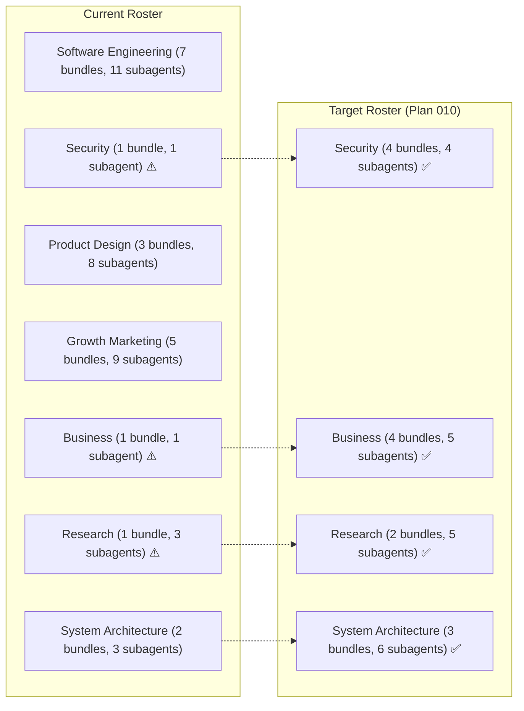

# Plan 010: Antigravity August 2026 Features Adoption & Department Subagent Ecosystem Expansion

> **Executor instructions**: Follow this plan step by step. Run every
> verification command and confirm the expected result before moving to the
> next step. If anything in the "STOP conditions" section occurs, stop and
> report — do not improvise. When done, update the status row for this plan
> in `plans/README.md` and sync `PROJECT.md`, `README.md`, and `CONTEXT.md`.

---

## 📑 Table of Contents
1. [Executive Summary & Scope](#1-executive-summary--scope)
2. [Department-by-Department Forensic Roster & Gap Analysis](#2-department-by-department-forensic-roster--gap-analysis)
3. [Master Milestone Decomposition (Milestones 1–6)](#3-master-milestone-decomposition-milestones-16)
4. [Target Technical Architecture & Contracts](#4-target-technical-architecture--contracts)
5. [Step-by-Step Implementation Sequence](#5-step-by-step-implementation-sequence)
6. [Verification Matrix & Quality Gates](#6-verification-matrix--quality-gates)
7. [STOP Conditions & Operational Guardrails](#7-stop-conditions--operational-guardrails)

---

## 1. Executive Summary & Scope

Google Antigravity 2.0 (v2.6.0–v2.10.0) and Antigravity CLI (v1.1.10–v1.1.21) released in August 2026 introduce powerful features for autonomous agent orchestration:
- **Declarative Agent Frontmatter**: `rules:` scoped array, `inheritCustomizations: boolean`, `disable-slash-command: true`, `metadata.icon`, reasoning `/effort` and `model:` tiers.
- **Subagent Tree Lifecycle & Task Concurrency**: Cascading descendant termination, `manage_task` delegation, reactive `schedule` liveness timers with sender conditions.
- **Multimodal Deliverables**: Live URL Artifact Cards (dev server preview pane), SVG/image side-by-side visual diffs, region-selection comments, audio file attachments & `/voice` transcription.
- **Native MCP CLI Management**: Direct `agy mcp add|remove|list|enable|disable` integration and disk offloading for large binary payloads.
- **Headless Stream-JSON & Remote Control**: `--input-format stream-json`, `--output-format stream-json`, and `--remote-control` browser driving.

Simultaneously, an architectural audit of Agents United's 8 department domains reveals critical subagent deficits in **Security Operations** (only 1 subagent), **Business Strategy** (only 1 generic subagent), **Deep Research** (missing quantitative and patent analysts), and **System Architecture** (missing cloud infrastructure, DBA, and FinOps specialists).

This plan outlines the end-to-end modernization of the orchestration architecture and the systematic expansion of the department rosters.

---

## 2. Department-by-Department Forensic Roster & Gap Analysis



### Detailed Department Roster Matrix

| Department Domain | Essentials Base | Existing Subagents | Deficit / Missing Roles | Target Addon Bundles & New Subagents |
|---|---|---|---|---|
| **🔒 Security Operations** | `security-operations` | `subagent-security-engineer` (1) | Cloud IAM posture, AppSec penetration testing, GRC compliance audits | • `secops-cloud-security` (`subagent-cloud-security-architect.md`)<br>• `secops-application-security` (`subagent-appsec-penetration-tester.md`)<br>• `secops-compliance-grc` (`subagent-compliance-grc-specialist.md`) |
| **💼 Business Strategy & Economics** | `business-strategy` | `subagent-business-panel-experts` (1) | SaaS financial modeling, unit economics, TAM/SAM/SOM market intelligence, legal & operations | • `business-financial-modeling` (`subagent-financial-analyst.md`)<br>• `business-market-intelligence` (`subagent-market-intelligence-analyst.md`)<br>• `business-operations-legal` (`subagent-legal-contract-analyst.md`, `subagent-operations-strategist.md`) |
| **🔬 Deep Technical Research** | `deep-research` | `subagent-deep-research`, `subagent-socratic-mentor`, `subagent-repo-index` (3) | Quantitative benchmark modeling, academic literature & patent prior art search | • `deep-research` Addon / Extension (`subagent-statistical-analyst.md`, `subagent-literature-patent-analyst.md`) |
| **🏛️ System Architecture & SRE** | `system-architecture` | `subagent-system-architect`, `subagent-backend-architect`, `subagent-sysops-sre-lead` (3) | Cloud infrastructure topology, Database Administration (DBA), FinOps cost engineering | • `system-architecture-cloud` (`subagent-cloud-infrastructure-architect.md`)<br>• `system-architecture-data` (`subagent-database-administrator.md`)<br>• `system-architecture-finops` (`subagent-finops-cost-engineer.md`) |
| **🛠️ Software Engineering & Delivery** | `software-engineering` | 11 subagents across 7 bundles | Complete coverage | Standardize with scoped `rules:` and reasoning `/effort` |
| **🎨 Product Design & UI/UX** | `product-design` | 8 subagents across 3 bundles | Complete coverage | Standardize with side-by-side image diffs & URL preview cards |
| **📈 Growth & Marketing Operations** | `growth-marketing` | 9 subagents across 5 bundles | Complete coverage | Standardize with audio voice memo intake & ad previews |
| **🏢 Organization Bundles** | `digital-agency` 🚧 | 9 specialized subagents | Blocked on MCP prerequisites | Unblock via native `agy mcp add` CLI automation |

---

## 3. Master Milestone Decomposition (Milestones 1–6)

### Milestone 1: Architectural Foundation & Conformance Adoption (ADR 0011 & Engine Updates)
- **Scope**:
  - Accept ADR 0011 (`docs/adr/0011-antigravity-august-features-and-department-expansion.md`).
  - Extend `src/core/types.ts` with `rules?: string[]`, `inheritCustomizations?: boolean`, `disableSlashCommand?: boolean`, and `icon?: string`.
  - Update `src/core/projector.ts` to cleanly preserve Antigravity frontmatter keys while safely stripping/translating for projected targets (`claude`, `cursor`, `cline`, `opencode`, `codex`).
  - Verify zero-regression against all 27 existing test suites.

### Milestone 2: Canonical Frontmatter Modernization across Existing Agents & Skills
- **Scope**:
  - Update all 46 existing agents in `registry/agents/`:
    - Add explicit `rules: [...]` arrays (e.g. `rules: [git-guardrails.md, tdd-protocol.md]`).
    - Add `inheritCustomizations: true / false` for worker subagent isolation.
    - Declare `model:` tiers and reasoning effort hints (`effort: high` for lead orchestrators).
  - Modernize all 90 skills in `registry/skills/**/SKILL.md`:
    - Add `metadata.icon: "<emoji>"` for visual catalog branding.
    - Add `disable-slash-command: true` on subagent-internal skills to keep the user `/` command menu clean.

### Milestone 3: Department-by-Department Subagent Ecosystem Expansion
- **Scope**:
  - **Security Operations**:
    - Create `registry/agents/subagent-cloud-security-architect.md`
    - Create `registry/agents/subagent-appsec-penetration-tester.md`
    - Create `registry/agents/subagent-compliance-grc-specialist.md`
    - Create 3 Addon bundles in `registry/bundles.json`: `secops-cloud-security`, `secops-application-security`, `secops-compliance-grc`.
  - **Business Strategy & Economics**:
    - Create `registry/agents/subagent-financial-analyst.md`
    - Create `registry/agents/subagent-market-intelligence-analyst.md`
    - Create `registry/agents/subagent-legal-contract-analyst.md`
    - Create `registry/agents/subagent-operations-strategist.md`
    - Create 3 Addon bundles in `registry/bundles.json`: `business-financial-modeling`, `business-market-intelligence`, `business-operations-legal`.
  - **Deep Technical Research**:
    - Create `registry/agents/subagent-statistical-analyst.md`
    - Create `registry/agents/subagent-literature-patent-analyst.md`
  - **System Architecture & SRE**:
    - Create `registry/agents/subagent-cloud-infrastructure-architect.md`
    - Create `registry/agents/subagent-database-administrator.md`
    - Create `registry/agents/subagent-finops-cost-engineer.md`
  - Update `registry/bundles.json` manifest and sync `full` suite.

### Milestone 4: Multimodal Capabilities, Live URL Cards & Reactive Lifecycle Execution
- **Scope**:
  - Update `subagent-frontend-architect.md`, `product-design`, and `devops-engineering` to generate URL Artifact Cards for local dev servers (`http://localhost:3000`) and preview environments.
  - Update `product-design` (`subagent-ui-designer`) and `qa-automation` (`subagent-e2e-tester`) with side-by-side SVG/image visual diffing and region-selection commenting runbooks.
  - Update `grill-me`, `grill-with-docs`, and `to-spec` runbooks to accept audio files (.mp3, .wav, .m4a) and `/voice` transcripts directly.
  - Equip `subagent-devops-engineer`, `subagent-sysops-sre-lead`, and `subagent-qa-automation-lead` with `manage_task` tool calling and reactive `schedule` liveness timers.

### Milestone 5: Organization Bundle Automation & Native MCP Tooling (`digital-agency`)
- **Scope**:
  - Upgrade `PrerequisiteChecker` in `src/core/prerequisites.ts` to support automatic provisioning via `agy mcp add --type stdio|http --env ...`.
  - Wire automated Firecrawl and GitHub MCP setup into `agents add digital-agency`.
  - Graduate `digital-agency` from `status: "under-construction"` to `status: "experimental"`.

### Milestone 6: Headless Stream-JSON Continuous Evaluation & Verification Harness
- **Scope**:
  - Create an automated benchmark evaluation harness under `tests/e2e-evals/` running `agy -p --input-format stream-json --output-format stream-json --json-schema`.
  - Expand 4-Tier test suite to validate all new bundles, agent schemas, and projection invariants.
  - Synchronize `PROJECT.md`, `README.md`, and `CONTEXT.md`.

---

## 4. Target Technical Architecture & Contracts

### 4.1 Canonical Agent Schema Contract (`registry/agents/*.md`)
```yaml
---
name: subagent-cloud-security-architect
version: 2.1.0
type: subagent # "orchestrator" | "subagent"
description: Cloud infrastructure security, IAM least-privilege, and IaC posture hardening.
model: inherit # "inherit" | "pro" | "flash"
effort: high # "low" | "medium" | "high"
permissionMode: acceptEdits # "acceptEdits" | "requestReview" | "strict" | "readOnly"
commandExecutionPolicy: auto # "auto" | "ask" | "never"
mainAgent: false
subagent: true
inheritCustomizations: false
rules:
  - git-guardrails.md
  - anti-hallucination.md
  - security-boundary.md
tools:
  - run_command
  - view_file
  - replace_file_content
  - write_to_file
  - grep_search
  - list_dir
hooks:
  PreInvocation:
    - matcher: ".*"
      action: audit_workspace
---
```

### 4.2 Canonical Skill Schema Contract (`registry/skills/<skill>/SKILL.md`)
```yaml
---
name: cloud-iam-hardening
description: Scoped IAM permission policies, principle of least privilege, and role assumption audits.
disable-slash-command: true # Hides from interactive / popup; keeps discoverable by agents
metadata:
  author: "Agents United Security Team (@agents-united)"
  version: "1.0.0"
  icon: "🛡️"
  source: "https://github.com/NeoAnthropocene/agents-united"
  license: "MIT"
---
```

---

## 5. Step-by-Step Implementation Sequence

```text
[Step 1: ADR 0011 Authoring & Types] -> [Step 2: Projector & Conformance] ->
[Step 3: Catalog Modernization] -> [Step 4: Department Roster Expansion] ->
[Step 5: MCP & Multimodal Tooling] -> [Step 6: Stream-JSON E2E Eval & Docs Sync]
```

1. **Step 1 (Milestone 1)**: Accept ADR 0011 and extend `src/core/types.ts` with typed interfaces for `rules: string[]`, `inheritCustomizations: boolean`, `disableSlashCommand: boolean`, and `icon: string`.
2. **Step 2 (Milestone 1)**: Update `src/core/projector.ts` dialect handlers to correctly preserve Antigravity fields and strip them from projected hosts (`claude`, `cursor`, `cline`, etc.).
3. **Step 3 (Milestone 2)**: Batch-update existing 46 agents in `registry/agents/` and 90 skills in `registry/skills/` with `rules:`, `metadata.icon`, and `disable-slash-command: true`.
4. **Step 4 (Milestone 3)**: Author the 12 new specialized subagents across Security, Business, Research, and Architecture, register the 7 new addon bundles in `registry/bundles.json`, and update the `full` suite.
5. **Step 5 (Milestone 4 & 5)**: Wire `URL Artifact Cards` into frontend/DevOps workflows, integrate `agy mcp` commands into `src/core/prerequisites.ts`, and graduate `digital-agency` to `experimental`.
6. **Step 6 (Milestone 6)**: Run complete 4-Tier test suite, verify 100% test pass rate, and update `PROJECT.md`, `README.md`, and `CONTEXT.md`.

---

## 6. Verification Matrix & Quality Gates

- [x] **Tier 1 (Schema & Unit)**: `vitest run tests/registry.test.ts tests/e2e-agents-schema.test.ts`
- [x] **Tier 2 (Multi-Host Projection)**: `vitest run tests/projector.test.ts tests/cline-projector.test.ts tests/fanout.test.ts`
- [x] **Tier 3 (Department Lifecycle & Addons)**: `vitest run tests/e2e-domain-conformance.test.ts`
- [x] **Tier 4 (Continuous Stream-JSON Evals & Full Catalog E2E)**: `npm run build && npm test && npm run test:evals` (all test suites pass 100%).

---

## 7. STOP Conditions & Operational Guardrails

1. **Host Projection Regressions**: If any projected target (`.claude/`, `.cursor/`, `.cline/`) fails schema parsing or receives non-standard frontmatter keys, STOP and fix the `HostProjector` dialect profile.
2. **Missing Attribution**: All newly created skills must declare `metadata: { author, version, icon, source, license }`.
3. **Breaking Essentials Baseline**: The Essentials bundle for each department domain must remain lean and self-contained; do not leak specialized addon subagents into the Essentials base.
