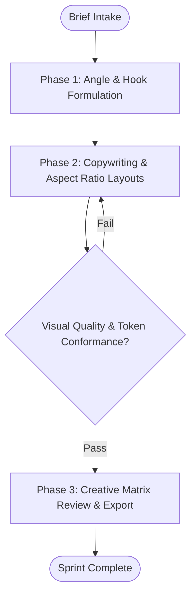

# Workflow: Agency Multi-Channel Ad Creative Sprint

## Overview & Scope
Coordinates rapid ad creative authoring, visual layout composition, and copy variant generation across paid social and search channels.

## Execution Flowchart

## Required Tool Inputs & Context
- Target ICP pain points & value propositions
- Aspect ratio specifications (1:1, 9:16, 16:9, 1.91:1)
- MCP Stitch / Figma integration or native image assets

## Phase 0: Planning Council (ADR 0014)
- Grill ambiguous briefs with the user (`/grill-me` or `/grill-with-docs`), then spawn up to 2 planning sidekicks.
- Collect a Scope-of-Work Statement (≤150 words) from every relevant specialist; peer exchanges capped at 2 per pair; max 2 planning rounds.
- Synthesize the Delegation Map (task → specialist, using the spawnable `subagent_*` tools declared in the Team Manifest) and present it to the user before Phase 1.
- Transition criteria: Delegation Map approved by user. Deterministic phase gate: specialist roster resolves against the Team Manifest (`.agents/plugins/digital-agency/agents-united/teams/digital-agency.yaml`).

## Phase 1: Context & Hooks
- Determine 3 core angles (Pain-led, Feature-led, Social Proof-led).
- Structure hook variations for each angle.

## Phase 2: Copy & Creative Generation
- Write primary text, headlines (under 40 chars), and CTA button copy.
- Generate asset layouts adhering to brand color tokens.

## Phase 3: Verification & Export
- Validate visual hierarchy, legibility on mobile, and ad network policy compliance.
- Export ready-to-launch creative matrix in markdown/JSON.

## Phase Transition Criteria & Deterministic Verification Gates
| Transition | Prerequisites | Verification Command / Gate | Success Criteria |
|---|---|---|---|
| Phase 1 -> Phase 2 | Angles formulated | `npx agents-united doctor` | Doctor health check succeeds with 0 errors |
| Phase 2 -> Phase 3 | Layouts generated | `npm run test --if-present` | Format and dimension checks pass 100% |
| Phase 3 -> Completion | Final matrix reviewed | `npm run build --if-present` | All assets formatted and validated |

## Validation Checkpoints & Automated Rollback Protocols
- **Validation Checkpoint 1**: Ad copy conforms to advertising platform compliance guidelines.
- **Automated Rollback Protocol**: Re-generate copy variants if headline exceeds character constraints.
