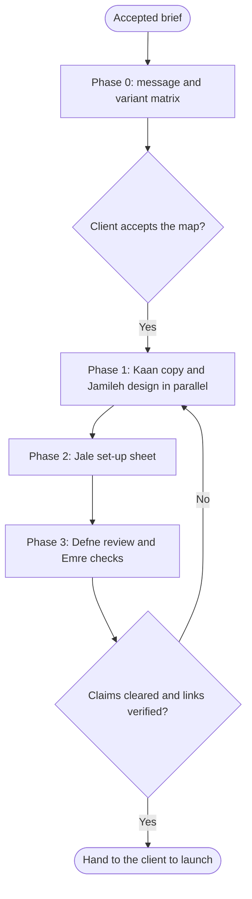

# Workflow: Agency Ad Creative Sprint

## Overview & Purpose
A creative sprint produces a tested set of ads in days: one message, three to six variants that differ on purpose, every claim reviewed, every link tagged. It is a short run, one cycle, with a client decision at the start and a measured result at the end. This playbook tells Chris how to slice it among Ava, Kaan, Jamileh, Jale, Defne and Emre.

## Execution Triggers
Load it for a request such as "new ads for the launch" or "test three angles". Do not load it for brand identity (use `workflow-agency-brand-design-system`) or for a full engagement (use `workflow-agency-full-campaign`). Nothing in this sprint buys media or publishes an ad: the client or the lead does that with their own account.

## Input/Output Requirements
Inputs: the accepted brief, the audience, the offer and its proof, the placements the client has budget for, brand tokens, legal copy the client requires, and what earlier ads taught.

Outputs: the creative brief with the single message; the variant matrix; copy per variant (Kaan); design specs per ratio (Jamileh, with `ad-creative-design`); the campaign set-up sheet with names and UTM tags (Jale); Defne's claims and disclosure review; Emre's link and landing-page check. **Evidence to attach**: the source of each claim and the path of each asset file.

## Step-by-Step Runbook

```mermaid
graph TD
    B([Accepted brief]) --> P0[Phase 0: message and variant matrix]
    P0 --> G0{Client accepts the map?}
    G0 -->|Yes| P1[Phase 1: Kaan copy and Jamileh design in parallel]
    P1 --> P2[Phase 2: Jale set-up sheet]
    P2 --> P3[Phase 3: Defne review and Emre checks]
    P3 --> G1{Claims cleared and links verified?}
    G1 -->|No| P1
    G1 -->|Yes| Done([Hand to the client to launch])
```

1. **Phase 0.** Ava states the audience, the single message and the metric (cost per qualified signup, not clicks); the lead presents the map. Variants change one dimension: the angle (outcome, proof, objection) or the format, never both at once.
2. **Phase 1.** Kaan writes the copy per variant with one claim each and a source list; Jamileh designs per placement (sizes verified against the platform), using Kaan's headline as a fixed input.
3. **Phase 2.** Jale writes the set-up sheet: ad names that match `utm_content`, UTM tags on every link, audiences and exclusions the client set. Jale does not create accounts or campaigns.
4. **Phase 3.** Defne reviews claims, comparisons, "free" and price statements, endorsements and the disclosure for any sponsored placement; Emre checks that each link lands on the right page, that tracking fires and that the landing page matches the ad's promise.
5. **Hand to the client.** The client or the lead sets the ads up and launches; Ava defines the stop rule and the day the result is read.

| Transition | Prerequisites | Gate (evidence) | Success criteria |
|---|---|---|---|
| Phase 0 -> Phase 1 | Single message and matrix agreed | The client accepted the delegation map | One message, one change between variants |
| Phase 1 -> Phase 2 | Copy and design exist as files | Lead has read both back with paths | Every claim has a source in the list |
| Phase 2 -> Phase 3 | Set-up sheet drafted | Names and UTM scheme listed | Each ad name equals its utm_content |
| Phase 3 -> Hand-off | Defne cleared and Emre green | Both reports read in full | No unsupported claim; links verified |

## Code & Config Exemplars
### Worked example
Brief: three angles for a webhook-retry feature, two placements (a feed ad and a vertical story), goal 400 connections in 14 days.

```text
Message: Failed webhooks now recover on their own.
Variants (one change each):  A outcome  | B objection ("no code on your side") | C proof (a result from a staging test, to be sourced)
Format: static 1080x1350 and vertical video 1080x1920 for A and B; C static only
Names: webhook-retries_<angle>_<format>_<size>_v1   utm_content = the same string
Stop rule (Ava): pause a variant after 1,000 impressions without a click, or when the guardrail (negative comments) exceeds 5 percent
Read-out: day 7 and day 14, by cost per connection
```
Rollback protocol: if Defne rejects a claim, the variant is withdrawn or rewritten (Kaan, then Jamileh), the sheet is renamed v2 and Phase 3 re-runs on the changed assets only; if the landing page does not match the promise, Kaan revises the page copy, not the ad.

### Anti-patterns
- Three messages in one ad set.
- Variants that differ in five ways.
- Setting up ads before the claims review.
- Reading results on fewer than the stated impressions.
- Letting a specialist create an ad account or spend.
- A landing page that does not carry the ad's promise.

## Edge Cases & Error Recovery
- **A platform rejects an ad**: record the reason, fix that point, rename the variant and re-run Defne's review on it.
- **No proof exists for the strongest claim**: drop that variant; do not fabricate or soften wording to hide it.
- **The client wants a competitor named**: send it to Defne first; Kaan drafts only after clearance.
- **Brand tokens are missing**: Jamileh works with a labelled provisional palette only if the client agrees.
- **Results disagree with the stop rule**: report both and let the client decide; do not move the goalposts.

## Verification Checklist
- [ ] One message; variants differ by one dimension; names match `utm_content`.
- [ ] Every claim in every variant has a source; Defne has cleared them in writing.
- [ ] Every link carries the four UTM fields and Emre has verified the landing and tracking.
- [ ] The stop rule and the read-out days are written by Ava.
- [ ] Nothing was published or bought by this team; the hand-off to the client is explicit.
- [ ] A rollback route is written for a rejected claim and a rejected ad.
