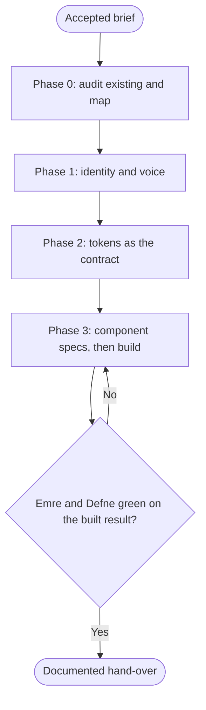

# Workflow: Agency Brand and Design System

## Overview & Purpose
A brand and design-system engagement ends with a small set of decisions engineering can use without asking: identity and voice, a token file, a component list with specifications, and proof that the built result keeps the contrast and accessibility the tokens promise. Chris runs it with Jamileh (identity and tokens), Kaan (voice and interface text), Deniz (the build), Emre (verification), Defne (licences and claims) and Yavuz when the voice must carry into content.

## Execution Triggers
Load it for a brand refresh, a new product's design foundations, or a system audit that must be fixed. Do not load it for a single campaign's visuals (use `workflow-agency-ad-creative-sprint`) or for a one-off banner. If the client already has a token set, the engagement audits and extends it; it does not replace it.

## Input/Output Requirements
Inputs: the accepted brief, the client's existing brand assets and guidelines, the surfaces (marketing site, product, email), whether dark theme is required, any fonts and their licences, and the integration state (`figma` and `stitch` for Jamileh).

Outputs: Jamileh's identity decisions with `brand-identity`, `design-tokens.json` with the contrast table (`design-system-tokens`); Kaan's voice guide and interface text rules (`ux-writing`); component specs (`ui-component-spec`) and a handoff spec per key screen (`design-handoff-spec`); Deniz's theme and components; Emre's contrast, keyboard and viewport check; Defne's licence and claims review. **Evidence to attach**: computed contrast ratios, the font and image licences, and the build output of the theme.

## Step-by-Step Runbook


1. **Phase 0.** Consult Jamileh and Deniz read-only on what exists; present the delegation map. Record which brand values are given and which are proposed.
2. **Phase 1: Jamileh and Kaan.** Identity decisions and a short voice guide built from real samples. Brand colours are taken as given; a derived step is added beside one that fails contrast.
3. **Phase 2: Jamileh.** `design-tokens.json` in three tiers with every text and boundary pair computed (4.5 to 1 for text, 3 to 1 for large text and boundaries) and a dark theme by remapping. The file is the contract; nothing is built before it is read back and listed.
4. **Phase 3: Deniz and Jamileh.** Component specs for the ten to fifteen components that matter (with every state, keyboard behaviour and test ids), then Deniz builds the theme and components from tokens only.
5. **Gate.** Emre runs contrast, keyboard and viewport checks on the built result; Defne reviews font and image licences and any claim in the guidelines. Findings go to the owner: tokens to Jamileh, code to Deniz.
6. **Hand-over.** A short document: where tokens live, how to add one, what may never be hardcoded, the open exceptions.

| Transition | Prerequisites | Gate (evidence) | Success criteria |
|---|---|---|---|
| Phase 1 -> Phase 2 | Identity and voice approved by the client | Client acceptance in the conversation | Given values are untouched; derived ones are labelled |
| Phase 2 -> Phase 3 | `design-tokens.json` exists | Contrast table read back; every alias resolves | No failing pair without a stated remedy |
| Phase 3 -> Hand-over | Theme and components built from tokens | Emre green and Defne cleared | No raw colour values in components |

## Code & Config Exemplars
### Worked example
A scheduling tool whose primary blue `#1D4ED8` and accent amber `#F59E0B` are given (invented brief).

```text
S1 Jamileh  identity + tokens   out: design/design-tokens.json   evidence: amber fails as text on white (2.15), so amber is a fill with a dark label; text amber is a derived darker step (5.02)
S1 Kaan     voice guide         out: brand/voice.md              evidence: from 12 real samples supplied by the client
S2 Jamileh  component specs     out: design/components/*.md      evidence: states table per component
S3 Deniz    theme + components  out: src/styles/theme, src/components/ui   evidence: build output; grep shows no raw hex in components
S4 Emre     contrast + keyboard out: qa/system-gate.md           evidence: axe results, tab path, viewport matrix
S4 Defne    licences            out: compliance/assets.md        evidence: font licence, image sources
```
Rollback protocol: if a token change breaks a verified component, the previous token file is restored (it is kept in version control by the client), Emre re-runs the checks on the changed components, and the token is re-proposed with its contrast result.

### Anti-patterns
- Changing the client's brand colour to pass a test.
- Building components before the tokens are agreed.
- Raw colour values in components.
- A voice guide invented without samples.
- A font used without a recorded licence.
- Claiming accessibility compliance from tokens alone.

## Edge Cases & Error Recovery
- **No existing guidelines**: Jamileh proposes a minimal set and labels it provisional until the client accepts it.
- **Brand pair fails and the client insists**: document the exception, restrict its use, and put the risk in the report; do not hide it.
- **A third-party component library constrains the build**: Deniz states what can and cannot be themed before Jamileh specifies beyond it.
- **Fonts cannot be embedded**: use outlines in assets and a licensed web font in the product, or a system stack agreed with the client.
- **The client changes the palette late**: re-run Phase 2 gate checks; do not patch components one by one.

## Verification Checklist
- [ ] Given brand values are unchanged; derived values are labelled.
- [ ] Every text and boundary pair has a computed ratio and a remedy for any failure.
- [ ] Components use semantic tokens only; a search shows no raw colour values.
- [ ] Emre's contrast, keyboard and viewport checks and Defne's licence review are attached and green, or open items are listed.
- [ ] A rollback route for a token change is written.
- [ ] The hand-over document says where tokens live and how to extend them.
