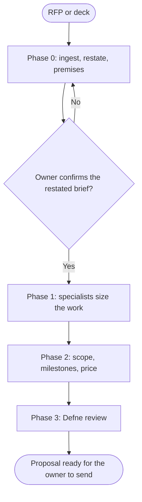

# Workflow: Agency Client Pitch and Proposal

## Overview & Purpose
A proposal is a promise in writing: what is delivered, in what order, by when, for how much, under which assumptions. The expensive mistakes: an unstated assumption, a missing exclusion, an unreviewed estimate. Chris builds it with Ava, Yavuz, Kaan, Jamileh, Selin and Deniz sizing the work and Defne reviewing what it claims and commits to.

## Execution Triggers
Load it when the input is an RFP, a discovery call, a deck or a brief to be answered with a proposal. Do not load it to run the engagement itself (`workflow-agency-full-campaign`), and send the proposal to no one: the client relationship and the sending belong to the human owner.

## Input/Output Requirements
Inputs: the client's material (ingest PDFs and decks through `markitdown` when connected); the rate card and standard terms from the owner; past work the owner permits to cite; the deadline; who approves internally.

Output: a restated brief with assumptions and unknowns (`agency-brief-and-premises`); a scope with deliverables, milestones and exclusions; each specialist's sizing in hours with assumptions; a price table from the rate card; the risks; the claims register; Defne's review. **Evidence to attach**: the page or line of the client material behind each requirement, and the rate card version.

## Step-by-Step Runbook

1. **Phase 0.** Ingest the material, restate it in three lists (what the client said, what you assume, what is unknown), test the premises with the owner and present the Delegation map for the sizing consultations. No proposal text before the owner confirms the restated brief.
2. **Phase 1: sizing.** Each relevant specialist writes a bounded estimate: deliverables, hours as a range with the reason for the spread (one number hides the risk), assumptions, dependencies and exclusions.
3. **Phase 2: scope and price.** The lead assembles milestones in assembly-line order, prices hours from the rate card (never an invented rate), lists exclusions and assumptions in plain words, names client dependencies (access, approvals, content) and adds change control.
4. **Phase 3: review.** Defne reviews every claim (results, case studies, guarantees, comparisons) and the terms committed to; a case study needs the owner's permission, otherwise a generic description labelled as such. Emre reviews measurable commitments for what can be verified.
5. **Hand-over.** The owner reads, adjusts and sends; the lead lists the owner's open questions.

| Transition | Prerequisites | Gate (evidence) | Success criteria |
|---|---|---|---|
| Phase 0 -> Phase 1 | Restated brief confirmed by the owner | Owner acceptance in the conversation | Assumptions and unknowns listed |
| Phase 1 -> Phase 2 | Each specialist's estimate as a range with assumptions | Estimates read back by the lead | Exclusions stated; no single-point estimates |
| Phase 2 -> Phase 3 | Scope, milestones, price and risks drafted | Rate card version recorded | Every price line traces to hours and a rate |
| Phase 3 -> Hand-over | Defne cleared; Emre reviewed measurable promises | Claims register read in full | No claim without a source or the owner's permission |

Rollback protocol: if the owner or Defne withdraws a claim, the claims register and the paragraph are corrected and Phase 3 re-runs on the changed text; if an estimate changes after review, price and milestones are recomputed from the table, never edited by hand.

## Code & Config Exemplars
Load [examples/worked-example.md](examples/worked-example.md) for the sizing sheet of a three-month relaunch RFP. The playbook works without it.

Anti-patterns, each with its reason:
- A proposal drafted before the brief is confirmed: it answers the wrong question.
- Single-number estimates with no assumption: they hide the risk.
- An invented rate or an unknown rate card version: the price cannot be defended.
- A past client cited without permission: a breach of trust.
- A measurable promise nobody checked: it becomes a liability.

## Edge Cases & Error Recovery
- **The RFP is contradictory or incomplete**: list the contradictions as questions for the owner; resolve none silently.
- **A price ceiling below the estimate**: present options (reduced scope, phased delivery) with their price, not an unexplained discount.
- **A required skill is not on the team**: say so and give the options (partner, exclude, client-supplied).

## Verification Checklist
- [ ] The owner confirmed the restated brief before any proposal text existed.
- [ ] Every estimate is a range with assumptions and exclusions; every price line traces to hours and a rate.
- [ ] Client dependencies and change control are stated.
- [ ] Defne's review and Emre's check of measurable promises are attached; case studies are cleared.
- [ ] A rollback route exists; the owner's open questions are listed; the proposal is handed over, not sent.
