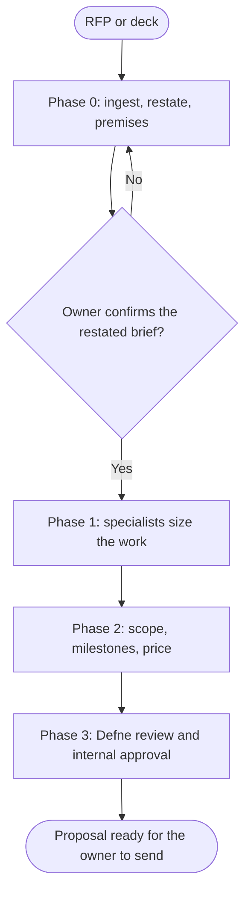

# Workflow: Agency Client Pitch and Proposal

## Overview & Purpose
A proposal is a promise in writing: what will be delivered, in what order, by when, for how much, and under which assumptions. The expensive mistakes are an unstated assumption, a missing exclusion and an estimate no specialist reviewed. This playbook is how Chris builds a proposal from raw client material with Ava, Yavuz, Kaan, Jamileh, Selin and Deniz sizing the work, and Defne reviewing what the proposal claims and commits to.

## Execution Triggers
Load it when the input is an RFP, a discovery call, a deck or a brief to be answered with a proposal. Do not load it to run the engagement itself (use `workflow-agency-full-campaign`), and do not send the proposal to anyone: the client relationship and the sending belong to the human who owns it.

## Input/Output Requirements
Inputs: the client's material (ingest PDFs and decks through the `markitdown` server when connected), the agency rate card and standard terms supplied by the owner, past comparable work the owner permits to be cited, the deadline for the proposal, and who approves it internally.

Outputs: a restated brief with assumptions and unknowns (`agency-brief-and-premises`); a scope of work with deliverables, milestones and exclusions; each specialist's sizing in hours with its assumptions; a price table from the rate card; the risks; the claims register; Defne's review. **Evidence to attach**: the page or line of the client material behind each requirement, and the rate card version used.

## Step-by-Step Runbook


1. **Phase 0.** Ingest the material, restate it in three lists (what the client said, what you assume, what is unknown) and test the premises with the owner. Present the delegation map for the sizing consultations. No proposal text is drafted before the owner confirms the restated brief.
2. **Phase 1: sizing.** Each relevant specialist writes a bounded estimate: deliverables, hours as a range, assumptions, dependencies and what they exclude. Estimates are ranges with the reason for the spread; a single number hides the risk.
3. **Phase 2: scope and price.** The lead assembles milestones in assembly-line order, converts hours to price with the rate card (never inventing a rate), lists exclusions and assumptions in plain words, names client-side dependencies (access, approvals, content), and adds a change-control clause from the standard terms.
4. **Phase 3: review.** Defne reviews every claim (results, case studies, guarantees, comparisons) and the terms the proposal commits to; case studies are cited only with the owner's permission. Emre reviews any measurable commitment ("zero accessibility violations") for what can actually be verified.
5. **Hand-over.** The owner reads, adjusts and sends. The lead lists the open questions the owner must close before sending.

| Transition | Prerequisites | Gate (evidence) | Success criteria |
|---|---|---|---|
| Phase 0 -> Phase 1 | Restated brief confirmed by the owner | Owner acceptance in the conversation | Assumptions and unknowns listed |
| Phase 1 -> Phase 2 | Each specialist's estimate as a range with assumptions | Estimates read back by the lead | Exclusions stated; no single-point estimates |
| Phase 2 -> Phase 3 | Scope, milestones, price and risks drafted | Rate card version recorded | Every price line traces to hours and a rate |
| Phase 3 -> Hand-over | Defne cleared; Emre reviewed measurable promises | Claims register read in full | No claim without a source or the owner's permission |

## Code & Config Exemplars
### Worked example
An RFP for a three-month website relaunch (invented). The restated brief lists as unknown: the current traffic and the size of the content to migrate.

```text
S1 Ava      growth and measurement plan   hours 20-30  assumes GA data available; excludes paid media management
S1 Yavuz    content audit + 90-day plan   hours 40-70  spread = unknown page count (50 to 150 pages); excludes writing the pages
S1 Kaan     key page copy (6 pages)       hours 24-36  assumes client approves within 3 working days
S1 Jamileh  tokens + 6 templates          hours 30-45  assumes client brand assets exist
S1 Deniz    build + migration             hours 90-140 spread = CMS unknown
S1 Selin    redirects + technical SEO     hours 16-24  critical dependency: full URL list from the client
Total range 220-345 h at the rate card version 2026-07: low and high price shown; the proposal states which unknowns move it
Exclusions: photography, video, paid media, content writing beyond 6 pages. Client dependencies: CMS access by week 2, brand files by week 1.
```
Rollback protocol: if the owner or Defne withdraws a claim, the claims register and the affected paragraph are corrected and Phase 3 re-runs on the changed text; if an estimate changes after review, price and milestones are recomputed from the table, never edited by hand.

### Anti-patterns
- Drafting the proposal before the owner confirmed the restated brief.
- Single-number estimates with no stated assumption.
- An invented rate, or a rate card of unknown version.
- Citing a past client without permission.
- A measurable promise nobody checked can be verified.
- Sending the proposal from this team.

## Edge Cases & Error Recovery
- **The RFP is contradictory or incomplete**: list the contradictions as questions for the owner; do not resolve them silently.
- **The client sets a price ceiling below the estimate**: present options (reduced scope, phased delivery) with their price, not a discount without a reason.
- **A required skill is not on the team**: say so and give the options (partner, exclude, client-supplied).
- **A case study cannot be cleared**: remove it; offer a generic description labelled as such.
- **The deadline is shorter than the sizing needs**: say which sections will be provisional.

## Verification Checklist
- [ ] The restated brief was confirmed by the owner before any proposal text existed.
- [ ] Every estimate is a range with assumptions and exclusions; every price line traces to hours and a rate.
- [ ] Client dependencies and change control are stated.
- [ ] Defne's review and Emre's check of measurable promises are attached; case studies are cleared.
- [ ] A rollback route for a withdrawn claim or a changed estimate is written.
- [ ] The open questions for the owner are listed; the proposal is handed over, not sent.
