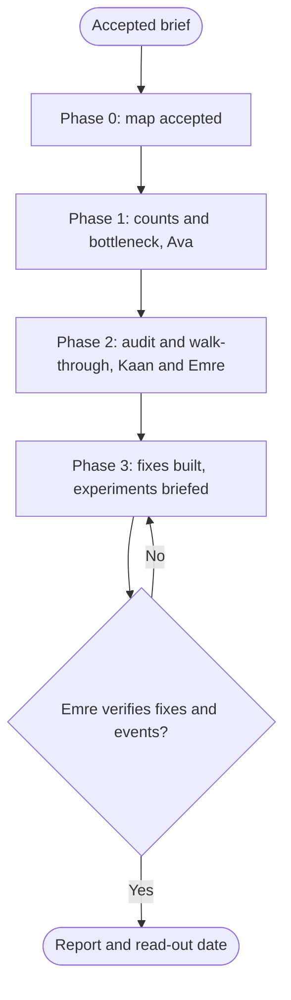

# Workflow: Agency CRO Funnel Teardown

## Overview & Purpose
A teardown takes one funnel apart step by step with numbers: where visitors leave, who they are, why, and the cheapest change that keeps them. It ends with fixes to ship now and a few experiments to run, not a redesign. Chris runs it with Ava, Kaan, Emre, Jamileh, Deniz and Defne.

## Execution Triggers
Load it when conversion is the stated problem, a page underperforms, or the client asks for a CRO audit. Do not load it under about 300 visitors a week to the funnel (do a heuristic review and say so) or when the offer is the problem (say it plainly). Do not scale acquisition into a leaking funnel.

## Input/Output Requirements
Inputs: the accepted brief; funnel steps with 28 days of counts by device, source and new versus returning; the URLs; the goal event; the tools connected (`playwright`, `chrome-devtools-mcp`); who can change the pages.

Output: Ava's bottleneck statement and ICE backlog; Kaan's graded findings (`conversion-funnel-optimization`); Emre's walk-through and instrumentation check; Jamileh's and Deniz's change specs or changes; experiment briefs through `ab-test-setup`; Defne's review of new tracking, consent text and claims. **Evidence to attach**: step counts with their date range, screenshots per viewport, the failing selectors.

## Step-by-Step Runbook

1. **Phase 0.** Consult Ava and Kaan read-only; present the Delegation map.
2. **Phase 1: Ava** draws the funnel with counts, finds the leak against a sourced benchmark and names the segment that carries it. If the data cannot split by segment, instrumentation is fix zero for Deniz and Emre.
3. **Phase 2: Kaan and Emre in parallel.** Kaan audits each step (clarity, effort, anxiety, relevance, distraction) and grades findings S1 to S4; Emre walks the flow at 375 and 1280 pixels, checks the events fire and the console is clean, and attaches evidence. S1 and S2 are fixes, not experiments.
4. **Phase 3.** Jamileh specs layout changes, Kaan supplies copy as typed props, Deniz builds the fixes with test ids; Ava writes the experiment queue and Kaan the briefs with `ab-test-setup`. Defne reviews new consent text, tracking and claims before anything ships.
5. **Gate and hand-off.** Emre re-runs the walk-through and events on the changed pages; red goes back to the owner.
6. **Read-out.** The report names the day the first results are read and the decision rule agreed beforehand.

| Transition | Prerequisites | Gate (evidence) | Success criteria |
|---|---|---|---|
| Phase 1 -> Phase 2 | Counts per step with a date range, bottleneck named | Lead checked the arithmetic of one step | Leak identified by segment, or "unknown" with a fix zero |
| Phase 2 -> Phase 3 | Findings graded with evidence | Emre's walk-through report read | Every S1 and S2 has an owner and a fix |
| Phase 3 -> Report | Fixes built, briefs written | Emre green on the changed pages; Defne cleared | Events verified; decision rule written before launch |

Rollback protocol: a fix that breaks a verified step is reverted by Deniz and the walk-through repeats; an experiment that harms the guardrail is stopped by the decision rule that was written before launch.

## Code & Config Exemplars
Load [examples/worked-example.md](examples/worked-example.md) for the delegation map of a course-checkout teardown. The playbook works without it.

Anti-patterns, each with its reason:
- Averaging across segments: the recommendation fits nobody's problem.
- Testing an S1 bug instead of fixing it: the test measures the bug.
- A redesign when the findings are small and located: the cost is out of proportion.
- A benchmark with no source and date: nobody can check it.
- Reporting a flow nobody walked: the client acts on a false claim.
- New tracking shipped before Defne has seen it: a consent risk.

## Edge Cases & Error Recovery
- **No segment data**: fix zero is instrumentation; the first read-out will be late and the report says so.
- **The site blocks automated browsing**: Emre works around nothing; the lead asks the client for an allow-list or a recording.
- **A campaign or season changes traffic mid-teardown**: one date range for every number; note the event.
- **A test is wanted on tiny traffic**: refuse politely, show the sample arithmetic from `ab-test-setup`, offer qualitative research.
- **A fix and an experiment touch one page**: ship the fix first, then start the experiment on the corrected baseline.

## Verification Checklist
- [ ] Every number has a date range; the leak is segmented or marked unknown.
- [ ] S1 and S2 findings are listed as fixes; each experiment has a brief with a decision rule.
- [ ] Emre's walk-through and event check are attached with screenshots and selectors.
- [ ] Defne cleared new consent text, tracking and claims before shipping.
- [ ] A rollback route exists for fixes and a stop rule for experiments; the report names the read-out day.
