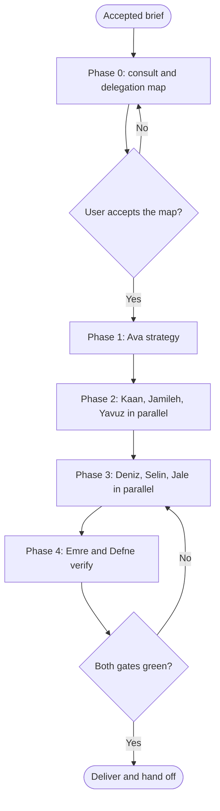

# Workflow: Agency Full Campaign

## Overview & Purpose
This is Chris's playbook for the whole engagement: a client brief becomes a strategy, creative, copy, a built and tracked landing page, a campaign kit and a verified, compliant result. It does not replace the lead's own steps (align with the client, consult, present the delegation map); it says how a full campaign is sliced, in what order, with which interfaces fixed between roles, and where the two gates sit.

## Execution Triggers
Load it when the brief covers strategy through launch across four or more roles (a product launch, a rebrand with a campaign, a new market). For a single discipline use the narrower playbook: `workflow-agency-seo-content-engine`, `workflow-agency-cro-funnel-teardown`, `workflow-agency-ad-creative-sprint`, `workflow-agency-brand-design-system` or `workflow-agency-client-pitch-proposal`. Do not load it for one deliverable; ask the one specialist.

## Input/Output Requirements
Inputs: the accepted brief from `agency-brief-and-premises` (objective, audience, success metric with number and date, constraints), the integration state (Operational, Limited or Brainstorming), the approval path on the client side, the dates, and which roles are installed.

Outputs: the delegation map (slice, owner, inputs, acceptance evidence), the artefacts of each slice, Emre's gate report, Defne's compliance review, and the final report in the lead's Output Contract. **Evidence to attach**: for each slice, the file paths written and the acceptance evidence the owner reported.

## Step-by-Step Runbook


1. **Phase 0: consult, then map.** Consult at least one relevant specialist read-only (usually Ava, plus Kaan when the page is the problem) and record who. Present the delegation map; create no deliverable file until the client accepts it. Keep each consulted teammate's task unowned until the consultation is accepted.
2. **Phase 1: Ava.** Funnel, unit economics, channel choice, ICE backlog. Her output is the fixed input of every later slice: the target metric, the audience, the positioning.
3. **Phase 2: Kaan, Jamileh, Yavuz in parallel**, each with Ava's playbook. Contract first: Kaan's typed section props and Jamileh's `design-tokens.json` are delivered as artefacts before Deniz starts; Yavuz's keyword map before Selin starts.
4. **Phase 3: Deniz, Selin, Jale in parallel.** Deniz builds from the tokens and props and exposes `data-testid` and `dataLayer` hooks; Selin adds structured data and metadata to that layout; Jale sequences the campaign kit with UTM tags using the page URL and the copy.
5. **Phase 4: Emre and Defne verify the whole**, not slices: Emre's gate report (viewport matrix, events, accessibility) and Defne's review (consent, email, disclosures, claims). A red result goes back to the owning specialist, not to a new one.
6. **Deliver.** The final report in the lead's Output Contract, with every slice's evidence, and a handoff note listing open items.

| Transition | Prerequisites | Gate (evidence) | Success criteria |
|---|---|---|---|
| Phase 0 -> Phase 1 | Brief accepted, consultation recorded, map presented | The client says yes in writing in the conversation | No deliverable file exists before this row passes |
| Phase 2 -> Phase 3 | Tokens, typed props and keyword map exist as files | The lead has read each file back and listed its path | A slice never starts without the artefact it depends on |
| Phase 3 -> Phase 4 | Page built, kit drafted, structured data placed | Owners report their acceptance evidence | Tracking events and test ids are named |
| Phase 4 -> Delivery | Emre green and Defne cleared | Both reports read, not summarised from memory | Failures were fixed by their owners and re-verified |

## Code & Config Exemplars
### Worked example
Brief (accepted): launch a webhook-retry feature, 400 connections in 14 days from a baseline of 60. Integrations: Limited Operational (no Figma).

Delegation map:
```text
S1 Ava      strategy and metric       in: brief            out: growth/playbook.md           evidence: LTV:CAC stated, ICE backlog
S2 Kaan     landing copy as props     in: S1               out: copy/hero.props.ts           evidence: five-second test written
S2 Jamileh  tokens and hero SVG       in: S1               out: design/design-tokens.json    evidence: contrast table
S2 Yavuz    guide and 4 posts brief   in: S1               out: content/briefs.md            evidence: keywords with source and date
S3 Deniz    page from tokens, props   in: S2 files         out: src/app/launch/page.tsx      evidence: build output, testids listed
S3 Selin    metadata and JSON-LD      in: S3 page, S2 kws  out: seo/snippets.md              evidence: validator output
S3 Jale     kit with UTM              in: S2 copy, URL     out: campaign/kit.md              evidence: every link tagged
S4 Emre     gate                      in: S3 page          out: qa/gate-report.md            evidence: run output, viewport matrix
S4 Defne    review                    in: S3 kit and page  out: compliance/review.md         evidence: checklist per asset
```
Rollback protocol: if S4 is red for a defect in S3, only that owner reworks; the gate re-runs on the changed files; if the client withdraws a claim at any point, Defne and Kaan revise the affected assets and S4 re-runs.

### Anti-patterns
- Starting Deniz before the tokens and props exist.
- Running the assembly line before the delegation map is accepted.
- Asking a new specialist to fix another one's failed slice.
- Declaring done on summaries instead of reading the gate reports.
- Spawning all nine at once on a small campaign.
- Setting a consulted teammate's task owner during the consultation.

## Edge Cases & Error Recovery
- **A role is not installed**: say so in the map, name the bundle, and give the installing command; do not self-execute expert work unless the client declines the install.
- **A slice cannot finish** (missing client input): park it with a named owner and date, continue the independent slices, and say what the final report lacks.
- **Teams are off**: run in relay mode; spawn with parallel `Agent` calls; every brief says relay.
- **The client changes the objective mid-run**: stop spawning, re-run `agency-brief-and-premises` for the change, and re-issue the map.
- **A gate fails twice on the same defect**: escalate to the client with the evidence; do not loop a third time.

## Verification Checklist
- [ ] The delegation map was accepted before any deliverable file existed.
- [ ] Every slice has an owner, an input artefact, an output path and acceptance evidence.
- [ ] Phase 2 artefacts were read back before Phase 3 started.
- [ ] Emre's gate and Defne's review were read in full and both are green, or the report says what is open.
- [ ] A rollback route (who reworks, what re-runs) is written for each gate.
- [ ] The final report lists open items and names the owners.
