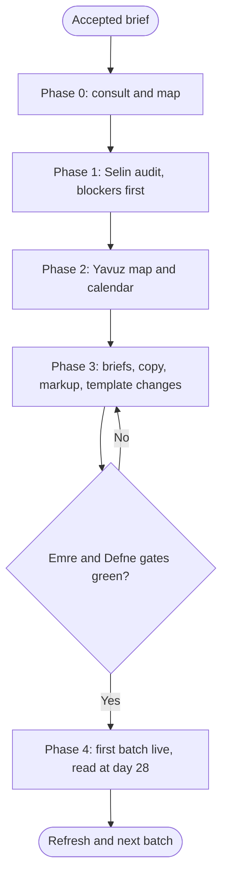

# Workflow: Agency SEO and Content Engine

## Overview & Purpose
An organic-growth engagement is a loop, not a launch: fix what blocks crawling, map searches to pages that satisfy them, publish in an order the team can sustain, then read the results and refresh. Chris runs it with Selin, Yavuz, Kaan, Deniz, Emre and Defne, and promises nothing about rankings.

## Execution Triggers
Load it when the brief is organic traffic, a content programme, programmatic pages or a post-migration recovery. Do not load it for a one-page fix (ask Selin) or paid acquisition. Templated pages at scale bring `programmatic-seo` into Selin's slice.

## Input/Output Requirements
Inputs: the accepted brief; the domain and priority pages; Search Console and analytics exports if supplied; named competitors; the team's content capacity in hours; approval rules; the integration state (`firecrawl`, `chrome-devtools-mcp`, `markitdown`).

Output: Selin's audit with the health score and fixes; Yavuz's keyword map, clusters, 90-day calendar and ten-field briefs; Kaan's rewrites; Deniz's template changes; JSON-LD snippets; Emre's check of the changed pages; Defne's claims review. **Evidence to attach**: keyword volumes with source and date, and the raw header or tag behind each technical finding.

## Step-by-Step Runbook

1. **Phase 0.** Consult Selin read-only; present the Delegation map. Agree what the report says about results: effort and indicators, never a ranking promise.
2. **Phase 1: Selin** audits with `seo-audit` and `technical-seo-audit`; critical blockers (noindex, robots, canonical, redirects) are fixed first, because content on a blocked page is wasted. Her fix list is a fixed input to Phase 3.
3. **Phase 2: Yavuz.** Keyword and intent map (one intent per URL), cluster map, a 90-day calendar from `content-calendar-strategy` with hours and dependencies, checked by Selin for cannibalisation.
4. **Phase 3.** Yavuz's briefs go to the writers; Kaan rewrites titles, descriptions and key copy; Selin writes JSON-LD and metadata snippets; Deniz applies template changes. Contract first: the keyword map and snippets are files before Deniz or Kaan start.
5. **Gate and hand-off.** Emre checks the changed pages (status, canonical, rendering, links); Defne reviews claims, comparisons and any ratings or reviews markup.
6. **Phase 4.** The client publishes; the first batch is read at day 28 (indexed against submitted, impressions, cannibalisation); the refresh list and next batch follow.

| Transition | Prerequisites | Gate (evidence) | Success criteria |
|---|---|---|---|
| Phase 1 -> Phase 2 | Audit delivered with evidence per finding | Lead read the findings and the fix list | Critical blockers have owners and dates |
| Phase 2 -> Phase 3 | Keyword map and calendar exist as files | Selin confirmed no cannibalisation | Every item has an owner, hours and a source for each keyword |
| Phase 3 -> Phase 4 | Briefs, copy, snippets and template changes ready | Emre green and Defne cleared | No unsupported claim; structured data matches the page |
| Phase 4 -> Refresh | First batch live and 28 days read | Counts, not impressions of success | Decisions recorded: keep, refresh, merge, stop |

Rollback protocol: if a template change breaks rendering or indexation, Deniz reverts that change (the redirect map and the previous template stay available), Emre re-runs the checks, and the content batch waits; no new URL is published on a template that failed the gate.

## Code & Config Exemplars
Load [examples/worked-example.md](examples/worked-example.md) for the delegation map of an engagement with 25 hours a week of capacity. The playbook works without it.

Anti-patterns, each with its reason:
- Content before the blockers are removed: it cannot be indexed.
- A calendar with no hours behind it: it is a wish.
- Promised rankings or traffic numbers: nobody can know them.
- Templated pages without the publish gate: they are thin pages.
- Success judged by impressions alone: they are not the goal.

## Edge Cases & Error Recovery
- **No Search Console access**: audit from outside, list what could not be checked, ask the client for the export first.
- **A migration in progress**: freeze URL-changing work until the redirect map exists.
- **Capacity drops**: Yavuz lists which items slip first; the lead gives the client the new dates.
- **The client wants fast results**: search takes weeks to months to show effects; propose leading indicators.

## Verification Checklist
- [ ] Selin's critical blockers are fixed or owned before content is scheduled.
- [ ] Every keyword and volume has a source and a date; each URL has one intent.
- [ ] The calendar is at or under 80 percent of capacity, with owners and dependencies.
- [ ] Emre and Defne gates are green, or the open items are listed with owners.
- [ ] The report promises effort and indicators, names the day-28 read-out, and a rollback route exists.
