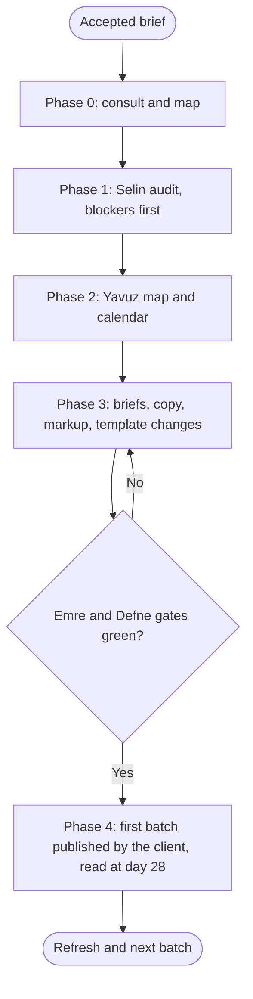

# Workflow: Agency SEO and Content Engine

## Overview & Purpose
An organic-growth engagement is a loop, not a launch: fix what blocks crawling, map what people search to pages that satisfy them, publish in an order the team can sustain, then read the results and refresh. Chris uses this playbook to run that loop with Selin, Yavuz, Kaan, Deniz, Emre and Defne, and to keep the engagement honest about what search can promise (nothing about rankings).

## Execution Triggers
Load it when the brief is organic traffic, a content programme, programmatic pages or a post-migration recovery. Do not load it for a one-page fix (ask Selin) or for paid acquisition. Templated pages at scale also bring `programmatic-seo` into Selin's slice.

## Input/Output Requirements
Inputs: the accepted brief, the domain and priority pages, Search Console and analytics exports if the client supplies them, competitors the client names, the team's content capacity in hours, publishing and approval rules, and the integration state (`firecrawl` and `chrome-devtools-mcp` for Selin, `firecrawl` and `markitdown` for Yavuz).

Outputs: Selin's audit with the health score and the technical fixes list; Yavuz's keyword universe, cluster map, 90-day calendar and ten-field briefs; Kaan's rewrites of titles, descriptions and key page copy; Deniz's changes (or recommendations) to the templates; structured-data snippets; Emre's check of the changed pages; Defne's review of claims. **Evidence to attach**: keyword volumes with their source and date, and the raw header or tag behind each technical finding.

## Step-by-Step Runbook


1. **Phase 0.** Consult Selin read-only on feasibility; present the delegation map. Agree what the report will say about results: effort and indicators, never a ranking promise.
2. **Phase 1: Selin.** Audit with `seo-audit` and `technical-seo-audit`; critical blockers (noindex, robots, canonical, redirects) are fixed first because content on a blocked page is wasted. Her fix list for Deniz is a fixed input to Phase 3.
3. **Phase 2: Yavuz.** Keyword and intent map (one intent per URL), pillar and cluster map, a 90-day calendar from `content-calendar-strategy` with hours and dependencies, validated by Selin for cannibalisation.
4. **Phase 3.** Yavuz's briefs go to the writers (the client's or named roles); Kaan rewrites titles, descriptions and conversion-critical copy; Selin writes JSON-LD and metadata snippets; Deniz applies template changes. Contract first: the keyword map and the metadata snippets are files before Deniz or Kaan start.
5. **Gate and hand-off.** Emre checks the changed pages (status, canonical, rendering, accessibility basics, links); Defne reviews claims, comparisons and any ratings or reviews markup.
6. **Phase 4.** The client publishes; the first batch is read at day 28 (indexed against submitted, impressions, cannibalisation); the refresh list and the next batch follow.

| Transition | Prerequisites | Gate (evidence) | Success criteria |
|---|---|---|---|
| Phase 1 -> Phase 2 | Audit delivered with evidence per finding | Lead read the findings and the fix list | Critical blockers have owners and dates |
| Phase 2 -> Phase 3 | Keyword map and calendar exist as files | Selin confirmed no cannibalisation | Every item has an owner, hours and a source for each keyword |
| Phase 3 -> Phase 4 | Briefs, copy, snippets and template changes ready | Emre green and Defne cleared | No unsupported claim; structured data matches the page |
| Phase 4 -> Refresh | First batch live and 28 days read | Report with counts, not impressions of success | Decisions recorded: keep, refresh, merge, stop |

## Code & Config Exemplars
### Worked example
A developer-tools site, 25 hours a week of content capacity, a migration two months ago (invented).

```text
S1 Selin   audit            out: seo/audit.md      evidence: headers for the 12 key URLs; finding 1 = noindex inherited from staging on /docs
S2 Yavuz   map + calendar   out: content/plan.md   evidence: 3 pillars, 14 clusters, 90 days at 70% of capacity; keywords with source and date
S3 Kaan    rewrite titles   out: copy/meta.md      evidence: lengths 50-60 and 120-155 listed
S3 Selin   JSON-LD          out: seo/schema.md     evidence: Rich Results Test output on staged pages
S3 Deniz   fixes            out: changes made or listed; redirect map; evidence: one-hop redirects verified
S4 Emre    gate             out: qa/seo-gate.md    evidence: status, canonical and rendering checks on the 12 URLs
S4 Defne   review           out: compliance/claims.md
```
Rollback protocol: if a template change breaks rendering or indexation, Deniz reverts that change (the redirect map and the previous template stay available), Emre re-runs the checks, and the content batch waits; no new URL is published on a template that failed the gate.

### Anti-patterns
- Writing content before the technical blockers are removed.
- A calendar with no hours behind it.
- Promising rankings or traffic numbers.
- Publishing templated pages without the publish gate.
- Judging success by impressions alone.
- Letting two pages chase one query.

## Edge Cases & Error Recovery
- **No Search Console access**: audit from outside, list what could not be checked, and ask the client for the export as the first action.
- **A migration is in progress**: freeze URL-changing work until the redirect map exists.
- **Capacity drops**: Yavuz lists which items slip first; the lead tells the client the revised dates.
- **The client wants fast results**: restate that search takes weeks to months to show effects and propose leading indicators.
- **A competitor's content is far ahead**: choose clusters where the client has a real advantage (product data, original research) before the contested ones.

## Verification Checklist
- [ ] Selin's critical blockers are fixed or owned before content is scheduled.
- [ ] Every keyword and volume figure has a source and a date; each URL has one intent.
- [ ] The calendar is at or under 80 percent of capacity with owners and dependencies.
- [ ] Emre and Defne gates are green or the open items are listed with owners.
- [ ] The report promises effort and indicators, not rankings, and names the day-28 read-out.
- [ ] A rollback route exists for template changes.
