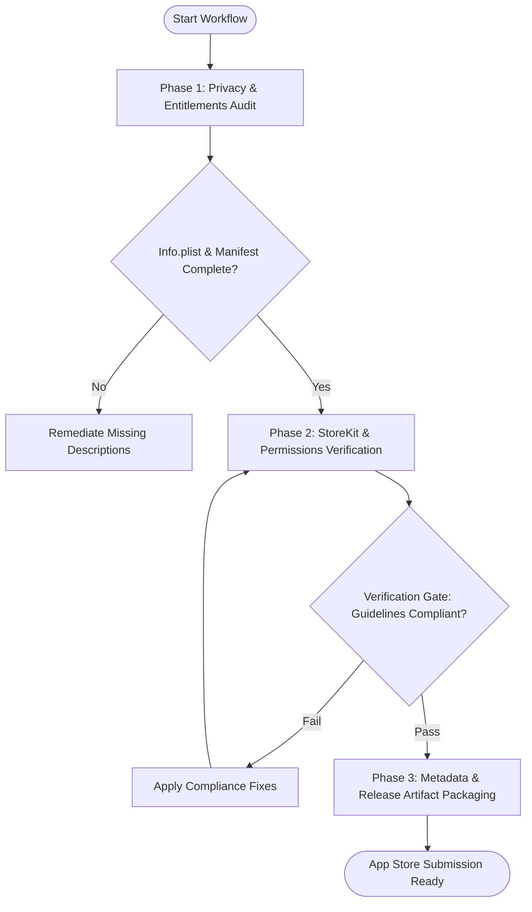

# Workflow: App Store & Google Play Release Preparation

## Overview & Scope
The App Store Release workflow audits mobile applications against Apple App Review Guidelines and Google Play Developer Policies prior to store submission, eliminating common rejection causes.

## Execution Flowchart

## Required Tool Inputs & Context
- `Info.plist` (iOS) / `AndroidManifest.xml` (Android)
- Privacy Policy URL and Terms of Service links
- Screenshot assets for target screen sizes

## Phase 1: Privacy & Entitlements Audit
- Verify that every requested permission (Camera, Location, Notifications) includes a clear, user-facing purpose string.
- Audit third-party SDK privacy manifests and data collection disclosures.

## Phase 2: StoreKit & Permissions Verification
- Verify In-App Purchase restore purchase functionality and clear pricing disclosures.
- Verify account deletion capabilities for apps with user authentication.

## Phase 3: Metadata & Release Artifact Packaging
- Compile App Store Connect / Google Play metadata, release notes, and version increment commits.

## Phase Transition Criteria & Deterministic Verification Gates
| Transition | Prerequisites | Verification Command / Gate | Success Criteria |
|---|---|---|---|
| Phase 1 -> Phase 2 | Permission strings verified | Manifest & Info.plist audit | 100% of requested permissions have explanations |
| Phase 2 -> Phase 3 | Store compliance verified | Guidelines checklist audit | Account deletion & purchase restore verified |
| Phase 3 -> Completion | Metadata bundle signed off | Release notes & version audit | Clean submission package prepared |
