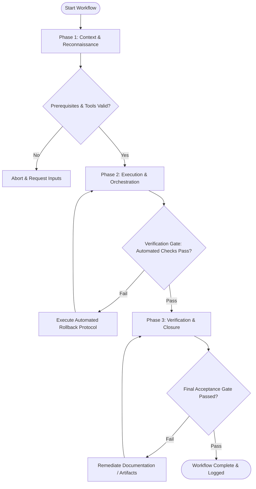

# Workflow: Code Hygiene & Refactoring Cleanup

## Overview & Scope
The Cleanup workflow streamlines codebase maintenance by identifying and eliminating orphaned code, unused npm packages, formatting inconsistencies, and stale comments across the project.

## Execution Flowchart

## Required Tool Inputs & Context
- Linter and formatter configurations (`.eslintrc`, `.prettierrc`)
- Unused dependency scanner (`depcheck` / `knip`)
- Repository file index & source directories

## Phase 1: Context & Reconnaissance
- Scan codebase for unreferenced export declarations, orphaned files, and dead code paths.
- Audit `package.json` against actual import usages to find unused dependencies.
- Check code formatting consistency across all source and test directories.

## Phase 2: Execution & Orchestration
- Safe removal of confirmed unused files, unused variables, and unreferenced functions.
- Run automated code formatters (`prettier --write .`) and linter auto-fixes (`eslint --fix`).
- Remove outdated or commented-out code blocks while preserving documentation comments.

## Phase 3: Verification & Closure
- Run full test suite and type-checker to ensure no functional code was inadvertently broken.
- Verify clean git diff to confirm only intended refactor/cleanup edits were made.
- Document total lines of code removed, dependencies pruned, and formatting changes applied.

## Phase Transition Criteria & Deterministic Verification Gates
| Transition | Prerequisites | Verification Command / Gate | Success Criteria |
|---|---|---|---|
| Phase 1 -> Phase 2 | Tool inputs verified & environment ready | `npx agents-united doctor` | Doctor health check succeeds with 0 errors |
| Phase 2 -> Phase 3 | Execution steps complete | `npm run lint --if-present` | 0 lint errors and 0 warnings remaining post-cleanup |
| Phase 3 -> Completion | Verification complete & artifacts signed off | `npm run test --if-present && npm run typecheck --if-present` | 100% pass rate on test suite and static type check after code removal |

## Validation Checkpoints & Automated Rollback Protocols
- **Validation Checkpoint 1**: Unused dependencies and unreferenced exports verified with static analysis before removal.
- **Validation Checkpoint 2**: Working tree formatted cleanly with zero style deviations.
- **Automated Rollback Protocol**: Revert uncommitted file removals using `git checkout -- .` if cleanup causes test regressions. If the workspace is not a git repository (`git rev-parse --is-inside-work-tree` fails), restore the removed files from your pre-change copies or re-apply the inverse edits instead — rollback must never depend on git being present.
