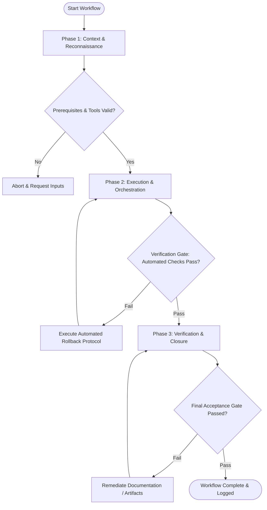

# Workflow: Design System Component Authoring

## Overview & Scope
The Create Component workflow governs the authoring of production-ready design system components. It enforces token integration, accessibility compliance, state coverage, and Storybook documentation.

## Execution Flowchart

## Required Tool Inputs & Context
- Component API specification and visual designs
- Design token library (`tokens.json`)
- Storybook / component testing framework (`vitest` / `axe-core`)

## Phase 1: Context & Reconnaissance
- Review component API design, props, variants, and keyboard interaction specs.
- Verify design tokens needed for component styling are available.
- Select component template structure in design system workspace.

## Phase 2: Execution & Orchestration
- Implement component TSX code, applying semantic design tokens for styling.
- Implement keyboard navigation and ARIA accessibility attributes matching target design pattern.
- Author unit tests, accessibility tests (`axe-core`), and Storybook story files.

## Phase 3: Verification & Closure
- Run automated unit test suite and visual regression tests across all component variants.
- Verify Storybook stories render cleanly without console warnings.
- Export component package for distribution.

## Phase Transition Criteria & Deterministic Verification Gates
| Transition | Prerequisites | Verification Command / Gate | Success Criteria |
|---|---|---|---|
| Phase 1 -> Phase 2 | Tool inputs verified & environment ready | `npx agents-united doctor` | Doctor health check succeeds with 0 errors |
| Phase 2 -> Phase 3 | Execution steps complete | `npm run test --if-present` | 100% of component unit tests and automated accessibility scans pass |
| Phase 3 -> Completion | Verification complete & artifacts signed off | `npm run build --if-present` | Component builds cleanly and exports type definitions (`.d.ts`) |

## Validation Checkpoints & Automated Rollback Protocols
- **Validation Checkpoint 1**: Zero accessibility violations detected by `axe-core` scanner.
- **Validation Checkpoint 2**: Storybook stories exist for all component variants, sizes, and states.
- **Automated Rollback Protocol**: Revert component code modifications if visual regression or accessibility tests fail.
