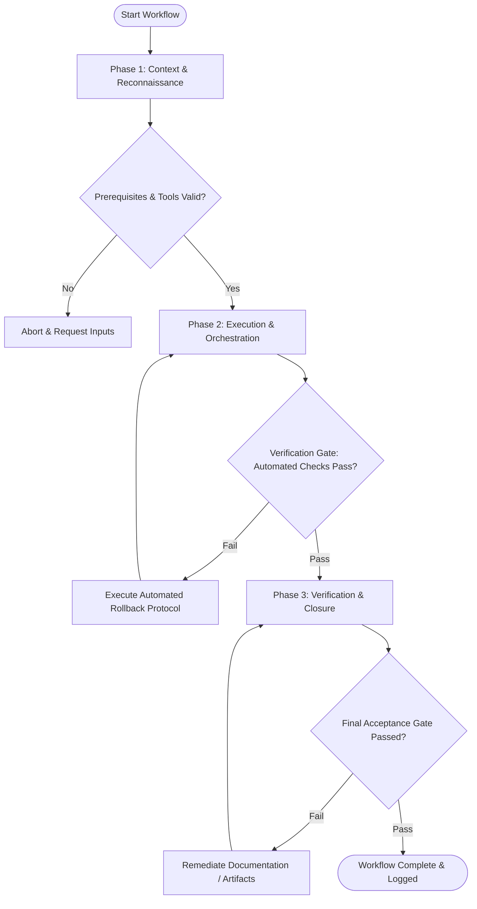

# Workflow: Product Launch Playbook Execution

## Overview & Scope
The Launch workflow coordinates product launch execution. It orchestrates Product Hunt launches, social media announcements, customer email blasts, press releases, and real-time launch operations.

## Execution Flowchart

## Required Tool Inputs & Context
- Product release notes & feature highlights
- Media kit assets (logos, screenshots, promotional videos)
- Multi-channel launch checklist

## Phase 1: Context & Reconnaissance
- Confirm product stability and verify production environment readiness.
- Verify all promotional creative, media kits, and link destinations are staged.
- Align launch team roles and monitoring responsibilities for launch day.

## Phase 2: Execution & Orchestration
- Publish launch post on Product Hunt, Hacker News, Twitter/X, and LinkedIn.
- Trigger launch email blast to subscriber mailing list.
- Engage with community comments and answer user feedback in real time.

## Phase 3: Verification & Closure
- Monitor server infrastructure load, signup conversion rates, and error logs.
- Compile day-1 launch analytics summary (upvotes, signups, traffic sources).
- Publish Post-Launch Retrospective report.

## Phase Transition Criteria & Deterministic Verification Gates
| Transition | Prerequisites | Verification Command / Gate | Success Criteria |
|---|---|---|---|
| Phase 1 -> Phase 2 | Tool inputs verified & environment ready | `npx agents-united doctor` | Doctor health check succeeds with 0 errors |
| Phase 2 -> Phase 3 | Execution steps complete | `npm run test --if-present` | Launch checklist validator confirms 100% prerequisite tasks complete |
| Phase 3 -> Completion | Verification complete & artifacts signed off | `npx agents-united doctor` | Doctor health check confirms system readiness |

## Validation Checkpoints & Automated Rollback Protocols
- **Validation Checkpoint 1**: Product onboarding and signup flows verified operational under traffic load.
- **Validation Checkpoint 2**: All scheduled channel launch posts published successfully.
- **Automated Rollback Protocol**: Divert traffic to status fallback page if servers experience unexpected downtime during launch.
