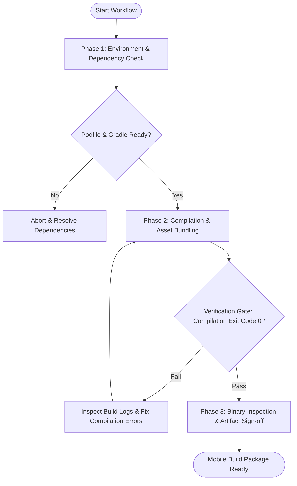

# Workflow: Mobile Multi-Platform Build & Verification

## Overview & Scope
The Mobile Build workflow compiles native and cross-platform mobile application packages (IPA / APK / AAB / Expo EAS), validating binary size, asset optimization, and compiler flags.

## Execution Flowchart

## Required Tool Inputs & Context
- Target mobile platform (`ios`, `android`, `all`)
- Build type (`debug`, `release`)
- Xcode / Android SDK environment setup

## Phase 1: Environment & Dependency Check
- Inspect native configuration files (`Podfile`, `build.gradle`, `app.json`).
- Verify signing identities and bundle identifiers.

## Phase 2: Compilation & Asset Bundling
- Execute compilation (`xcodebuild` / `./gradlew assembleRelease` / `eas build --local`).
- Check output for deprecated API usages or symbol collision warnings.

## Phase 3: Binary Inspection & Artifact Sign-off
- Audit final binary file size against mobile app budget (< 50MB target).
- Verify entry point manifest and permission declarations.

## Phase Transition Criteria & Deterministic Verification Gates
| Transition | Prerequisites | Verification Command / Gate | Success Criteria |
|---|---|---|---|
| Phase 1 -> Phase 2 | Dependencies resolved | `npm run lint --if-present` / `pod install` | Dependency graph clean with 0 lockfile errors |
| Phase 2 -> Phase 3 | Compilation completed | `npm run build:mobile --if-present` | Binary generated with exit code 0 |
| Phase 3 -> Completion | Binary signed and verified | Binary size & signature audit | Target package bundle verified |
