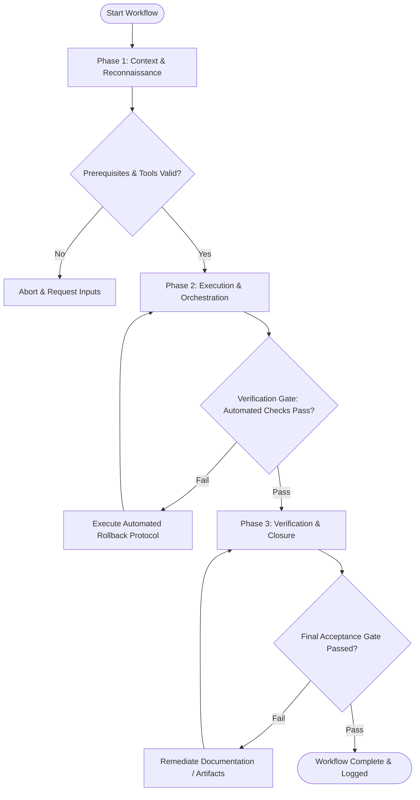

# Workflow: Technical & Strategic Recommendation Synthesis

## Overview & Scope
The Recommend workflow synthesizes technical, business, and operational analysis into formal executive recommendations. It presents clear option comparisons, risk trade-offs, and decisive action plans.

## Execution Flowchart

## Required Tool Inputs & Context
- Technical architecture plans & business evaluation reports
- Option trade-off comparison matrix
- Executive recommendation proposal template

## Phase 1: Context & Reconnaissance
- Gather findings from technical research, architecture planning, and business evaluation panels.
- Identify key decision options requiring executive alignment.
- Define evaluation metrics (Cost, Time-to-market, Scalability, Risk).

## Phase 2: Execution & Orchestration
- Construct Option Comparison Matrix scoring each alternative across evaluation metrics.
- Synthesize clear Primary Recommendation with explicit supporting rationale.
- Detail implementation plan, resource requirements, and risk mitigation strategies.

## Phase 3: Verification & Closure
- Review recommendation document for executive clarity and brevity.
- Verify all claims are backed by documented technical or business evidence.
- Publish Executive Recommendation Proposal.

## Phase Transition Criteria & Deterministic Verification Gates
| Transition | Prerequisites | Verification Command / Gate | Success Criteria |
|---|---|---|---|
| Phase 1 -> Phase 2 | Tool inputs verified & environment ready | `npx agents-united doctor` | Doctor health check succeeds with 0 errors |
| Phase 2 -> Phase 3 | Execution steps complete | `npx agents-united doctor` | Doctor health check validates recommendation proposal schema |
| Phase 3 -> Completion | Verification complete & artifacts signed off | `npm run build --if-present` | Project build passes cleanly during proposal publication |

## Validation Checkpoints & Automated Rollback Protocols
- **Validation Checkpoint 1**: Primary recommendation explicitly supported by option comparison matrix.
- **Validation Checkpoint 2**: Risk mitigation plan included for recommended path.
- **Automated Rollback Protocol**: Revise recommendation proposal if executive review identifies unaddressed trade-offs.
