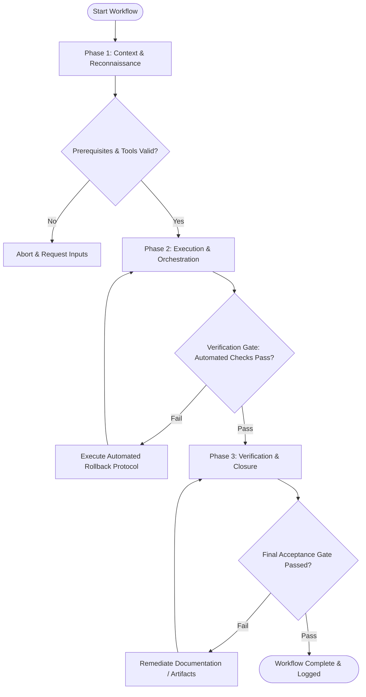

# Workflow: Multi-Perspective Specification Review Panel

## Overview & Scope
The Spec Panel workflow convenes diverse expert perspectives (Architecture, Security, Engineering Ops, Business) to conduct rigorous multi-dimensional reviews of critical system specifications.

## Execution Flowchart

## Required Tool Inputs & Context
- Technical specification or architecture proposal document
- Review evaluation matrix (scalability, security, maintainability, UX)
- Panel reviewer persona profiles

## Phase 1: Context & Reconnaissance
- Load specification document and extract key architectural assumptions.
- Assemble evaluation matrix covering system scalability, threat model, implementation risk, and operational cost.
- Distribute specification to panel personas for pre-review analysis.

## Phase 2: Execution & Orchestration
- Convene panel evaluation session to collect independent feedback across reviewer personas.
- Record consensus points, technical disagreements, and identified design gaps.
- Formulate required modifications and actionable revision requirements.

## Phase 3: Verification & Closure
- Synthesize panel feedback into formal Review Verdict (Approved, Approved with Revisions, Rejected).
- Assign ownership and due dates for all required spec revision items.
- Publish Panel Review Summary report to repository.

## Phase Transition Criteria & Deterministic Verification Gates
| Transition | Prerequisites | Verification Command / Gate | Success Criteria |
|---|---|---|---|
| Phase 1 -> Phase 2 | Tool inputs verified & environment ready | `npx agents-united doctor` | Doctor health check succeeds with 0 errors |
| Phase 2 -> Phase 3 | Execution steps complete | `npx agents-united doctor` | Doctor health check confirms specification document integrity |
| Phase 3 -> Completion | Verification complete & artifacts signed off | `npm run typecheck --if-present` | All code snippets within specification compile cleanly |

## Validation Checkpoints & Automated Rollback Protocols
- **Validation Checkpoint 1**: All 4 review dimensions evaluated with documented panel comments.
- **Validation Checkpoint 2**: Verdict explicitly supported by documented panel findings.
- **Automated Rollback Protocol**: Return specification document to draft status if panel issues a Rejection verdict.
