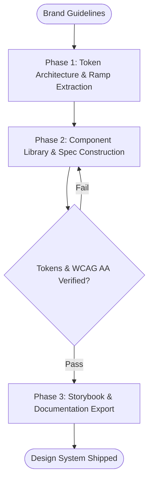

# Workflow: Agency Brand Design System & Component Library

## Overview & Scope
Builds scalable, production-grade design systems with design tokens, typography ramps, UI component contracts, and Storybook interactive playgrounds.

## Execution Flowchart

## Required Tool Inputs & Context
- Brand guidelines, logo marks, and primary/secondary colors
- Figma MCP / Stitch MCP / local CSS token definitions
- Storybook / component playground configs

## Phase 1: Token Architecture
- Define semantic tokens (colors, spacing, radii, typography ramps, shadows).
- Establish light/dark mode color pairings.

## Phase 2: Component Specifications
- Build core component contracts (Button, Input, Card, Modal, Nav).
- Ensure WCAG 2.2 AA accessibility and focus states.

## Phase 3: Verification & Storybook Integration
- Spin up component sandbox via `manage_task` or static build.
- Export token documentation and Tailwind CSS preset.

## Phase Transition Criteria & Deterministic Verification Gates
| Transition | Prerequisites | Verification Command / Gate | Success Criteria |
|---|---|---|---|
| Phase 1 -> Phase 2 | Tokens declared | `node dist/cli.js doctor` | Doctor health check succeeds with 0 errors |
| Phase 2 -> Phase 3 | Components implemented | `npm run typecheck` | TypeScript component interfaces compile cleanly |
| Phase 3 -> Completion | Visual contracts verified | `npm run build` | Storybook / component assets build without errors |

## Validation Checkpoints & Automated Rollback Protocols
- **Validation Checkpoint 1**: All color contrast ratios meet or exceed 4.5:1 for normal text.
- **Automated Rollback Protocol**: Adjust hue and luminosity values if contrast checker fails.
