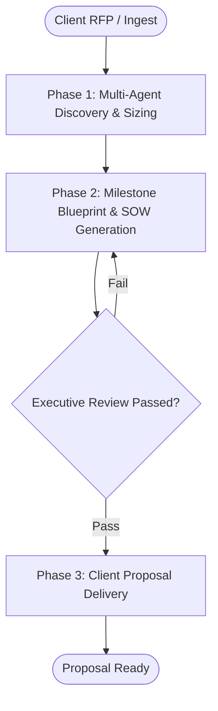

# Workflow: Agency Client Pitch Proposal & Scoping Blueprint

## Overview & Scope
Transforms raw client discovery calls, RFPs, or PDF pitch decks into a comprehensive, high-impact digital agency project proposal and scoping blueprint.

## Execution Flowchart

## Required Tool Inputs & Context
- Client RFP, discovery call transcripts, or PDF pitch deck
- MarkItDown MCP / voice memo ingestion
- Agency rate card and milestone estimation framework

## Phase 0: Planning Council (ADR 0014)
- Grill ambiguous briefs with the user (`/grill-me` or `/grill-with-docs`), then spawn up to 2 planning sidekicks.
- Collect a Scope-of-Work Statement (≤150 words) from every relevant specialist; peer exchanges capped at 2 per pair; max 2 planning rounds.
- Synthesize the Delegation Map (task → specialist, using the spawnable `subagent_*` tools declared in the Team Manifest) and present it to the user before Phase 1.
- Transition criteria: Delegation Map approved by user. Deterministic phase gate: specialist roster resolves against the Team Manifest (`.agents/plugins/digital-agency/agents-united/teams/digital-agency.yaml`).

## Phase 1: Context & Discovery Sizing
- Ingest client materials and extract core functional requirements.
- Calculate timeline estimates across Design, Engineering, and Growth.

## Phase 2: SOW & Milestone Architecture
- Structure deliverables into vertical phased milestones (M1–M4).
- Define Acceptance Criteria, SLA expectations, and risk contingencies.

## Phase 3: Verification & Packaging
- Verify timeline feasibility and budget alignment with the Director (Chris / `orchestrator-marketing`).
- Output executive markdown proposal and client presentation outline.

## Phase Transition Criteria & Deterministic Verification Gates
| Transition | Prerequisites | Verification Command / Gate | Success Criteria |
|---|---|---|---|
| Phase 1 -> Phase 2 | Sizing completed | `node dist/cli.js doctor` | Doctor health check succeeds with 0 errors |
| Phase 2 -> Phase 3 | Proposal drafted | `npm test` | Proposal validator confirms all deliverables have explicit acceptance criteria |
| Phase 3 -> Completion | Final review complete | `npm run build` | Proposal documentation renders with 0 errors |

## Validation Checkpoints & Automated Rollback Protocols
- **Validation Checkpoint 1**: Every vertical milestone has measurable success criteria.
- **Automated Rollback Protocol**: Re-scope deliverables if total project duration exceeds client deadline.
