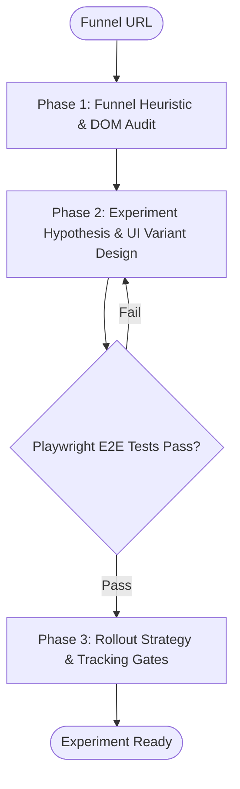

# Workflow: Agency CRO Funnel Teardown & Onboarding Optimization

## Overview & Scope
Systematic conversion rate optimization process auditing customer signup funnels, identifying drop-off friction points, and implementing A/B split-test variants.

## Execution Flowchart

## Required Tool Inputs & Context
- Funnel URL, conversion funnel metrics, or analytics tracking
- Playwright MCP / test runner for automated flow simulation
- CRO heuristics framework (Fogg Behavior Model, LIFT model)

## Phase 1: Funnel Teardown & Friction Analysis
- Inspect onboarding steps, form input fields, and social proof placement.
- Identify friction, value clarity issues, and anxiety triggers.

## Phase 2: Hypothesis & Variant Design
- Formulate CRO hypothesis: *If we [change], then [metric] will increase because [reason]*.
- Design high-converting variant UI components and copy.

## Phase 3: Verification & Test Execution
- Run Playwright test simulating user signup flow on variants.
- Validate analytics event dispatching and conversion triggers.

## Phase Transition Criteria & Deterministic Verification Gates
| Transition | Prerequisites | Verification Command / Gate | Success Criteria |
|---|---|---|---|
| Phase 1 -> Phase 2 | Friction audit completed | `node dist/cli.js doctor` | Doctor health check succeeds with 0 errors |
| Phase 2 -> Phase 3 | Variants coded & tokenized | `npm run typecheck` | UI variants compile without type errors |
| Phase 3 -> Completion | E2E simulations green | `npm test` | Playwright test completes with 0 form drop-offs |

## Validation Checkpoints & Automated Rollback Protocols
- **Validation Checkpoint 1**: All form validation messages are clear and accessible.
- **Automated Rollback Protocol**: Revert to control funnel if form submission fails in E2E sandbox.
