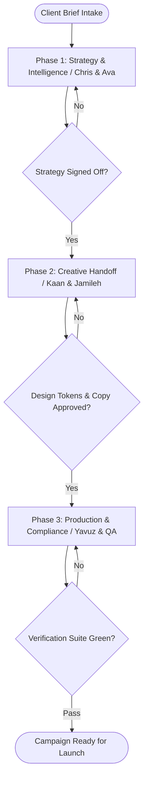

# Workflow: Digital Agency Full-Funnel Campaign Orchestration

## Overview & Scope
The Full-Funnel Campaign workflow coordinates the AstrolabsAI team — Chris (`orchestrator-marketing`, coordinator), Ava (`subagent-marketing-growth-strategist`), Kaan (`subagent-marketing-conversion-specialist`), Jamileh (`subagent-marketing-creative-designer`), Yavuz (`subagent-marketing-content-strategist`), Jale (`subagent-marketing-campaign-specialist`) — through dynamic DAG message handoffs (`/handoff`, `/design-handoff-spec`) across Tri-Tier execution envelopes. Spawn each specialist via its configured Cline tool (e.g. `subagent_marketing_growth_strategist` for Ava).

## Execution Flowchart

## Required Tool Inputs & Context
- Client product brief & target ICP demographics
- Brand assets, color tokens & design systems
- Active MCP servers (GitHub, Firecrawl, Context7, Playwright, Figma) or Fallback mode

## Phase 0: Planning Council (ADR 0014)
- Grill ambiguous briefs with the user (`/grill-me` or `/grill-with-docs`), then spawn up to 2 planning sidekicks.
- Collect a Scope-of-Work Statement (≤150 words) from every relevant specialist; peer exchanges capped at 2 per pair; max 2 planning rounds.
- Synthesize the Delegation Map (task → specialist, using the spawnable `subagent_*` tools declared in the Team Manifest) and present it to the user before Phase 1.
- Transition criteria: Delegation Map approved by user. Deterministic phase gate: specialist roster resolves against the Team Manifest (`.agents/plugins/digital-agency/agents-united/teams/digital-agency.yaml`).

## Phase 1: Context & Strategy (Chris & Ava)
- Ingest client brief or deck via MarkItDown / Firecrawl.
- Formulate campaign objectives, CAC targets, and channel strategy.
- Dispatch structured `/handoff` to creative specialists.

## Phase 2: Copywriting & Visual Design (Kaan & Jamileh)
- Author high-converting ad copy variants, email sequences, and landing page headlines.
- Design Figma/Tailwind component layouts, Storybook preview cards, and visual assets.
- Validate WCAG 2.2 AA accessibility contrast.

## Phase 3: Frontend Implementation & Verification (Yavuz & Compliance)
- Implement interactive responsive UI in React/Next.js.
- Execute Playwright E2E CRO funnel tests and performance lighthouse checks.
- Audit data privacy and advertising compliance (GDPR, CAN-SPAM).

## Phase Transition Criteria & Deterministic Verification Gates
| Transition | Prerequisites | Verification Command / Gate | Success Criteria |
|---|---|---|---|
| Phase 1 -> Phase 2 | Strategy formulated & budget approved | `node dist/cli.js doctor` | Doctor health check succeeds with 0 errors |
| Phase 2 -> Phase 3 | Copy & visual prototypes completed | `npm run typecheck` | Component layouts and tokens compile cleanly |
| Phase 3 -> Completion | End-to-end integration verified | `npm test` | 100% pass across E2E test suites and accessibility gates |

## Validation Checkpoints & Automated Rollback Protocols
- **Validation Checkpoint 1**: Copy and creative variants pass brand voice guidelines.
- **Validation Checkpoint 2**: Playwright funnel test confirms zero form submission drop-offs.
- **Automated Rollback Protocol**: If API tokens or MCP servers fail, orchestrator transitions dynamically to Brainstorming/Limited mode.
