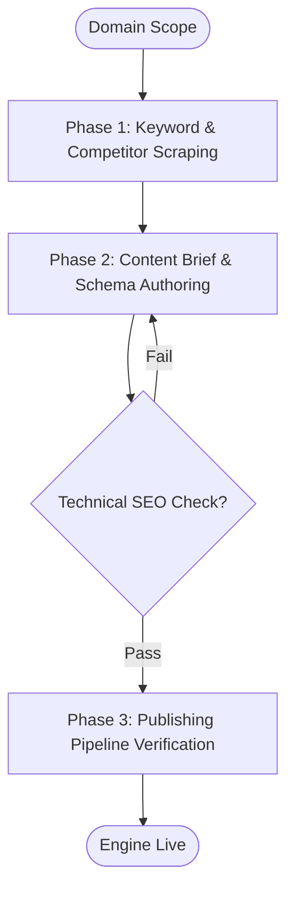

# Workflow: Agency Programmatic SEO & Content Pipeline

## Overview & Scope
Drives organic traffic acquisition through keyword clustering, competitor gap scraping (via Firecrawl MCP), content briefs, and structured schema markup.

## Execution Flowchart

## Required Tool Inputs & Context
- Seed keywords and target industry topic clusters
- Firecrawl MCP server or local web scraping fallback
- JSON-LD schema taxonomy

## Phase 1: Keyword Research & Gap Analysis
- Extract competitor URL maps and ranking structures.
- Cluster search intent keywords into high-intent landing page buckets.

## Phase 2: Content Briefs & JSON-LD Generation
- Generate markdown content outlines with H1-H3 header hierarchies.
- Author schema markup (FAQPage, Article, SoftwareApplication, Organization).

## Phase 3: Verification & Auditing
- Validate schema JSON-LD with structured data validators.
- Inspect Core Web Vitals impact and meta tags.

## Phase Transition Criteria & Deterministic Verification Gates
| Transition | Prerequisites | Verification Command / Gate | Success Criteria |
|---|---|---|---|
| Phase 1 -> Phase 2 | Keyword clusters mapped | `node dist/cli.js doctor` | Doctor health check succeeds with 0 errors |
| Phase 2 -> Phase 3 | Schema markup authored | `npm test` | JSON-LD syntax validation passes 100% |
| Phase 3 -> Completion | Audit complete | `npm run build` | Zero broken references or missing meta tags |

## Validation Checkpoints & Automated Rollback Protocols
- **Validation Checkpoint 1**: Schema markup strictly conforms to Schema.org standards.
- **Automated Rollback Protocol**: Strip non-standard schema tags if structured validation fails.
