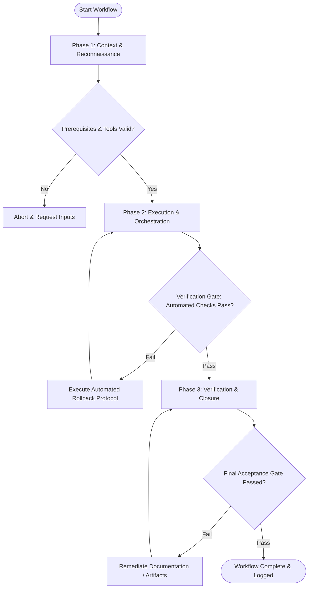

# Workflow: Codebase Security & Static Analysis

## Overview & Scope
The Analyze workflow enforces codebase security hygiene. It runs static application security testing (SAST), scans for exposed secrets, audits dependency vulnerabilities, and evaluates code complexity.

## Execution Flowchart

## Required Tool Inputs & Context
- Source code repository
- Static security scanning tools (`npm audit`, `snyk`, `semgrep`, `secret-scanner`)
- Dependency manifest (`package.json`)

## Phase 1: Context & Reconnaissance
- Identify target source directories, configuration files, and external dependencies.
- Configure SAST rules and vulnerability severity thresholds (Critical, High, Medium, Low).
- Check scanning tool dependencies.

## Phase 2: Execution & Orchestration
- Execute dependency vulnerability audit (`npm audit`).
- Run SAST scanners to detect code vulnerabilities (XSS, SQLi, path traversal, hardcoded secrets).
- Audit code complexity metrics (cyclomatic complexity, maintainability index).

## Phase 3: Verification & Closure
- Classify findings by severity and impact.
- Generate actionable remediation diffs for identified vulnerabilities.
- Publish Codebase Security & Static Analysis Report.

## Phase Transition Criteria & Deterministic Verification Gates
| Transition | Prerequisites | Verification Command / Gate | Success Criteria |
|---|---|---|---|
| Phase 1 -> Phase 2 | Tool inputs verified & environment ready | `node dist/cli.js doctor` | Doctor health check succeeds with 0 errors |
| Phase 2 -> Phase 3 | Execution steps complete | `npm audit` | Zero Critical or High severity security vulnerabilities detected |
| Phase 3 -> Completion | Verification complete & artifacts signed off | `npm run typecheck` | Static type checking passes cleanly |

## Validation Checkpoints & Automated Rollback Protocols
- **Validation Checkpoint 1**: Zero exposed secrets or credentials found in source code.
- **Validation Checkpoint 2**: Security analysis report includes explicit remediation steps for all findings.
- **Automated Rollback Protocol**: Block build deployment immediately if Critical severity security vulnerabilities are discovered.
