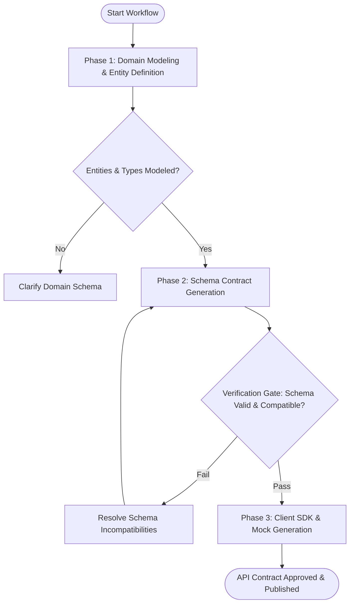

# Workflow: API Contract & Schema Design

## Overview & Scope
The API Contract Design workflow ensures all client-server and microservice communications have strictly typed, backward-compatible, and documented API schemas before implementation begins.

## Execution Flowchart

## Required Tool Inputs & Context
- Domain entity model and service requirements
- Target API style (`REST OpenAPI`, `GraphQL`, `gRPC Protobuf`)
- Backward compatibility requirements

## Phase 1: Domain Modeling & Entity Definition
- Map domain models to request/response payloads, error structures, and pagination patterns.
- Enforce standard HTTP status code and error payload conventions (`RFC 7807`).

## Phase 2: Schema Contract Generation
- Author OpenAPI YAML, GraphQL SDL, or Protobuf `.proto` definition.
- Run schema linting (`spectral` / `buf lint`) and breaking change detection (`buf breaking` / `oasdiff`).

## Phase 3: Client SDK & Mock Generation
- Generate typed client SDKs and mock server definitions (MSW / Prism) for parallel frontend development.

## Phase Transition Criteria & Deterministic Verification Gates
| Transition | Prerequisites | Verification Command / Gate | Success Criteria |
|---|---|---|---|
| Phase 1 -> Phase 2 | Domain entities specified | Entity mapping review | All mandatory fields and types declared |
| Phase 2 -> Phase 3 | Schema authored | Schema linter & diff tool | 0 lint errors, 0 breaking changes detected |
| Phase 3 -> Completion | SDK & mocks generated | Mock server validation | Client SDK compiles without type errors |
