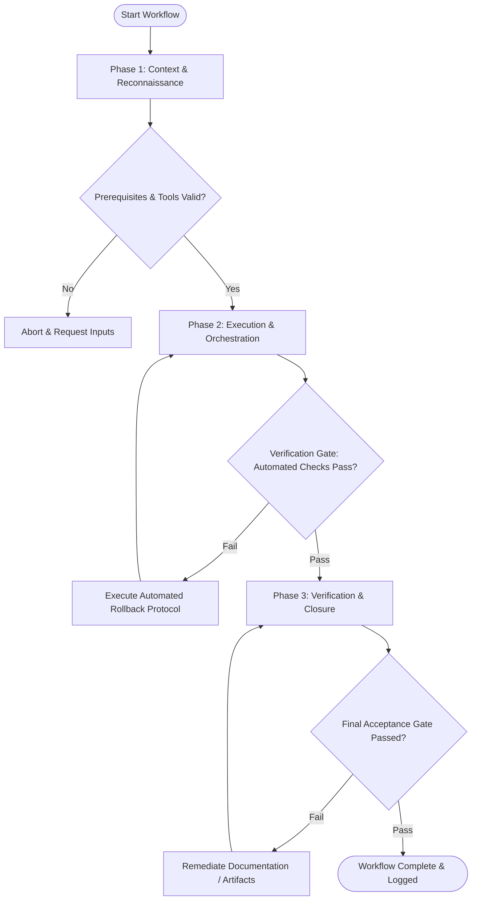

# Workflow: Structured Option Generation & Brainstorming

## Overview & Scope
This workflow drives structured technical innovation. It applies SCAMPER and Lateral Thinking frameworks to generate diverse solution options before narrowing down to optimal candidates.

## Execution Flowchart

## Required Tool Inputs & Context
- Problem context statement & hard project constraints
- Brainstorming framework guides (SCAMPER, 6 Thinking Hats)
- Option evaluation matrix template

## Phase 1: Context & Reconnaissance
- Review target problem statement and state non-negotiable constraints (tech stack, latency budget, timeline).
- Set target idea volume goal (minimum 10 distinct solution concepts).
- Prepare brainstorming workspace.

## Phase 2: Execution & Orchestration
- Divergent Phase: Generate high-volume ideas using SCAMPER (Substitute, Combine, Adapt, Modify, Put to another use, Eliminate, Reverse).
- Categorize generated ideas into architectural clusters.
- Convergent Phase: Evaluate ideas against feasibility, impact, and project constraints.

## Phase 3: Verification & Closure
- Select top 3 candidate options for detailed technical evaluation.
- Document pros, cons, trade-offs, and risks for each top option.
- Publish Technical Option Generation Summary.

## Phase Transition Criteria & Deterministic Verification Gates
| Transition | Prerequisites | Verification Command / Gate | Success Criteria |
|---|---|---|---|
| Phase 1 -> Phase 2 | Tool inputs verified & environment ready | `node dist/cli.js doctor` | Doctor health check succeeds with 0 errors |
| Phase 2 -> Phase 3 | Execution steps complete | `node dist/cli.js doctor` | Doctor health check validates brainstorming document schema |
| Phase 3 -> Completion | Verification complete & artifacts signed off | `npm test` | Validation test confirms presence of top candidate trade-off analyses |

## Validation Checkpoints & Automated Rollback Protocols
- **Validation Checkpoint 1**: Minimum of 10 distinct solution options generated during divergent phase.
- **Validation Checkpoint 2**: Top candidate options evaluated against all hard project constraints.
- **Automated Rollback Protocol**: Re-frame brainstorming prompt if generated concepts violate core constraints.
