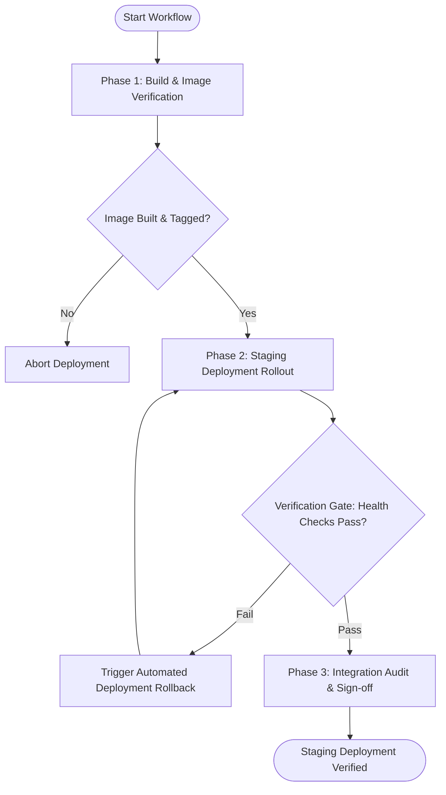

# Workflow: Staging Preview & Deployment Automation

## Overview & Scope
The Staging Deployment workflow automates the creation of isolated staging environments, container image verification, and post-deployment health checks prior to production promotion.

## Execution Flowchart

## Required Tool Inputs & Context
- Target container registry and deployment environment credentials
- Health check HTTP endpoint (`/healthz` or `/api/health`)
- Staging environment configuration parameters

## Phase 1: Build & Image Verification
- Build production container image using Docker multi-stage workflow.
- Scan built container image for security vulnerabilities using vulnerability scanners.

## Phase 2: Staging Deployment Rollout
- Deploy container image to staging cluster or preview environment.
- Verify environment variables and database migration status.

## Phase 3: Integration Audit & Sign-off
- Execute HTTP health check polling on staging URL.
- Log deployment status, image SHA, and deployment duration.

## Phase Transition Criteria & Deterministic Verification Gates
| Transition | Prerequisites | Verification Command / Gate | Success Criteria |
|---|---|---|---|
| Phase 1 -> Phase 2 | Container built cleanly | `docker inspect <image>` | Image exists with non-root user context |
| Phase 2 -> Phase 3 | Staging rollout completed | `curl -f https://staging.example.com/healthz` | Endpoint returns HTTP 200 OK |
| Phase 3 -> Completion | Health verification passed | `agents doctor` | Deployment lockfile updated successfully |
