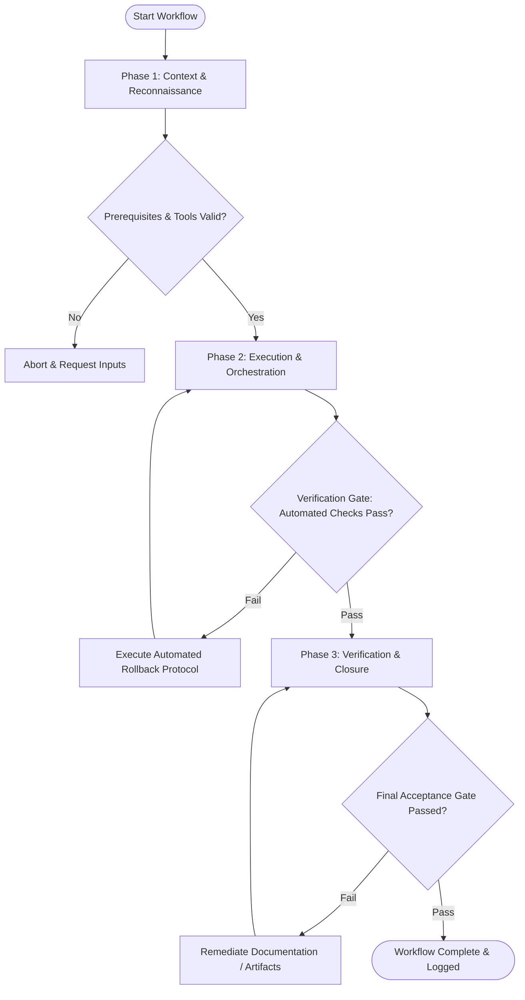

# Workflow: API & Interface Specification Design

## Overview & Scope
This workflow provides a methodical approach to designing software contracts, TypeScript interfaces, and schema definitions. It emphasizes type safety, clear abstraction boundaries, and backward compatibility.

## Execution Flowchart

## Required Tool Inputs & Context
- Domain model requirements and entity definitions
- Interface guidelines and type convention standards
- TypeScript compiler / Zod schema validator tools

## Phase 1: Context & Reconnaissance
- Identify core domain entities, value objects, and boundary interfaces.
- Audit existing type definitions for duplication or naming inconsistencies.
- Determine data validation rules, optional fields, and payload constraints.

## Phase 2: Execution & Orchestration
- Draft TypeScript interface definitions (`types.ts`) and export type signatures.
- Implement validation schemas (e.g. Zod or JSON Schema) matching runtime payload requirements.
- Add comprehensive TSDoc/JSDoc comments describing method parameters, return types, and potential errors.

## Phase 3: Verification & Closure
- Verify type compilation (`tsc --noEmit`) to confirm no circular type dependencies exist.
- Validate schema serialization and deserialization against sample payload fixtures.
- Export finalized type contracts for downstream consumption by backend/frontend engineers.

## Phase Transition Criteria & Deterministic Verification Gates
| Transition | Prerequisites | Verification Command / Gate | Success Criteria |
|---|---|---|---|
| Phase 1 -> Phase 2 | Tool inputs verified & environment ready | `node dist/cli.js doctor` | Doctor health check succeeds with 0 errors |
| Phase 2 -> Phase 3 | Execution steps complete | `npm run typecheck` | TypeScript compiler validates all new type interfaces without errors |
| Phase 3 -> Completion | Verification complete & artifacts signed off | `npm test` | Schema validation unit tests pass cleanly against sample data |

## Validation Checkpoints & Automated Rollback Protocols
- **Validation Checkpoint 1**: Interfaces encapsulate domain logic cleanly with zero `any` types.
- **Validation Checkpoint 2**: TSDoc documentation complete for all public interface methods and properties.
- **Automated Rollback Protocol**: Revert interface modifications if circular dependencies or breaking type signature changes occur.
