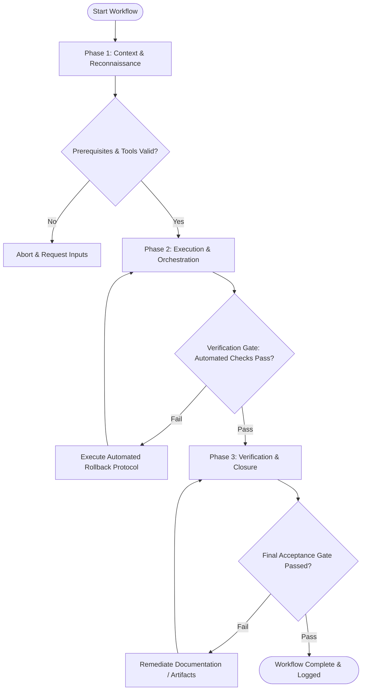

# Workflow: Design-to-Engineering Handoff Specification

## Overview & Scope
The Handoff workflow standardizes design specs for development. It packages redline specs, interaction behaviors, asset exports, token mappings, and edge-case specs into comprehensive developer handoffs.

## Execution Flowchart

## Required Tool Inputs & Context
- Finalized screen designs and component specs
- Design token repository and component library mappings
- Asset export rules (SVG optimization, image compression)

## Phase 1: Context & Reconnaissance
- Confirm screen designs are finalized and locked for implementation.
- Audit design elements to ensure 100% map to existing design system tokens or documented new components.
- Verify SVG graphics are clean and vectorized.

## Phase 2: Execution & Orchestration
- Attach redline specifications detailing layout margins, padding, and alignment.
- Annotate dynamic component behaviors, error states, and micro-interactions.
- Export optimized SVG/PNG assets and document data field requirements for backend APIs.

## Phase 3: Verification & Closure
- Conduct handoff walkthrough with engineering leads.
- Address technical clarification questions and update handoff spec annotations.
- Archive handoff specification package in project repository.

## Phase Transition Criteria & Deterministic Verification Gates
| Transition | Prerequisites | Verification Command / Gate | Success Criteria |
|---|---|---|---|
| Phase 1 -> Phase 2 | Tool inputs verified & environment ready | `node dist/cli.js doctor` | Doctor health check succeeds with 0 errors |
| Phase 2 -> Phase 3 | Execution steps complete | `node dist/cli.js doctor` | Doctor health check confirms handoff specification artifact structure |
| Phase 3 -> Completion | Verification complete & artifacts signed off | `npm test` | Asset validation script confirms all exported SVGs are valid and optimized |

## Validation Checkpoints & Automated Rollback Protocols
- **Validation Checkpoint 1**: 100% of visual elements mapped to design tokens or explicit component specs.
- **Validation Checkpoint 2**: All graphic assets exported in optimized SVG format.
- **Automated Rollback Protocol**: Update handoff spec package if engineers identify unannotated interaction behaviors.
