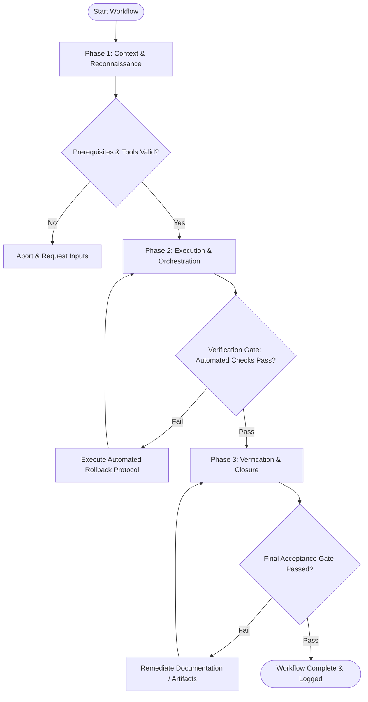

# Workflow: Design Sprint & Capacity Planning

## Overview & Scope
This workflow manages design team capacity and sprint execution. It scopes incoming requests, estimates design effort, allocates designer availability, and establishes clear sprint commitments.

## Execution Flowchart

## Required Tool Inputs & Context
- Product feature backlog and design request tickets
- Designer availability & velocity history
- Sprint goals and engineering milestone targets

## Phase 1: Context & Reconnaissance
- Collect incoming design requests and feature tickets for the upcoming sprint.
- Calculate net available designer hours accounting for overhead, meetings, and PTO.
- Review engineering sprint commitments to align design deliverables.

## Phase 2: Execution & Orchestration
- Break down design requests into specific tasks (research, wireframing, high-fi design, handoff).
- Estimate effort story points for each design task based on complexity.
- Assign tasks to designers matching capacity and expertise.

## Phase 3: Verification & Closure
- Review sprint plan with product management and engineering leads.
- Commit sprint backlog items to design tracking board.
- Publish Design Sprint Plan document.

## Phase Transition Criteria & Deterministic Verification Gates
| Transition | Prerequisites | Verification Command / Gate | Success Criteria |
|---|---|---|---|
| Phase 1 -> Phase 2 | Tool inputs verified & environment ready | `node dist/cli.js doctor` | Doctor health check succeeds with 0 errors |
| Phase 2 -> Phase 3 | Execution steps complete | `node dist/cli.js doctor` | Doctor health check verifies sprint plan document syntax |
| Phase 3 -> Completion | Verification complete & artifacts signed off | `npm run build` | Project build passes cleanly during sprint planning |

## Validation Checkpoints & Automated Rollback Protocols
- **Validation Checkpoint 1**: Total committed story points do not exceed calculated design team capacity.
- **Validation Checkpoint 2**: Every sprint task has an explicit definition of done.
- **Automated Rollback Protocol**: De-scope lower priority design tickets if allocated capacity is exceeded.
