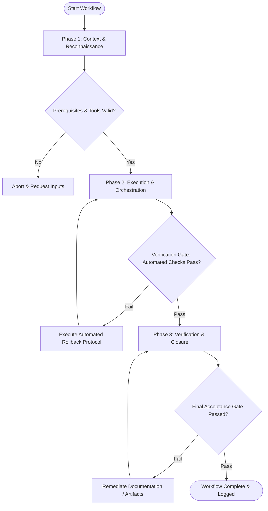

# Workflow: Design Tooling & Workflow Pipeline Setup

## Overview & Scope
The Setup Workflow provisions design infrastructure. It configures design tool integrations, token sync automation webhooks, asset export scripts, and team workspace governance rules.

## Execution Flowchart

## Required Tool Inputs & Context
- Design tool API credentials (Figma API token, repository tokens)
- Project workspace template files
- CI/CD workflow definitions

## Phase 1: Context & Reconnaissance
- Audit existing design tooling setup and identifying automation friction points.
- Inspect repository access permissions and webhook configuration settings.
- Prepare automated sync scripts for tokens and assets.

## Phase 2: Execution & Orchestration
- Configure automated webhook triggers for design token synchronization on file updates.
- Set up linter rules for design file naming conventions and component organization.
- Establish design file branching and approval workflow rules.

## Phase 3: Verification & Closure
- Execute test run of automated asset sync pipeline.
- Verify workspace permissions and access controls across team member roles.
- Publish Design Workflow Documentation.

## Phase Transition Criteria & Deterministic Verification Gates
| Transition | Prerequisites | Verification Command / Gate | Success Criteria |
|---|---|---|---|
| Phase 1 -> Phase 2 | Tool inputs verified & environment ready | `node dist/cli.js doctor` | Doctor health check succeeds with 0 errors |
| Phase 2 -> Phase 3 | Execution steps complete | `npm test` | Pipeline integration test suite confirms webhook payload processing |
| Phase 3 -> Completion | Verification complete & artifacts signed off | `npm run build` | Workflow setup scripts compile without errors |

## Validation Checkpoints & Automated Rollback Protocols
- **Validation Checkpoint 1**: Automated webhook triggers successfully on token repository changes.
- **Validation Checkpoint 2**: Design token repository synchronizes automatically without manual intervention.
- **Automated Rollback Protocol**: Revert webhook credentials and API configurations if sync verification tests fail.
