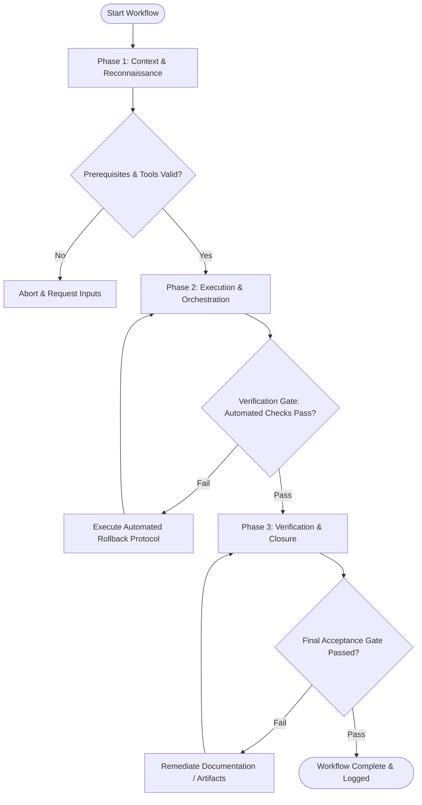

# Workflow: Multi-Agent Design Orchestration

## Overview & Scope
The Design Orchestrate workflow manages multi-agent design pipelines. It decomposes large product epics, delegating sub-tasks to UX Strategist, UI Designer, Interaction Designer, and Design Systems subagents.

## Execution Flowchart

## Required Tool Inputs & Context
- Product epic specification document
- Design subagent manifest definitions
- Design system token and component specs

## Phase 1: Context & Reconnaissance
- Deconstruct epic into domain-specific subagent assignments (UX Strategy -> Visual Design -> Micro-Interactions -> Tokens).
- Establish subagent input/output file contracts and state passing conventions.
- Verify subagent environment readiness.

## Phase 2: Execution & Orchestration
- Dispatch UX Strategist subagent to frame problems and define wireframe flows.
- Dispatch UI Designer and Interaction Designer subagents to author screen visuals and motion specs.
- Dispatch Design Systems Lead subagent to verify token alignment and component reuse.

## Phase 3: Verification & Closure
- Synthesize subagent deliverables into a unified Master Design Specification.
- Run end-to-end completeness and consistency verification checks.
- Publish Design Orchestration Summary.

## Phase Transition Criteria & Deterministic Verification Gates
| Transition | Prerequisites | Verification Command / Gate | Success Criteria |
|---|---|---|---|
| Phase 1 -> Phase 2 | Tool inputs verified & environment ready | `node dist/cli.js doctor` | Doctor health check succeeds with 0 errors |
| Phase 2 -> Phase 3 | Execution steps complete | `npm test` | Orchestration test suite confirms all subagent deliverables meet quality gates |
| Phase 3 -> Completion | Verification complete & artifacts signed off | `npm run build` | Master design documentation builds cleanly |

## Validation Checkpoints & Automated Rollback Protocols
- **Validation Checkpoint 1**: All delegated subagent tasks completed without missing output artifacts.
- **Validation Checkpoint 2**: Unified design spec complies 100% with design system token rules.
- **Automated Rollback Protocol**: Re-invoke specific failed subagent with adjusted parameters if deliverable fails quality bar.
