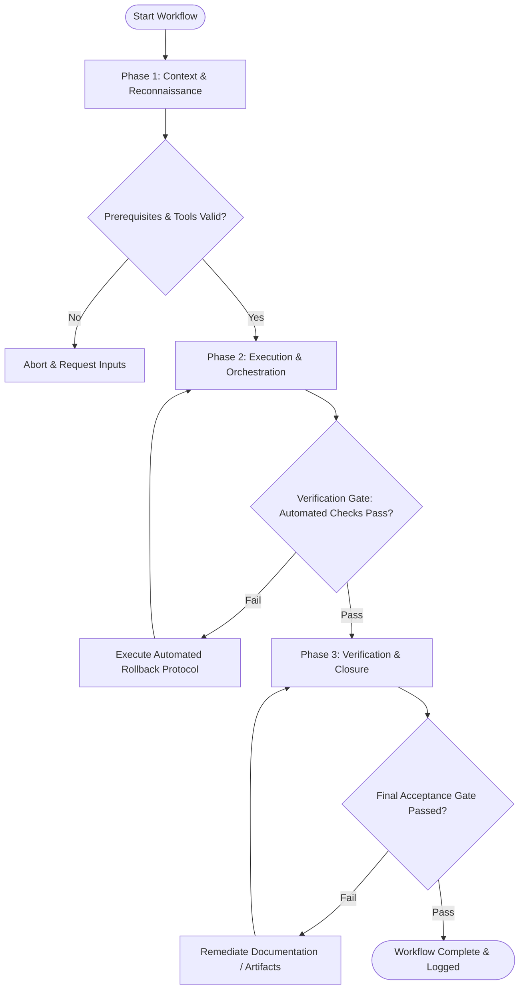

# Workflow: Design System & Component Drift Audit

## Overview & Scope
This workflow monitors design system adoption and component drift. It scans the codebase for hardcoded hex colors, arbitrary spacing, duplicate component implementations, and detached styles.

## Execution Flowchart

## Required Tool Inputs & Context
- Component library codebase & design token definitions
- AST / static analysis scanning scripts
- Design system adoption target metrics

## Phase 1: Context & Reconnaissance
- Configure static analysis rules to search for inline styles, raw CSS hex colors, and hardcoded pixel values.
- Scan codebase UI components to list custom component implementations.
- Establish design system adoption baseline score.

## Phase 2: Execution & Orchestration
- Categorize drift violations by severity (e.g. Critical: raw color usage, Major: custom button rewrite, Minor: arbitrary padding).
- Calculate adoption metrics per module/page.
- Identify candidate components for design system consolidation.

## Phase 3: Verification & Closure
- Generate Design System Drift Report with exact file paths and line numbers.
- Create refactoring tickets to migrate custom components to design system tokens.
- Publish Design Debt Dashboard.

## Phase Transition Criteria & Deterministic Verification Gates
| Transition | Prerequisites | Verification Command / Gate | Success Criteria |
|---|---|---|---|
| Phase 1 -> Phase 2 | Tool inputs verified & environment ready | `node dist/cli.js doctor` | Doctor health check succeeds with 0 errors |
| Phase 2 -> Phase 3 | Execution steps complete | `npm test` | Drift audit script completes scan across 100% of codebase UI files |
| Phase 3 -> Completion | Verification complete & artifacts signed off | `npm run typecheck` | Static type checking passes cleanly post-scan |

## Validation Checkpoints & Automated Rollback Protocols
- **Validation Checkpoint 1**: 100% of codebase UI components scanned for style violations.
- **Validation Checkpoint 2**: Every detected drift instance cataloged with file path, line number, and remediation guidance.
- **Automated Rollback Protocol**: Adjust audit script parameters if false positive scans exceed acceptable noise threshold.
