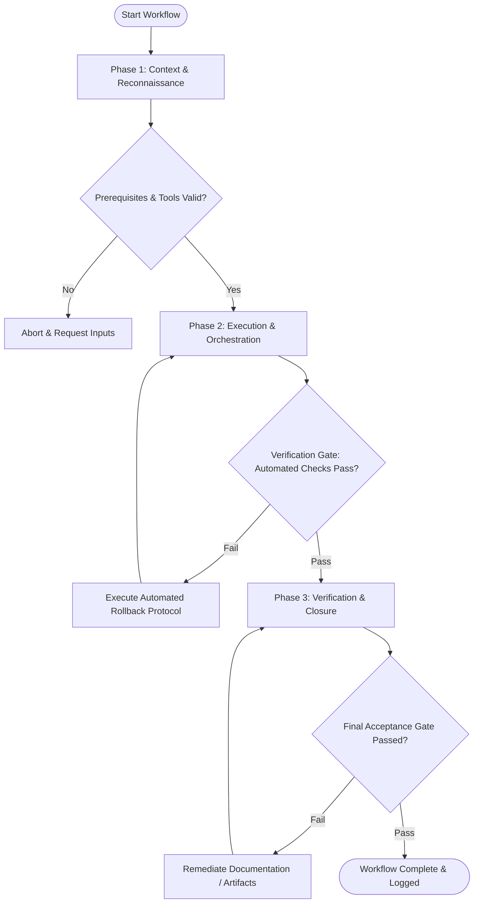

# Workflow: Design Token Extraction & Transformation

## Overview & Scope
This workflow automates design token pipeline management. It ingests source tokens, transforms them across platform formats (CSS custom properties, Tailwind, TS types, iOS/Android formats), and validates output files.

## Execution Flowchart

## Required Tool Inputs & Context
- Source design token JSON / Figma Tokens file
- Token transformation tool (`Style Dictionary`)
- Target platform format configurations

## Phase 1: Context & Reconnaissance
- Inspect raw token source files for valid DTCG (Design Tokens Community Group) schema compliance.
- Check token naming conventions (category-type-item-variant-state).
- Verify output build configuration rules.

## Phase 2: Execution & Orchestration
- Execute transformation build scripts using Style Dictionary.
- Generate platform-specific outputs: CSS custom properties (`tokens.css`), JS/TS constants (`tokens.ts`), Tailwind config extension.
- Validate that generated token values contain no unresolved references or `undefined` properties.

## Phase 3: Verification & Closure
- Run token integration tests against sample UI components.
- Publish updated design token package.
- Document token release notes detailing added, changed, or deprecated tokens.

## Phase Transition Criteria & Deterministic Verification Gates
| Transition | Prerequisites | Verification Command / Gate | Success Criteria |
|---|---|---|---|
| Phase 1 -> Phase 2 | Tool inputs verified & environment ready | `node dist/cli.js doctor` | Doctor health check succeeds with 0 errors |
| Phase 2 -> Phase 3 | Execution steps complete | `npm run build` | Style Dictionary compilation builds with exit code 0 |
| Phase 3 -> Completion | Verification complete & artifacts signed off | `npm test` | Token validation suite confirms zero undefined token values |

## Validation Checkpoints & Automated Rollback Protocols
- **Validation Checkpoint 1**: Style Dictionary transformation executes without warnings or errors.
- **Validation Checkpoint 2**: Generated CSS/TS token files pass syntax validation.
- **Automated Rollback Protocol**: Restore previous token package version if transform scripts fail.
