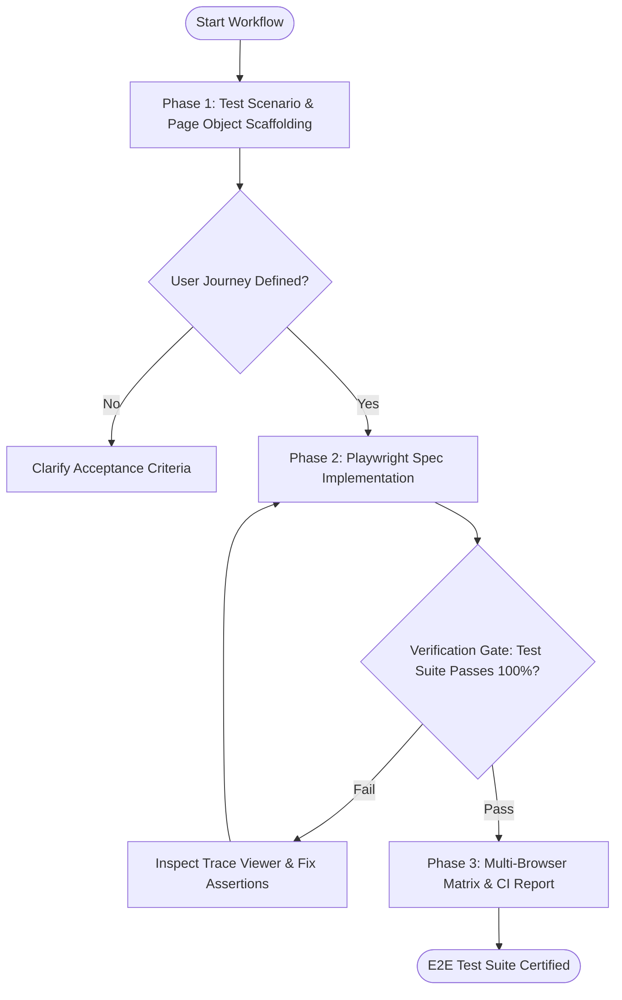

# Workflow: End-to-End Browser Test Automation

## Overview & Scope
The E2E Testing workflow executes automated browser journeys across desktop and mobile viewports, verifying critical business flows (signup, checkout, data mutation) with video/trace capture.

## Execution Flowchart

## Required Tool Inputs & Context
- Target user flow description and test credentials
- Playwright configuration and preview URL
- Expected UI states and assertions

## Phase 1: Test Scenario & Page Object Scaffolding
- Map user story steps into Page Object Model methods.
- Set up isolated test database fixtures and authentication storage states.

## Phase 2: Playwright Spec Implementation
- Author test assertions utilizing user-facing locators (`getByRole`, `getByLabel`).
- Execute test run locally via `npx playwright test`.

## Phase 3: Multi-Browser Matrix & CI Report
- Run tests against Chromium, Firefox, and WebKit matrix.
- Generate HTML test report and verify trace artifacts on any retried tests.

## Phase Transition Criteria & Deterministic Verification Gates
| Transition | Prerequisites | Verification Command / Gate | Success Criteria |
|---|---|---|---|
| Phase 1 -> Phase 2 | Page Objects structured | POM code review | Selectors utilize role/label locators |
| Phase 2 -> Phase 3 | Local tests passing | `npx playwright test` | 100% test scenarios pass with exit code 0 |
| Phase 3 -> Completion | Multi-browser matrix verified | CI test runner execution | Zero test flakes or unhandled exceptions |
